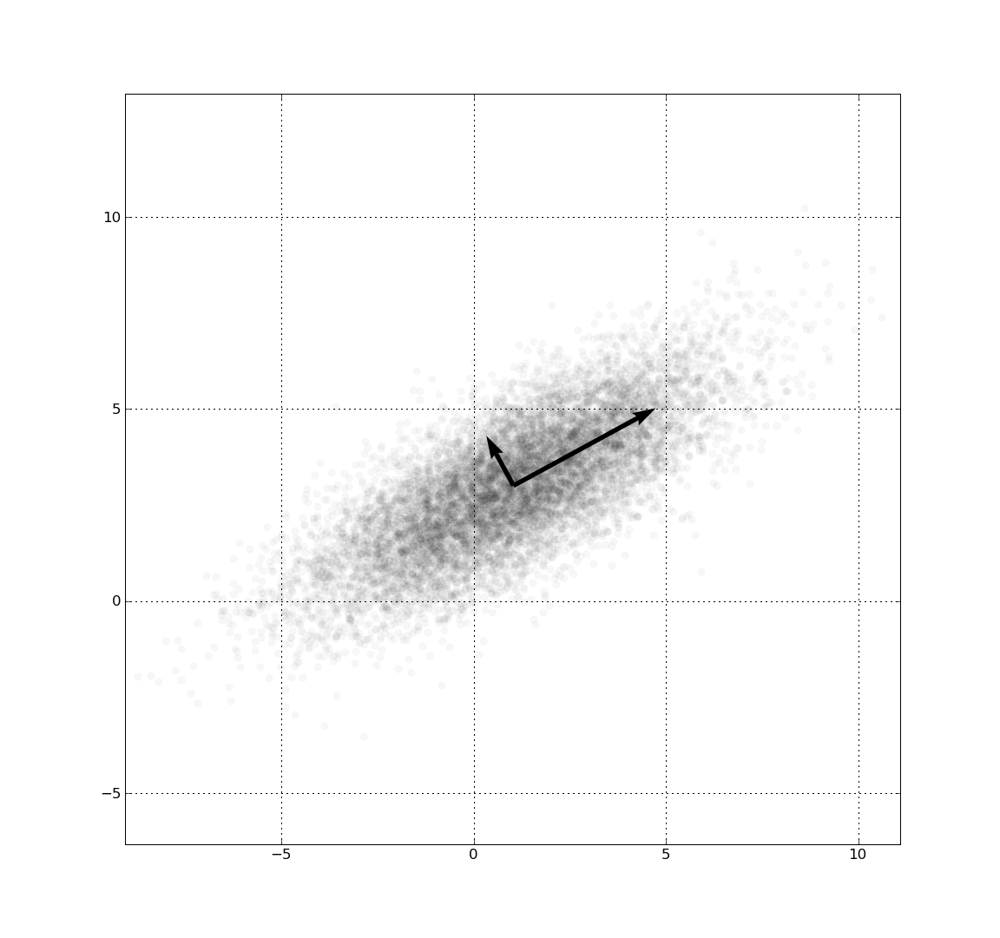

Contents

* TOC
{:toc}
----------

오늘 알아볼 주제는 루트에서 아주 약간 벗어나서, 딥 러닝 시대 이전의 머신 러닝 알고리즘을 하나 보려고 합니다. 

Goodfellow, Bengio, Courville의 Deep learning book 에서도 이 알고리즘을 거의 맨 앞에 다루고 있는데, 사실 그 유도 방법이 수식이 꽤 많고 복잡합니다. 아마도 선형대수와 벡터미적분의 이론을 최대한 덜 휘두르면서 나아가려다 보니 그런 것 같은데, 이미 한학기의 선형대수와 벡터미적분학 수업을 들었다면 굳이 그렇게 힘든길을 걷지 않아도 같은 결론에 도달할 수 있을 뿐 아니라 색다른 insight를 제공하기 때문에 소개하려 합니다. 

이 글의 유도 방법은 wikipedia에서의 유도와 가장 비슷하며 (앞에서 좀 다릅니다), 후반부는 Goodfellow et al.의 책 5장의 방법을 따라갔습니다.

## Principal Component Analysis

**Principal Component Analysis (주성분 분석)**, 이하 PCA 는 다음과 같은 문제를 해결합니다.

> 어떤 $n$차원 데이터 데이터 $x_1, \dots x_m$이 주어졌을 때, 이들을 적절히 **손실있는 압축** 함수 $f$ 와 그 decoder $g$ 를 생각해서 
> $y_i = f(x_i)$, $x_i \approx g(y_i) = g(f(x_i))$ 이게 하고 싶습니다.

그런데, 여기서 가급적 결과물 $f(x_i)$가 좋은 성질을 갖기를 원합니다. 좋은 성질이란, 
1. 데이터의 원본이 갖는 **변동성** 을 최대한 많이 설명하고 싶고
2. 계산하기 쉬웠으면 좋겠습니다.

이를 위해서 새로운 parameter로 표현되는 mlp, cnn 등 뉴럴 네트워크로 $f, g$를 만들어서 학습시키는 방법을 **autoencoder** 라고 합니다. Autoencoder에 대해서는 [포스팅 링크](/deep-learning-study/autoencoders) 에 소개한 적이 있는데, 오늘 알아볼 방법은 좀더 근본있게(?) 수학적으로 논증을 전개합니다.

## 변동성의 설명 
이 방법에 대한 설명은 다양하게 있었지만, 저는 

미지의 데이터들이 주어졌을 때, 이들을 어떤 **타원체** 로 이해하려고 생각한다고 가정해 봅시다. 타원체는 그 축이 되는 선분들을 모두 찾으면 그것으로 충분하며, 다시 말해 **중심** 과 **축의 방향, 길이** 들을 찾아야 합니다. 중심은 뭔가 당연하게 모든 데이터의 벡터로서의 평균이어야 할것 같습니다. 예를 들어 아래 그림에서와 같이 찾으면 뭔가 좋은 설명이 될 것 같습니다.

이때, 우리가 데이터를 설명하는 **단 하나의 축** 을 골라야 한다면, 모든 데이터를 그 축에 대해 정사영했을 때 결과물이 최대한 원본 데이터의 성질을 잘 설명해 주는 축을 고르는 편이 바람직할 것입니다. 이를 수식으로 설명하자면, 다음을 최소화하면 좋겠습니다. 
$$\sum_{i = 1}^{n} \norm{x_i - y_i}^2$$
여기서 제곱을 이용하기 때문에 PCA를 $L^2$ norm을 사용한다고 말합니다. (직관적으로는 거리를 최소화하는게 자연스럽겠지만, 거리의 제곱의 합도 뭔가 최소화되면 좋을것 같으므로 이부분의 정당성은 넘어가겠습니다. 사실 통계학적 방법으로 PCA를 유도하면 제곱이어야 하는 이유가 좀더 자연스럽습니다) 당연히 $L^1$이나 다른 norm을 사용할 수도 있겠으나, 그렇게 하게 되면 이후 계산과정이 달라지고 다른 알고리즘이 됩니다. 

### 분산 최대화 vs 오차 최소화 
먼저 대상이 되는 차원이 1차원인, 즉 $y$가 1차원인 문제를 풀어 봅시다. 어떤 데이터 $x_i$를 축 $w$에 정사영한 결과 $y_i$를 생각할 때, 정사영의 기하적인 성질을 생각하면 $y_i$와 $x_i - y_i$가 수직이므로 피타고라스 정리에 의해, 다음이 성립하게 됩니다. 
$$\norm{x_i}^2 = \norm{y_i}^2 + \norm{x_i - y_i}^2$$

그런데 $\norm{x_i}^2$는 이미 주어진 데이터이므로 사실 상수입니다. 따라서, 앞서 오차를 최소화한다는 것은 사실 $\norm{y_i}^2$을 최대화하는 것과 같은 문제를 풀고 있는 셈이 됩니다.

편의상 모든 데이터를 평행이동해서, 평균이 0이 되게 맞추었다고 생각하겠습니다. 또한 편의상 $w$의 방향만 정하면 되므로 $w$를 unit vector가 되도록 강제하겠습니다.

$y_i$라는 값이 정사영 대상축 $w$에 대해, $(x \cdot w) w$를 만족하므로, 이제 $\norm{y_i}^2$ 는 $(\mathbf{x_i} \cdot \mathbf{w})^2$ 가 됩니다. 따라서, 우리는 다음과 같은 문제를 해결하는 셈이 됩니다.
$$\underset{\norm{\mathbf{w}} = 1}{\maximize}\ \sum_{i = 1}^{n} (\mathbf{x_i} \cdot \mathbf{w})^2$$

이 문제를 다르게 해석하는 방법은, $y$값들의 **분산**을 최대화한다고 보는 관점입니다. 고등학교 때 배운 공식 
$$\variance{X} = \expect{X^2} - \expect{X}^2$$ 
위 공식에서, 사실 $\expect{X}$ 가 0이므로 앞부분만 계산하면 되므로... 결국 우리는 $y_i$들의 분산을 최대화하고 있는 것입니다.

### PCA 계산과정 유도
우리는 잘 formulate된 최적화 문제를 들고 있으므로, 이를 해결해 보고자 합니다. 
$$\underset{\norm{\mathbf{w}} = 1}{\maximize}\ \sum_{i = 1}^{n} (\mathbf{x_i} \cdot \mathbf{w})^2$$
식을 좀 조작하면, matrix form으로 한번에 $x_i$들을 묶어서 쓸 수 있습니다. 
$$\underset{\norm{\mathbf{w}} = 1}{\maximize}\  \norm{X \mathbf{w}}^2 = \underset{\norm{\mathbf{w}} = 1}{\maximize}\  w X^T X w$$
이제, $X^T X$라는 행렬을 생각해 보면, 이 행렬은 $X$가 각 데이터를 행으로 들고있는 행렬이므로 $m \times n$ 행렬이고, $X^T X$는 $n \times n$ 행렬입니다. 만약 이 행렬이 가역행렬이 아니라면 애당초 데이터 행렬 $X$의 rank가 $n$이 채 안된다는 의미이므로 그 데이터가 (선형 종속성을 제거했을때) $n$차원이 아니었다는 말이 됩니다. 따라서, 편의상 이를 가역행렬로 두더라도 의미가 크게 손상되지 않습니다. 가역행렬이면서 대칭행렬인 $X^T X$는 orthonormal eigenbasis를 가진다는 사실이 잘 알려져 있으므로, 고윳값(eigenvalue) $\lambda_1, \dots \lambda_n$과 그 고유벡터 (eigenvector) $v_1, \dots v_n$에 대하여, 일반성을 잃지 않고 $\lambda_i$가 큰 것부터 나열되어 있다고 하면 $w = \sum c_i v_i, \sum \abs{c_i}^2 = 1$ 에 대해
$$\underset{\norm{\mathbf{c}} = 1}{\maximize}\ \sum \abs{c_i}^2 \lambda_i$$ 

(원래는 $\abs{\lambda_i}$ 를 이용해서 논증해야 하지만, $X^T X$ 형태의 행렬은 언제나 positive definite하므로 상관 없습니다)

이 값의 최대는 결국 당연히 $w = v_1$ 일 때 $\lambda_1$이 최대가 됩니다. 결국, 이렇게 얻은 최적화 문제의 해가 의미하는 바는 

> 데이터행렬 $X$로부터 **최대한의 정보를 뽑아내는** 축 $w$는 $X^TX$의 가장 큰 eigenvalue에 대응하는 eigenvector이다 

이렇게 요약할 수 있겠습니다.

### Code space가 다차원인 경우
다시 문제를 원본으로 되돌려서, 여러 축을 이용하는 경우를 생각해 봅시다. $d$차원에 대한 문제를 해결하는 방법은, 1차원 문제를 $d$번 연속해서 풀고자 합니다. 즉, 위와 같이 축 하나를 뽑아낸 다음, 그 축방향의 모든 분산을 제거한 행렬 
$$\hat{X} = X - X w w^T$$
이 $\hat{X}$에 대해 다시 주성분분석한 벡터를 하나 찾는 방식으로 진행합니다. 

그런데, $\hat{X}^T \hat{X}$라는 행렬을 생각하면, 원본 $X^T X$의 eigenvector $v$에 대해 
$$\hat{X}^T \hat{X}v = (X - Xww^T)^T (X-Xww^T) v = (X^T - ww^T X^T) (Xv - Xww^T v)$$
여기서 $v$가 $w$일 때를 제외하고, 나머지 경우들에서는 eigenvector들이 orthogonal하게 뽑혔다고 생각할 수 있으므로 $w^T v = 0$ 이고, 
$$(X^T - ww^T X^T) (Xv) = X^T X v - ww^T X^T X v = \lambda v - \lambda ww^T v = \lambda v$$
즉, $\hat{X}^T \hat{X}$ 들은 나머지 모든 eigenvalue와 그 eigenvector를 그대로 보존한 채로, eigenvalue 하나만 0이 되고 그에 해당하는 eigenvector $w$를 갖는 행렬입니다. 따라서 이번에는 같은 논증에 의해, 두번째로 큰 eigenvalue와 그 eigenvector를 뽑게 됩니다. 

귀납적으로 반복하면, 결국 **주성분** 들은 eigenvector들임을 알 수 있습니다.

## Statistical Approach : Covariance matrix 