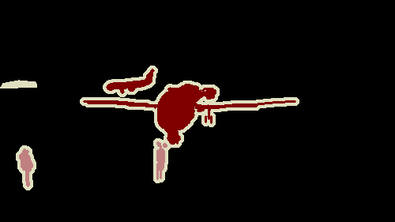

<div id="toc">
Contents
</div>
* TOC
{:toc}
----------

몇가지 이유에 의해, 데이터셋을 Drone aerial images에서 pascalvoc으로 바꿨습니다.
- FCN을 직접 코딩해 봤는데, 이미지가 너무 크고 (6000 by 4000), 너무 적어서 (400장), 훈련이 잘 되지 않습니다
- 이후에 나온 모델들의 코드를 따서 돌려본 결과, training이 안되지는 않는데 너무 느려서 뭘 할수가 없습니다.
- 결정적으로, 다른사람들의 실험결과가 많지 않아 결과를 비교하기가 어렵습니다

이후에 나올 큰 모델들은 다시 큰 데이터셋으로 돌아가겠지만, 이 프로젝트의 초반부 데이터셋은 PASCALVOC 2012로 바꾸기로 했습니다. 특히 이제부터는 pl-lightning을 사용합니다.

## PASCALVOC 2012
PASCALVOC은 Pascal Visual Object Classes Challenge의 약자로, ImageNet과 함께 초기 Computer vision의 역사를 견인해왔다고 해도 과언이 아닌 데이터셋입니다. Image classification, semantic segmenation 등 많은 태스크에 사용할 수 있는 수천 장의 이미지가 준비되어 있고, `torchvision` 에도 내장되어 있어서 사용하기 편리합니다. 

지난 포스팅과는 달리, 이번에는 데이터셋을 받아다가 써야 하기 때문에 구현할 내용이 조금 적습니다.

```py
# datautils.py
from torchvision.datasets import VOCSegmentation

class PascalVOCDataset(VOCSegmentation):
    def __getitem__(self, idx, task='semantic'):
        img = np.array(PIL.Image.open(self.images[idx]).convert('RGB'))
        mask = np.array(PIL.Image.open(self.masks[idx]))
        mask[mask == 255] = 0
        t = T.Compose([T.ToTensor(), T.Normalize(mean, std)])
        img = t(img)
        mask = torch.from_numpy(mask).long()
        return img, mask

def load_pascalVOC_dataset():
    train_set = PascalVOCDataset("../dataset/PASCALVOC", year='2012',image_set='train')
    train_loader = DataLoader(train_set, batch_size=batch_size)
    testval_set = PascalVOCDataset("../dataset/PASCALVOC",year='2012',image_set='val')
    val_set, test_set = torch.utils.data.random_split(testval_set, [449, 1000])
    val_loader = DataLoader(val_set)
    test_loader = DataLoader(test_set)
    return train_loader, val_loader, test_loader
```
다른 부분들은 거의 그대로 코드가 읽어지기 때문에 별로 논의할 게 없습니다. 1,464장의 training image를 이용해서 학습하고, 449장을 validation에, 1000장을 test에 사용하겠습니다. 

딱 하나 특이한 부분은 `mask[mask == 255] = 0` 입니다. 이부분은, PascalVOC 데이터가 어떻게 생겼는지를 보면 알 수 있습니다.

  
{: .text-center }

이 그림은 데이터셋에 들어있는 정답 (ground truth) 이미지 중 하나인데, 보다시피 이미지 외곽선에 하얗게 5픽셀 두께의 선이 따져 있는 것을 볼 수 있습니다. 이는 나중에 contour detection에 관한 문제를 풀고자 할 때 매우 유용하게 쓰이겠지만, semantic segmenation을 할 때는 저 부분이 조금 불편합니다. 특히, 저게 내부 라벨값이 255라서 저희 이후 코드에 적용하기가 불편하기 때문에, 저기까지 0으로 밀어버리겠습니다. 

## Data Augmentation
[Data augmentation 포스팅](/deep-learning-study/data-augmentation) 에서 설명한, data augmentation을 적용합니다. 이를 쉽게 해주는 `albumentation` 라이브러리를 사용하겠습니다. 위 코드에서 몇 줄만 추가하면 됩니다. 

```py
from torchvision.datasets import VOCSegmentation

class PascalVOCDataset(VOCSegmentation):
    def __getitem__(self, idx, task='semantic'):
        img = np.array(PIL.Image.open(self.images[idx]).convert('RGB'))
        mask = np.array(PIL.Image.open(self.masks[idx]))
        mask[mask == 255] = 0
        if self.transforms is not None:
            aug = self.transforms(image = img, mask = mask)
            img = PIL.Image.fromarray(aug['image'])
            mask = aug['mask']
        t = T.Compose([T.ToTensor(), T.Normalize(mean, std)])
        img = t(img)
        mask = torch.from_numpy(mask).long()
        return img, mask

def load_pascalVOC_dataset():
    t_train = A.Compose([A.Resize(height=image_H, width=image_W, interpolation=cv2.INTER_NEAREST),
                         A.HorizontalFlip(), A.VerticalFlip(),
                         A.GridDistortion(p=0.2), A.RandomBrightnessContrast((0,0.5),(0,0.5)),
                         A.GaussNoise()])
    t_test = A.Compose([A.Resize(height=image_H, width=image_W)])
    train_set = PascalVOCDataset("../dataset/PASCALVOC", year='2012',image_set='train',transforms=t_train)
    train_loader = DataLoader(train_set, batch_size=batch_size)
    testval_set = PascalVOCDataset("../dataset/PASCALVOC",year='2012',image_set='val',transforms=t_test)
    val_set, test_set = torch.utils.data.random_split(testval_set, [449, 1000])
    val_loader = DataLoader(val_set)
    test_loader = DataLoader(test_set)
    return train_loader, val_loader, test_loader
```

사용하는 augmentation 기법은 축에 대한 반전, gaussian noise, 랜덤한 밝기 조절 등입니다.