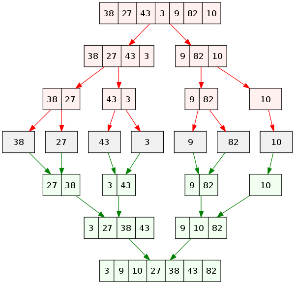

Contents

* TOC
{:toc}
----------

우리의 목표는, $n$개의 원소를 가진 배열을 정렬하는 것입니다. 편의상,
다음과 같은 사실을 가정합니다.

-   정렬은 작은 것부터 큰 것 순서로 늘어놓는 것을 말합니다. ex) 1, 2, 3,
    4, 5

-   $n$개의 원소에 대한 사전 정보는 전혀 없습니다.

-   $n$개의 원소는 모두 Random-access 가능한 형태로 저장되어 있습니다.
    [^1]

## Slow Sorting Algorithm

자연스럽게, 정렬을 처음 생각하면 보통 $\order{n^2}$ 알고리즘을 생각하게
됩니다. 여기서는 비교적 간단하지만 유용한 Insertion sort 에 대해서만
알아보겠습니다. 한번 for loop을 실행할 때마다, 새 원소의 올바른 자리를
찾아 준다고 생각하면 됩니다.

    int key, j;
    for(int i = 1; i < size; i++) {
        key = array[i];
        j = i;
        while(j > 0 && array[j-1]>key) {
            array[j] = array[j-1];
            j--;
        }
        array[j] = key;
    }

이 알고리즘을 잘 살펴보면, 다음과 같은 사실들을 확인할 수 있습니다.[^2]

-   Stable : 같은 원소 두 개, 즉 $x_1$ 과 $x_2$ 가 있을 때, 이 둘의
    순서가 정렬 후에 바뀌지 않습니다. 이게 왜 필요하냐면, 이름 순으로
    정렬된 사람의 목록을 나이 순으로 정렬한 다음에도, 같은 나이인
    사람들끼리는 이름순으로 정렬되어 있음이 보장된다는 뜻입니다.

-   In-place : 추가적인 메모리를 거의 소모하지 않습니다. 정의에 따라
    다르지만, $O(n)$ 보다 작은 추가 메모리를 소모한다는 의미로
    받아들이기도 합니다.

-   Adaptive : 좋은 데이터가 주어지면, 그 성질을 활용해서 정렬을 더 빨리
    끝낼 수 있습니다. [^3]

## Fast Sorting Algorithms
### Heap Sort

Heap 이라는 자료구조를 이용하는 정렬 방법으로, 나중에 Heap을 다룰 때 공부할 예정입니다.

### Merge Sort

Merge sort (합병 정렬) 은 대표적인 Divide and Conquer 알고리즘입니다. 이
분할 정복 방법론 자체는 나중에 본격적으로 다루겠지만, 간단히 말하자면
다음과 같습니다.

-   큰 문제를 한 번 푸는 대신, 이를 작은 문제로 나누어서

-   각각의 작은 문제를 풀고

-   이 작은 문제의 결과들을 합치는 방법

앞서 공부한 Master theorem을 이용하여, 이러한 유형의 알고리즘들이 왜 더
빨라지는지, 어떻게, 얼만큼 더 빨라지는지 이해할 수 있습니다. 여기서
주목할 만한 점은 크게 두 가지입니다.

-   작은 문제로 나누어 풀고 합치는게 정말 더 빠른가?

-   작은 문제는 어떻게 푸는가?

1번 질문의 답은, Master theorem이나 이를 확장한 정리를 이용해 답하면
됩니다. 2번 질문은, 작은 문제가 큰 문제와 같지만 $n$만 작아진 버전이라는
사실에 주목하여, **더 작은 문제** 로 나누어서 더 작은 문제를 풀고, \....
하면 됩니다. 간단히 말해서, **푸는 방법이 자명해질 때까지** 문제를
줄이면 됩니다! 예를 들어, 정렬의 경우 배열의 원소가 2개 남으면, 자명하게
해결할 수 있습니다. [^4] 이제, Merge sort의 구체적인 방법을 생각해
봅시다.

-   배열을 두개로 나눕니다.

-   각각의 배열을 Merge sort 합니다.

-   정렬된 두 배열을 합칩니다.

  

시간 복잡도를 생각해 봅시다. $n$개의 원소를 가진 배열을 정렬하는데
$T(n)$ 의 시간이 걸린다면, 두개로 나누어 각각을 정렬하는데 한번에
$T(n/2)$ 씩 2번이 필요할 것입니다. 이제 정렬된 두 배열을 합치면 됩니다.\
합치는 과정은, 두 배열이 이미 정렬되어 있음을 이용합니다. 두 배열 각각의
시작점을 표시하고, 더 작은 쪽을 챙기고, 챙긴 원소를 빼는 방법으로
생각하면 됩니다. 구현을 처음 해본다면 상당한 주의가 필요하지만,
$\Theta(n)$에 가능하다는 것은 쉽게 이해할 수 있을 것입니다.\
따라서, $T(n) = 2T(n/2) + \Theta(n)$이고, 이를 마스터 정리로 풀면
$T(n) \in \Theta(n \log n)$ 을 얻습니다.

### Quick sort

Quick sort는 비슷하게 Divide and Conquer 방식을 이용하는 알고리즘으로,
더 간단하게 설명할 수 있습니다. 다음 세 줄이면 충분합니다.

-   적당한 Pivot을 고릅니다.

-   Pivot보다 작은 원소는 왼쪽으로, 큰 원소는 오른쪽으로 보냅니다.

-   Pivot의 좌우에 대해 반복합니다.

이 과정을 반복하여 전체 배열을 정렬하는 방법입니다. 이 방법이 왜 Quick
이라고 불리냐면, 실제로 돌려보면 평균적으로 Merge나 다른 정렬보다 빠르기
때문입니다. 그러나 이 방법에는 치명적인 문제가 있습니다.\
적당한 Pivot을 어떻게 고르느냐에 따라, 알고리즘의 성능이 크게
좌우됩니다. 이 알고리즘의 성능은, Pivot보다 작은 원소가 $k$개, 큰 원소가
$n-k-1$개라고 할 때, $T(n) = T(k)+T(n-k-1)+\Theta(n)$ 형태로 나타난다는
사실을 어렵지 않게 알 수 있습니다. 모든 지점에서 $k = 0$이라면, 즉 운이
매우 없어서 / 또는 데이터가 매우 불리하게 주어져서, 매번 가장 작은
원소가 Pivot에 걸린다면 수행 시간이 $\Theta(n^2)$가 됩니다. 이를 막기
위해서는, 비교적 중간값에 가까운 Pivot을 골라야 합니다. 그러나 이것은
필연적으로 Pivot 고르는 시간을 필요로 하게 됩니다. 크게 다음의 방법이
**주로** 쓰입니다.

-   Random : 배열의 **임의의** 원소를 씁니다.

-   Median-of-3 (9) : 3 (9)개를 임의로 뽑아 보고, 그중 중간값을
    Pivot으로 씁니다.

### Hybrid Sort

Quick sort는 $n$이 작을 때 상대적으로 느립니다. 반면, $O(n^2)$ Sorting
algorithm들은 단순하기 때문에 $n$이 작으면 매우 빠릅니다. 그래서, Hybrid
sort 라고 해서, Quick sort 같은 알고리즘을 쓰다가 원소의 개수가 적어지면
[^5] Insertion으로 마무리하는 알고리즘이 있고, 이것의 성능이 단순
Quick보다 훨씬 좋습니다.

## Selection Algorithms

우리의 다음 목표는, $n$개의 원소 중 $k$번째로 큰 원소를 찾는 것입니다.
이것을 'selection', 선택 문제라고 부르기로 합니다. 잠깐 생각해 보면,
정렬하고 나면, $\order{1}$ 에 선택 문제를 풀 수 있으므로, 선택 문제에
대한 알고리즘의 후보로 정렬을 쓸 수 있습니다. 다시 말해, 선택 알고리즘은
적어도 정렬보다는 쉬운 문제 (Computationally, 시간 복잡도가 같거나 더
작은 문제) 일 것이라는 생각을 할 수 있습니다. 구체적으로, 우리는 어떤
$k$에 대해서든, $\order{n}$에 해결하고 싶습니다. 가장 작은 원소, 가장 큰
원소 등은 $\order{n}$에 찾을 수 있음이 자명하기 때문입니다.

### Quickselect

Quickselect algorithm은 Quicksort를 응용한 방법입니다. 먼저, Quicksort
알고리즘을 크게 다음과 같이 정리합시다.

-   Partition : pivot을 기준으로 좌우로 원소들을 분할하는 작업.

-   Recursive Quicksort $\times 2$

이제, 생각해 보면, Partition을 똑같이 해보고 나서, 왼쪽 또는 오른쪽 중에
어느 쪽에 우리가 원하는 $k$번째 원소가 있는지를 알 수 있습니다. 예를
들어, 10개의 원소가 3개-pivot-6개로 나누어져 있고, 우리가 7번째 작은
원소를 원한다면, 왼쪽은 버리고 오른쪽에 대해서만 재귀적으로 들어갑니다.
즉, 오른쪽 part에 대해 3번째로 작은 원소를 고르면 됩니다. (5, 6, 7, 8,
9, 10 중 3번째를 고른다는 의미)\
이 방법은 정말 빠를까요? 얼마나 빠른지를 생각해 봅시다. 만약에, 한번
실행마다 절반씩 원소를 줄일 수 있다면 (최적의 Partition), $n$, $n/2$,
$n/4$ $\dots$ 에 대한 Partition만 하면 끝나므로, 이를 무한급수로
생각하면 $2n \in \order{n}$ 시간에 해결할 수 있습니다. 즉, Pivot을 잘
고르면 $\order{n}$ 시간에 해결할 수 있음을 의미합니다. 그러나, Quick
sort와 마찬가지로, Pivot을 계속 못 고르면 $n^2$ 시간이 걸릴 수도
있습니다. 이런 알고리즘에 어떤 의미가 있는지는 문제 iv 번을 참고하세요.

### Worst-Case Linear Selection

우리의 목표에 있어서 별로 중요하지 않기 때문에, 매우 간단하게만
설명하겠습니다. 아이디어는 약간의 시간을 써서 Quickselect의 pivot이
나쁘지 않게 하는 것입니다. [^6]

1.  전체 $n$ 크기의 배열을, $n/5$개의 5개짜리 배열로 나눕니다.

2.  5개짜리 배열 각각의 중간값을 찾습니다.

3.  $n/5$개의 수들 중, 중간값을 재귀적으로 구합니다.

4.  이제, 이 수를 $M$이라고 합시다. 이 수는 **중간값들의 중간값**입니다.

5.  이 $M$을 pivot으로, Partition합니다.

이 방법이 정말 빠를까요? (Additional 5 참고)

## Additional topics and Problems 

1.  (Almost-Sorted) Insertion sort의 Adaptive한 성질을 더 생각해 봅시다.
    구체적으로, $n$개의 원소를 가진 배열에서, 각 원소가 sorting된
    자리에서 $k$ 자리 이상 벗어나 있지 않음이 보장되어 있다고 가정하고,
    Insertion sort가 $O(nk)$에 정렬을 완료함을 보이세요.

2.  STL의 sort가 어떻게 구현되어 있는지 찾아보세요.

3.  (Tip) C++ sort의 comparator란, 두 원소의 크고 작음을 비교하는 기준을
    제공하면 이를 기준으로 정렬해 준다는 의미입니다. 예를 들어, 두
    String을 길이를 기준으로 정렬할 수 있습니다. 유용하니 반드시 익히길
    권합니다. Comparator는 (이산수학을 수강했다면) strict partial
    order여야 합니다.

4.  다음 조건 하에서, 흐름을 따라가며 Quick sort의 시간 복잡도가 average $O(n \log n)$ 임을 보이세요.

    -   입력은 임의의 중복 없는 수열.

    -   즉, 위 설명에서, $k$가 0부터 $n-1$까지의 임의의 수일 확률이 모두
        일정하다.

    이때, Average의 개념을 생각하면, $T(n)$ 에 대한 평균은
    $$T(n) = \frac{1}{n}\left(\sum_{k = 0}^{n-1} T(k)+T(n-k-1)\right) + \Theta(n)$$
    이 식을 어떻게 계산할지 생각해 보세요. 다양한 방법이 있습니다.\
    거의 비슷한데, Quick select 알고리즘의 평균 시간 복잡도가 $O(n)$
    임을 보이세요. 다시 말해,
    $$T(n) = \frac{1}{n} \left(\sum_{k = 0}^{n-1} \max\{T(k), T(n-k-1)\}\right) + \Theta(n)$$
    이 식을 계산해 보세요.\
    **힌트** : $T(n) \in O(f(n))$ 을 증명하는 방법으로, 수학적 귀납법을
    생각해 보세요. $n$보다 작은 $m$에 대해, $T(m) \leq cf(m)$ 인 상수
    $c$가 존재한다고 가정하고 $n$에 대해서도 성립함을 보입니다.

5.  Quick sort에서 각 과정에서 항상 좌우의 배열 크기가 1:9로
    나누어진다고 가정하고, 시간 복잡도를 계산해 보세요. 1:99, 1:999에
    대해서도 생각해 보세요.

6.  (제약의 중요성) 맨 앞 장으로 돌아가, **가정**을 보세요. 모든 수가
    -100만부터 +100만까지라는 사실이 주어져 있을때, $n$개의 수가 주어질
    때 $O(n)$에 정렬할 수 있는 방법을 제시하세요.

    힌트 : 이 방법을 **Counting Sort** 라고 부릅니다.

7.  앞서 제시한 Linear-Time Selection 알고리즘이 정말 Linear-time
    selection을 보장함을 보이세요.

8.  **(Sorting Lower Bound)** Decision tree에 대해 찾아보고, Worst
    case에 $O(n \log n)$ 보다 좋은 비교 기반의 정렬 알고리즘이 없음을 납득하세요. 이를 Sorting lower bound라고 부릅니다. (6번에서 다룬 Counting sort는 비교 기반 정렬이 아니므로 (< 연산의 결과를 쓰지 않습니다) 이 내용과 상관 없습니다)

## Programming Practice

1.  STL의 도움을 전혀 받지 말고 (필요하다면 벡터 정도까지는 써도 됩니다)
    편한 방법대로 quick sort와 merge sort를 구현해 보세요. Baekjoon OJ의
    2751번에 제출해서 구현을 확인해 보세요.

2.  Quickselect를 구현해서 Baekjoon OJ의 11004번에 제출하고, 시간 초과를
    받았다면 개선해 보세요. [^7] Worst case linear selection을 구현해
    보세요.

3.  BOJ 11650, 11651을 통해 STL의 sort 함수 사용법을 익히세요.

[^1]: Small exercise) Asymptotic analysis를 이용하여, 이 가정이
    불필요함을 보이세요.

[^2]: 직접 확인해 보세요.

[^3]: Additional 의 i 를 참고하세요

[^4]: 한 줄로, 한번에 풀 수 있을 때까지 나누면 된다고 생각하기 쉽습니다.
    사실은, 충분히 빨리 풀 수 있는 방법이 있다면 굳이 그럴 필요는
    없습니다.

[^5]: Typically, 8, 16, 32, 64 정도 값을 택합니다.

[^6]: 목표는 **좋게** 가 아니라 **나쁘지 않게**. (Additional 5) 참고.

[^7]: 항상 Worst case에 대비하는 mind를 준비하세요! ㅋㅋ
