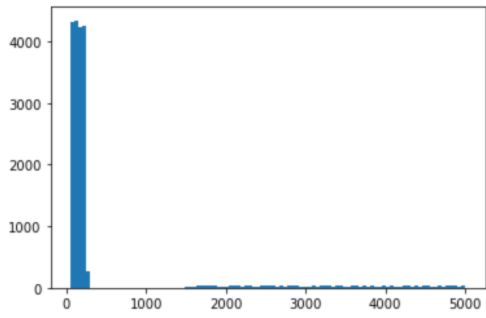

To improve my English writing, I will try writing this post in English

Disclaimer : A large portion of this post is based on my personal opinion. Also, I do not mean to blame any of our teammates by writing about their mistakes (which mine looked biggest anyway). My teammates were wonderful and I am sincerely grateful to study with them.

<div id="toc">
Contents
</div>
* TOC
{:toc}
----------

We (Team Little Piplup @ SNU) managed to reach world #106 (out of 9000+ teams), Korea #4 at Google Hashcode 2022 Preliminaries. 

As I did last year ([Link](/cp-rounds/Hashcode-2021-prelim)), this post consists of two parts : "Our preparation" and "During the contest". This post is the latter, which we share our preparation, approaches and frustrations during contest. First part is [Here](/cp-rounds/Hashcode-2022-prep/)

## Results
```
A - An Example             33
B - Better Start Small     743,841
C - Collaboration          153,754
D - Dense schedule         91,424
E - Exceptional skills     1,606,884
F - Find great mentors     745,793
TOTAL SCORE                3,341,729
```

## What we planned for Hashcode 2022
From last two years experience (2020, [2021 Hashcode](cp-rounds/Hashcode-2021-prelim/)), we had several thoughts regarding in-contest strategies. 
- We agreed not to try implementing local checker if problem is complicated. Last year, I had a painful hour implementing simulation code, which we had to reimplement in C++ anyway. Implementing checker and script in python allows us for fine-tuning the solution, especially 'magic constants'. However in 4 hour contests, we thought coming up with meaningful idea is much more significant to overall result.
- `Dlwocks31` will try writing 'template code' with bare minimum baseline greedy, on which we can try different ideas and compare to. 
- For the first hour or so, while `Dlwocks31` writes baseline code, other 3 will analyze the data for any insight. 
- Although we met in person, we planned to use git for sharing code, google docs for writing down what we found from data, slack for sharing quick memos. 

## About the problem
[`Problem Statement`](https://codingcompetitions.withgoogle.com/hashcode/round/00000000008caae7/000000000098afc8)

- `Projects` and `Employees` are given.
- `Employees` have set of `(skill, skill_level)` pair
- `Projects` have set of `roles`, which is also `(skill, skill_level)` pair
- For employee to participate in project, employee must fill one and only one role in project
- If all roles are filled, project is started. Project gets finished in some days, which then some score is given.
- Our goal is to get highest score as possible, by finishing projects.
- Projects have best before date, which project value starts to diminish after that date.

`Learning and Mentoring`
- If employee has skill level $x$ and he fills role which requires level $x$, employee `learns` and his skill gets a level-up. 
- Employee can do one level higher than his level, if another employee can `mentor` him. In this case mentee gets a level-up.


## General Strategy
It looks obvious that 'if same task can be done, learning/mentoring gives additional bonus'. For example, consider a project 'A' requiring level 2 C++ and level 3 Python. Employee X has level 1 C++ and level 3 python, while employee Y has level 2 C++ and level 2 python.
- If X does Python and Y does C++, project can be done.
- If X does C++ (with mentoring of Y) and Y does Python (with mentoring of X), not only project can be done, but both employee get a levelup for their roles. This additional levelup can open some new possibilities in the future without harm.

## In contest timeline
### 000 - 060 min : Understanding problems and data
After short period of time parsing the problem statement, as we discussed before contest, `Dlwocks31` started implementing boilerplate code. Baseline is built with following strategy.
- We wanted the projects with short best-before date to be done first, since their score will decay in the future. We noticed that there is no 'fixed time limit' to do any projects, so projects with very late best before day can be postponed.
- Greedily, we will simulate the time-series of events. For each $t$, we will try to allocate some employees to some project, prioritizing the project with shorter best before date.
- For some reason, `Dlwocks31` had initial idea to simulate as 
```
For each person, if he is not working on something
  Try allocating him to some role in some project
    If the project is full (good to go), start the project
```
Now we think that more obvious way is to simulate as 'for each project, try allocate people' order. But here nobody actually noticed this.

While he worked on the code, we started to analyze data. We tried to print 'score distributions of each tasks' and something similar.

Our first submission resulted in `{B : 7950, D : 741}` with completing only one or two projects completed :(

### 060 - 120 min : Greedy simulation 
We noticed several insights. 
- Without learning or mentoring, task very much looks like a bipartite match (or max-flow) problem. I tried to work on this reduction for quite a long time, but it seemed nontrivial and I wasn't sure if we can additionally implement learning/mentoring in the flow-like solution.
- There must be some cases where without mentoring, later projects cannot be done. If these projects are more valuable, learning can actually be crucial.

After first submission, I took the code and fixed the loop-order issue. Here I made a horrible mistake, storing roles {skill, level} as key-value pair in `std::map<string, int>` for each project. This only works if for each project, one skill is required only once - that means, if a project requires "level 2 C++, level 1 python, level 3 C++" my code will not notice this and fail. 

At this time I had no idea about this, and for about 40 minutes I tried to fix the greedy strat. At about 120 minutes, we were able to get 33K for both D and E, with 0.4 M for B. (Total score about 0.5M)

### 120 - 160 min : Implementing Learning
`DHDroid` managed to solve the implementation issue, with learning implemented (but not mentoring).

Our greedy solution finally was successful, with 1.6 M for case E. (Total score about 2.4M)

At 60min, we took a glance at leaderboard and found out that the team `Past Glory` achieved 2.4M score in an hour. This worked as some implicit milestone for us. ("Yes we know that past glory is a world-class team, it is kinda sad if we cannot reach their first-hour score in 4h...") And our score right before scoreboard freeze was about 2.4M.

For case F, this strategy gave us about 0.45M (this result came right after scoreboard froze, so actually we got 2.85M before freeze). By looking at what `Coffeetea` and I analyzed (score distribution)

<br>

`Dlwocks31` suggested to ignore less valuable projects in testcase F and focusing on the tail side. 

We tried that strategy and managed to squeeze about 100K points.

### 160 - 225 min : Final sprint
`DHDroid` and `Dlwocks31` worked together on F, while I tried to come up with something that can deal with mentoring. 

For case F, we tried to implement 'measuring project values' by considering 'if we start this project right now, how much score we can earn' and 'how long does this take'. This gave us about 200K additional points, which in total we surpassed the 3M line. 

Despite our best effort, we were not able to implement `mentoring` in time. We focused on finding bug in `DHDroid`'s implementation, but we weren't able to. 

### After Contest
Try locating a implementation mistake in this fragment of our solution. Hidden in 200 lines of code, all of us were unable to locate this in about 20-30 minutes.
```cpp
for(auto &proj: projects) {
    if(proj.best_before + proj.score < ctime) continue;
    if(proj.started_running()) continue;
    vector<pair<role*, contributor*>> assigned_cons;
    bool completed = true;
    vector<int> mentored{int(proj.roles.size()), 0};
    for(int idx=0; idx<proj.roles.size(); idx++) {
        auto& role = proj.roles[idx];
        //...
```
> `vector<int> mentored{int(proj.roles.size()), 0};`  

What we intended is a vector of zeros with length `proj.roles.size()`. What we get from this code is a vector of length two with those two elements. This wasn't the only thing we missed, but this was what killed us.

Even worse is that while watching the broadcast, we found this bug. :( [^1]

## In retrospect
We had a ton of fun as we did last year. Our results (106th worldwide, 4th in korea) is better than last year!

- However, I think that for the last two year problems required too much implementation. We don't have time to deeply think about the algorithmic nature - we have to laser focus on finding one working idea and implementing simulation. As far as I know, in 2020 and before problems were less like this. Something like [link to Tourist's comment on 2020 Hashcode](https://codeforces.com/blog/entry/73710?#comment-582218) was why I loved Hashcode. Still, those kind of ideas seem to be what distinguishes WF level team with others. After contest is over, in codeforces there seems to be some discussion about case D and F. [Solution of user Psycho@CF](https://codeforces.com/blog/entry/100289?#comment-890265) looks impressive, and aligns with what hashcode is all about (at least what I think).

- One person just start implementing boilerplate code seemed like a reasonable idea, but it seems to work only after we agree on several aspects of code (core logic part). Without such consideration, we had some difficulty because of how other teammates had inconsistent understanding of problems. 

KUDOS to both my teammates and hashcode team who prepared an exciting experience, and wish some good luck for two Korean teams participating on the Hashcode WF :)

---

[^1]: Fixing this bug about half an hour after contest gave us some score, which was about 50th worldwide. 