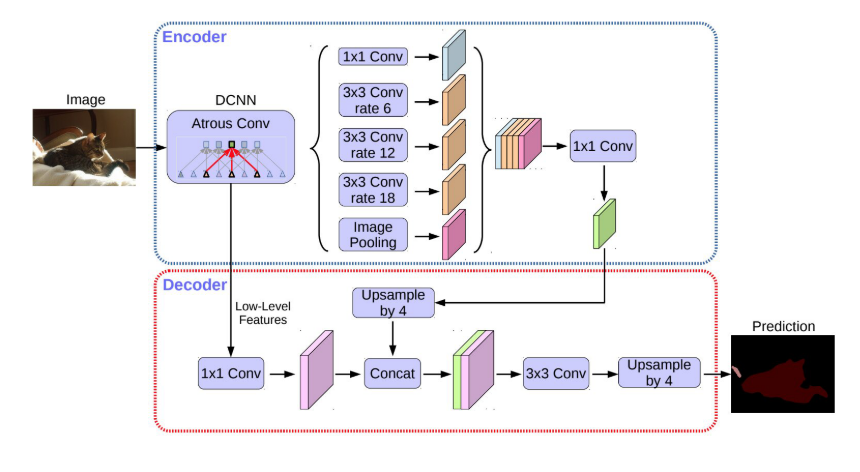

Contents

* TOC
{:toc}
----------

이 글의 상당 부분은, 서베이 논문인 Minaee, S., Boykov, Y., Porikli, F., Plaza, A., Kehtarnavaz, N., & Terzopoulos, D. (2020). Image Segmentation Using Deep Learning: A Survey. IEEE Transactions on Pattern Analysis and Machine Intelligence, 1–22. https://doi.org/10.1109/TPAMI.2021.3059968 을 정리한 내용입니다. 

## 문제 소개 
Semantic Segmentation이란, Computer Vision 분야의 대표적인 task중 하나로, 간단히 요약하자면 

**이미지가 주어졌을 때**, 그 이미지를 픽셀단위로 **어떤 대상인지** 를 분류해내는 문제입니다.

  
출처 : Stanford cs231n slides 

이 사진은 대표적인 네 가지의 task를 비교한 것인데, 굉장히 직관적으로 무슨 의미인지 알 수 있습니다. 

## 활용 
Semantic segmentation은 딱 느낌에도 매우 유용할 것 같은데, 대표적인 활용처 몇개를 생각해보면...
- 자율 주행 : 자율주행에서 지금 눈앞에 보이는 것이 도로인지, 흙바닥인지, 물웅덩이인지를 판단하는 작업은 굉장히 중요합니다. 
- 의료 이미지 : CT 사진에서, 각 고형장기를 분류한다거나, 정상조직과 비정상조직을 구분하는 작업도 결국은 segmentation에 기반합니다. 
 

## 개요 
여기서는 정말 대략적인 아이디어를 한줄로 정리하고, 개별 네트워크 구조에 대한 포스팅을 통해 전체 내용을 붙여나가려고 합니다. 

이 이미지가 개인지, 고양이인지를 판단하는 Classification의 경우, 통상적으로 convolutional neural network (CNN) 에 기반한 방법들을 사용합니다. 사진 전체의 정보를 인코딩한 $3 \times W \times H$ 텐서를 가지고 시작해서, Convolution layer를 거치면서 정보들을 추출하고, 마지막에 fully connected layer를 붙여서 실제로 클래스를 구분해내는 식으로 진행하게 되는 것입니다.

이 방법을 semantic segmentation같은 문제에서 적용하기 어려운 이유는, 마지막 fully connected layer가 기하적인 위치정보를 다 날려버리기 때문입니다. 즉, '고양이가' 있다는 정보는 어떻게 분류해볼 수 있을지라도, 고양이가 '어디에' 있는지에 대해서는 전혀 알 수가 없게 됩니다. 그렇기 때문에 fully connected layer를 쓸 수 없습니다.

이를 개선하기 위해 나온 아이디어로, 마지막 정보를 Fully connected로 처리하는 대신 $1 \times 1$ Convolution을 쓰는 방법을 생각해 볼 수 있습니다. Convolution은 위치정보를 어느정도 보존할 수 있다는 점에서 착안한 아이디어인데, 이는 2016년에 **Fully Convolutional Network (FCN)** 이라는 이름으로 발표되었습니다. 여기에 추가로 Conditional Random Field, Markov Random Field 등의 모델들을 적용하면 더 높은 정확도를 얻을 수 있다고 합니다. 

  

CNN에서는 Convolution과 함께 Pooling을 반복하기 때문에, 갈수록 feature map의 크기가 줄어들게 됩니다. 그런데 우리는 각 픽셀단위로 어떤 클래스인지를 찾아내는 것이 목표이기 때문에, 다시 feature map의 크기를 원본 이미지 크기만큼 키워야 합니다. 이를 위해 다양한 방법들이 있는데, FCN에서는 skip connection / upsampling 이라고 해서, 네트워크를 타고 흐르는 중간의 정보를 뽑아다가 최종 정보와 함께 사용하는 방식을 사용합니다. 

  

CNN에서 사용하는 개념 중, feature map의 크기를 거꾸로 늘리게 되는 deconvolution이라는 연산이 있습니다 (convolution의 계산적인 inverse이긴 한데, 정확한 inverse는 아닙니다. transposed convolution이 좀더 정확한 말인데, 이 부분도 나중에 다루겠습니다). CNN을 타고 feature map의 개수가 줄어들었다는 것이 문제가 된다면, 다시 deconvolution을 그만큼 거꾸로 돌려서 feature map을 돌이켜주면 되지 않을까요? 이를 **Encoder-Decoder** 형태의 구조라고 부르며, **U-Net** 을 필두로 (이 이름은, 말그대로 convolution과 deconvolution을 U자형으로 쌓아서 붙여진 이름입니다) 여러 모델들이 성공적인 결과를 보여주었습니다.

  

Convolution에서 pooling을 통해 정보를 잃다가 다시 이걸 만들어주는 것 대신, 처음부터 feature map의 크기를 줄이지 않으면 어떨까요? 그렇다고 pooling을 아예 하지 않을 수는 없는데, 필터의 크기가 크면 연산이 너무 많아지는 데다가 learning capacity가 너무 커지는 현상들이 발생하기 때문입니다. 이런 문제를 어느정도 해결하는 Dilated convolution은 Convolution을 할 때부터 적당히 필터에 제로 패딩을 붙여줌으로써, 공간적인 정보를 잃지 않고 feature map의 크기를 유지해 줍니다. 이 연산을 이용하여 (원래의 upsampling과 함께 쓰긴 합니다) Dilated Convolutional Model 들이 개발되었는데, 대표적으로 Google의 **DeepLab** 를 예시로 들 수 있습니다. 

  

우선은 FCN, U-Net, DeepLab을 필두로 정리를 시작해 보려고 합니다. 