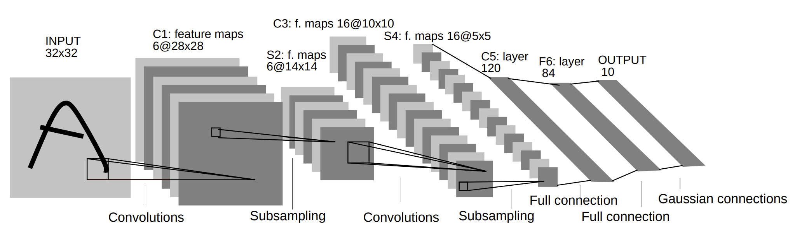

<div id="toc">
Contents
</div>
* TOC
{:toc}
----------

**심층 신경망의 수학적 기초** 8강 (10월 5일) 에 기반합니다.

[MLP로 MNIST 풀어보기](/deep-learning-study/mnist-mlp/)의 코드와 [CNN 기초](/deep-learning-study/convolutionary-neural-networks/) 내용에 이어지는 포스팅입니다.

## LeNet 모델 
여기서는 LeNet-5 모델에 대해 간단히 살펴봅니다.

LeNet은 거의 최초의 CNN을 이용한 image classification 모델이라고 할 수 있습니다. Turing award 수상자이며, 사실상 CNN의 아버지 격인 Yann Lecun의 연구팀이 1998년에 개발하였고 그 이름을 따서 LeNet이라는 이름을 갖게 되었습니다. "Gradient Based Learning Applied to Document Recognition" 라는 제목의 논문으로 발표되었는데, 제목에서 알 수 있듯 본래 손글씨로 쓰인 글자를 구분하는 task를 해결하기 위해 개발되었습니다. 

  

이 구조는 LeNet의 전체적인 모델입니다. [CNN 기초](/deep-learning-study/convolutionary-neural-networks/) 에 있는 각 레이어별 설명을 모두 이해했다는 가정하에, LeNet의 '선택' 만 살펴보겠습니다.
- 첫 레이어는 $5 \times 5$ Convolution filter 6개를 사용합니다.
- Subsampling은 average pooling을 사용하고
- Activation function으로는 tanh의 약간 변형된 형태를 사용합니다. 
- 재밌는 점은 C3 Layer가 일반적인 convolution이 아니라는 점입니다. 원본 논문에 의하면, symmetry를 깨기 위해서 S2->C3 convolution을 할 때, 6개 채널 전부가 아닌 채널 일부만 사용해서 convolution을 수행합니다. 
  이와 같이, 0번째 컨볼루션은 0, 1, 2 채널만 쓰고... 하는 방법입니다. 
- Fully connected layer를 2번 탄 다음, 마지막에는 Gaussian connection이라는 조금 복잡한 방법을 사용합니다. 후술할 이유로 인해 자세히 설명하지는 않겠습니다. 

그러나 이어진 후속연구에 의해, 꼭 이런 design choice를 지킬 필요가 없음이 알려졌습니다. 구현의 단순함과 성능을 위해 모델을 조금 수정해서 다음과 같이 구현하겠습니다.
- Subsampling에는 avg pooling이 아닌 max pooling을 사용합니다.
- Activation으로 ReLU를 사용하겠습니다.
- 굳이 Symmetry를 이런 방법으로 깨지 않아도, initialization을 잘 하면 상관 없다고 합니다. Symmetry-breaking connection은 버리겠습니다.
- Gaussian connection도 하지 않아도 됩니다. 그냥 Fully connected layer로 충분하다고 합니다. 

## 구현 
구현은 [MLP로 MNIST 풀어보기](/deep-learning-study/mnist-mlp/) 와 크게 다르지 않습니다. 

MNIST 데이터 로딩하는 부분의 코드를 그대로 가져옵니다. 
```py
import torch
import torch.nn as nn
from torch.optim import Optimizer
from torch.utils.data import DataLoader
from torchvision import datasets
from torchvision.transforms import transforms

train_set = datasets.MNIST(root='./mnist_data/', train=True, transform=transforms.ToTensor(), download=True)
test_set = datasets.MNIST(root='./mnist_data/', train=False, transform=transforms.ToTensor(), download=True)
train_loader = DataLoader(dataset=train_set, batch_size=1024, shuffle=True)
test_loader = DataLoader(dataset=test_set, batch_size=1, shuffle=False)
device = torch.device("cuda" if torch.cuda.is_available() else "cpu")
```

이제, LeNet 모델을 정의합니다. Convolution 연산을 쓴다는것 외에는 여전히 다른점이 없습니다. 

모델의 정의가 위 그림과 다른점이 하나 더 있는데, 그림에서는 첫 layer에 패딩을 쓰지 않는 대신 이미지 크기가 32 by 32였지만, 우리가 가진 MNIST 데이터는 28 by 28이기 때문에 첫 레이어에서 패딩 2를 넣어 줍니다. 이후에는 위 설명과 똑같습니다. Optimizer로는 여기서도 SGD를 쓰겠습니다.
```py
class LeNet(nn.Module):
    def __init__(self) :
        super(LeNet, self).__init__()
        self.conv_layer1 = nn.Sequential(
            nn.Conv2d(1, 6, kernel_size=5, padding=2),
            nn.ReLU()
        )
        self.pool_layer1 = nn.MaxPool2d(kernel_size=2, stride=2)
        self.conv_layer2 = nn.Sequential(
            nn.Conv2d(6, 16, kernel_size=5),
            nn.ReLU()
        )
        self.pool_layer2 = nn.MaxPool2d(kernel_size=2, stride=2)
        self.C5_layer = nn.Sequential(
            nn.Linear(5*5*16, 120),
            nn.ReLU()
        )
        self.fc_layer1 = nn.Sequential(
            nn.Linear(120, 84),
            nn.ReLU()
        )
        self.fc_layer2 = nn.Linear(84, 10)
        
    
    def forward(self, x) :
        output = self.conv_layer1(x)
        output = self.pool_layer1(output)
        output = self.conv_layer2(output)
        output = self.pool_layer2(output)
        output = output.reshape(-1,5*5*16)
        output = self.C5_layer(output)
        output = self.fc_layer1(output)
        output = self.fc_layer2(output)
        return output

learning_rate = 0.1
EPOCH = 20
model = LeNetModern().to(device)
loss_function = torch.nn.CrossEntropyLoss()
optimizer = torch.optim.SGD(model.parameters(), lr=learning_rate)
from torchsummary import summary 
print(summary(model, (1, 28, 28)))
```
이렇게 얻은 model의 summary는 다음과 같습니다. 
```
----------------------------------------------------------------
        Layer (type)               Output Shape         Param #
================================================================
            Conv2d-1            [-1, 6, 28, 28]             156
              ReLU-2            [-1, 6, 28, 28]               0
         MaxPool2d-3            [-1, 6, 14, 14]               0
            Conv2d-4           [-1, 16, 10, 10]           2,416
              ReLU-5           [-1, 16, 10, 10]               0
         MaxPool2d-6             [-1, 16, 5, 5]               0
            Linear-7                  [-1, 120]          48,120
              ReLU-8                  [-1, 120]               0
            Linear-9                   [-1, 84]          10,164
             ReLU-10                   [-1, 84]               0
           Linear-11                   [-1, 10]             850
================================================================
Total params: 61,706
Trainable params: 61,706
Non-trainable params: 0
----------------------------------------------------------------
Input size (MB): 0.00
Forward/backward pass size (MB): 0.11
Params size (MB): 0.24
Estimated Total Size (MB): 0.35
----------------------------------------------------------------
```
6만 개의 parameter를 갖는 매우 작은 모델입니다. 

이제 데이터를 이용해서 이 모델을 실제로 훈련합니다. Train 방법도 MLP에서와 똑같습니다. 
```py
for epoch in range(EPOCH) :
    for images, labels in train_loader :
        images, labels = images.to(device), labels.to(device)
        optimizer.zero_grad()
        train_loss = loss_function(model(images), labels)
        train_loss.backward()
        optimizer.step()
    print(f"Epoch {epoch+1}/{EPOCH} : loss {train_loss.item()}")
```
- `optimizer.zero_grad()` 로 기존 MLP 모델에 남아있던 gradient 값들을 다 날리고 
- `train_loss` 는 현재 시점에 모델이 이미지를 받아서 추측을 해보고 그 loss function 값을 확인하고,
- `.backward()` 로 현재 시점의 gradient를 계산하고
- `optimizer.step()` 으로 실제 optimization (여기선 SGD)를 수행합니다. 

거의 같은 방법으로, Test set에 대해서 실제 정확도를 확인합니다.
```py 
test_loss, correct, total = 0, 0, 0
for images, labels in test_loader :
    images, labels = images.to(device), labels.to(device)

    output = model(images)
    test_loss += loss_function(output, labels).item()

    pred = output.max(1, keepdim=True)[1]
    correct += pred.eq(labels.view_as(pred)).sum().item()
    total += labels.size(0)

print(f'''[Test set]\nAverage loss: {test_loss /len(test_loader):.4f}, 
Accuracy: {correct}/{len(test_loader)} ({100. * correct / len(test_loader):.2f}%)''')
```
저는 20번의 epoch (대략 1분 정도의 training) 후에 98.25%의 정확도를 얻을 수 있었습니다.