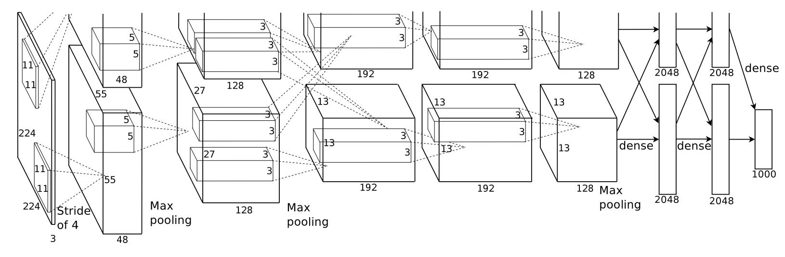
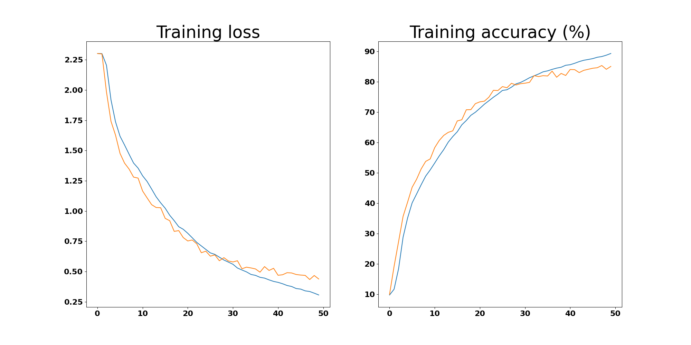
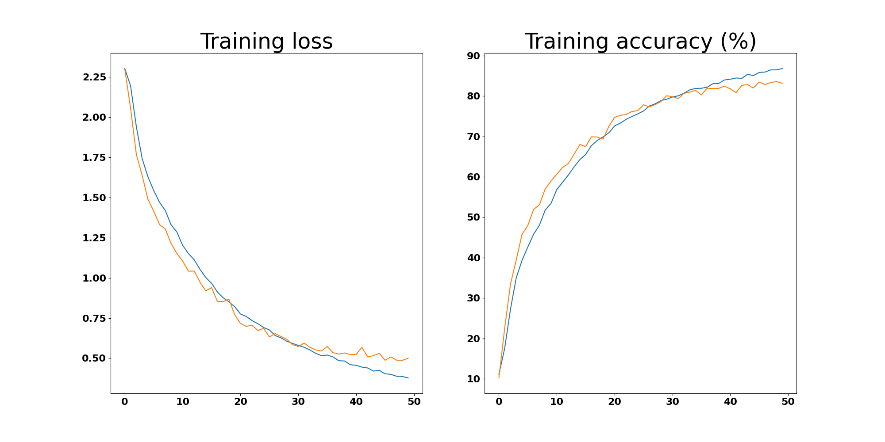

<div id="toc">
Contents
</div>
* TOC
{:toc}
----------

코드는 [Github repository](https://github.com/gratus907/Pytorch-Cifar10) 에 업로드됩니다.

## 구현 : AlexNet
상세한 코드는 위 Repository에서 볼 수 있으므로, 여기서는 모델만 구현하겠습니다.
  
정확히 그림을 따라가지는 않을건데, 그림은 ImageNet task를 위한 모델이므로 우리의 CIFAR-10 데이터셋과 다르기 때문입니다. ImageNet은 224 * 224 이미지인데 비해 우리는 32 * 32 이미지를 사용합니다.

```py
import torch
import torch.nn as nn
class AlexNet(nn.Module) :
    def __init__(self) :
        super(AlexNet, self).__init__()
        self.name = "AlexNet"
        self.conv_layer1 = nn.Sequential(
            nn.Conv2d(3, 96, kernel_size=(4, 4)),
            nn.ReLU(inplace=True),
        )
        self.conv_layer2 = nn.Sequential(
            nn.Conv2d(96, 256, kernel_size=(5, 5), padding=(2, 2)),
            nn.ReLU(inplace=True),
            nn.MaxPool2d(kernel_size=3, stride=2)
        )
        self.conv_layer3 = nn.Sequential(
            nn.Conv2d(256, 384, kernel_size=(3, 3), padding=(1, 1)),
            nn.ReLU(inplace=True),
            nn.Conv2d(384, 384, kernel_size=(3, 3), padding=(1, 1)),
            nn.ReLU(inplace=True),
            nn.Conv2d(384, 256, kernel_size=(3, 3), padding=(1, 1)),
            nn.ReLU(inplace=True),
            nn.MaxPool2d(kernel_size=3, stride=2)
        )
        self.fc_layer1 = nn.Sequential(
            nn.Dropout(p = 0.5),
            nn.Linear(9216, 4096),
            nn.ReLU(inplace=True),
            nn.Dropout(p = 0.5),
            nn.Linear(4096, 4096),
            nn.ReLU(inplace=True),
            nn.Linear(4096, 10)
        )

    def forward(self, x) :
        output = self.conv_layer1(x)
        output = self.conv_layer2(output)
        output = self.conv_layer3(output)
        output = output.view(-1, 9216)
        output = self.fc_layer1(output)
        return output
```
이 모델은 최대한 원본 그림을 그대로 따라간 버전입니다. 채널수 96->256->384->384도 똑같이 맞췄고, 5 by 5 convolution과 overlapping pooling을 적용했습니다.

Convolution 파트의 결과값이 256채널 * 6 * 6 = 9216개의 뉴런이기 때문에, 9216 -> 4096 -> 4096 -> 10 으로 진행되는 MLP를 붙여야 합니다. 원본과 똑같이 dropout을 적용했습니다.

이 모델의 summary는 다음과 같습니다.
```
----------------------------------------------------------------
        Layer (type)               Output Shape         Param #
================================================================
            Conv2d-1           [-1, 96, 29, 29]           4,704
              ReLU-2           [-1, 96, 29, 29]               0
            Conv2d-3          [-1, 256, 29, 29]         614,656
              ReLU-4          [-1, 256, 29, 29]               0
         MaxPool2d-5          [-1, 256, 14, 14]               0
            Conv2d-6          [-1, 384, 14, 14]         885,120
              ReLU-7          [-1, 384, 14, 14]               0
            Conv2d-8          [-1, 384, 14, 14]       1,327,488
              ReLU-9          [-1, 384, 14, 14]               0
           Conv2d-10          [-1, 256, 14, 14]         884,992
             ReLU-11          [-1, 256, 14, 14]               0
        MaxPool2d-12            [-1, 256, 6, 6]               0
          Dropout-13                 [-1, 9216]               0
           Linear-14                 [-1, 4096]      37,752,832
             ReLU-15                 [-1, 4096]               0
          Dropout-16                 [-1, 4096]               0
           Linear-17                 [-1, 4096]      16,781,312
             ReLU-18                 [-1, 4096]               0
           Linear-19                   [-1, 10]          40,970
          AlexNet-20                   [-1, 10]               0
================================================================
Total params: 58,292,074
Trainable params: 58,292,074
Non-trainable params: 0
----------------------------------------------------------------
Input size (MB): 0.01
Forward/backward pass size (MB): 8.26
Params size (MB): 222.37
Estimated Total Size (MB): 230.64
----------------------------------------------------------------
```

주목할 점은...
- Deeper convolution network 라는 컨셉이긴 하지만, 사실 잘 보면 대부분의 parameter는 마지막 linear layer에 몰려 있습니다. 이건 이후에 공부할 VGG를 비롯한 모델들도 마찬가지인데, 결국 앞부분의 Convolution으로 feature를 **적당히** 추출한 다음, 추출한 feature에 대한 MLP라고 생각할 수 있겠습니다.
- LeNet이 6만개의 파라미터를 갖는것에 비해, 대략 1000배인 6천만 개의 파라미터를 갖습니다. 오버피팅을 막기 위한 regularization이 매우 중요할 것 같습니다.

## 결과 : AlexNet
  
파란색이 training, 주황색이 testing (validation) 이고, 왼쪽이 Loss, 오른쪽이 정확도 (Accuracy)입니다. 대략 80%정도까지는 잘 올라가지만, 이후에는 Overfitting의 문제가 살짝 발생하는 것을 볼 수 있습니다. 

최종적으로, 50 Epoch (대략 76분 정도)[^1] 의 training을 통해, 85.03%의 정확도를 얻을 수 있었습니다.

## 구현 : SmallAlexNet
정말 이렇게 큰 모델이 CIFAR10에 필요할까요? 좀 빨리 훈련할수 있는, 경량화 AlexNet을 적당히 짜맞춰 보겠습니다.
```py
class SmallAlexNet(nn.Module):
    def __init__(self) :
        super(SmallAlexNet, self).__init__()
        self.name = "SmallAlexNet"
        self.conv_layer1 = nn.Sequential(
            nn.Conv2d(3, 64, kernel_size=(7, 7)),
            nn.ReLU(inplace=True),
        )
        self.conv_layer2 = nn.Sequential(
            nn.Conv2d(64, 192, kernel_size=(5, 5), padding=(2, 2)),
            nn.ReLU(inplace=True),
            nn.MaxPool2d(kernel_size=3, stride=2)
        )
        self.conv_layer3 = nn.Sequential(
            nn.Conv2d(192, 256, kernel_size=(3, 3), padding=(1, 1)),
            nn.ReLU(inplace=True),
            nn.Conv2d(256, 256, kernel_size=(3, 3), padding=(1, 1)),
            nn.ReLU(inplace=True),
            nn.Conv2d(256, 128, kernel_size=(3, 3), padding=(1, 1)),
            nn.ReLU(inplace=True),
            nn.MaxPool2d(kernel_size=3, stride=2)
        )
        self.fc_layer1 = nn.Sequential(
            nn.Dropout(p = 0.5),
            nn.Linear(3200, 2048),
            nn.ReLU(inplace=True),
            nn.Dropout(p = 0.5),
            nn.Linear(2048, 2048),
            nn.ReLU(inplace=True),
            nn.Linear(2048, 10)
        )

    def forward(self, x) :
        output = self.conv_layer1(x)
        output = self.conv_layer2(output)
        output = self.conv_layer3(output)
        output = output.view(-1, 3200)
        output = self.fc_layer1(output)
        return output
```

우선, linear layer의 크기를 확 줄였습니다. 이를 위해 적당히 맞춰서 앞부분의 크기도 줄였습니다. 뭔가 합당한 이유와 원리를 가지고 줄인건 아니고, 그냥 적당히 비율을 맞춰 줄여봤습니다. 

대신에, 좀더 넓은 범위를 보면서 feature를 추출할 수 있도록 첫 convolution 필터사이즈를 $7 \times 7$ 로 늘렸습니다.
```
----------------------------------------------------------------
        Layer (type)               Output Shape         Param #
================================================================
            Conv2d-1           [-1, 64, 26, 26]           9,472
              ReLU-2           [-1, 64, 26, 26]               0
            Conv2d-3          [-1, 192, 26, 26]         307,392
              ReLU-4          [-1, 192, 26, 26]               0
         MaxPool2d-5          [-1, 192, 12, 12]               0
            Conv2d-6          [-1, 256, 12, 12]         442,624
              ReLU-7          [-1, 256, 12, 12]               0
            Conv2d-8          [-1, 256, 12, 12]         590,080
              ReLU-9          [-1, 256, 12, 12]               0
           Conv2d-10          [-1, 128, 12, 12]         295,040
             ReLU-11          [-1, 128, 12, 12]               0
        MaxPool2d-12            [-1, 128, 5, 5]               0
          Dropout-13                 [-1, 3200]               0
           Linear-14                 [-1, 2048]       6,555,648
             ReLU-15                 [-1, 2048]               0
          Dropout-16                 [-1, 2048]               0
           Linear-17                 [-1, 2048]       4,196,352
             ReLU-18                 [-1, 2048]               0
           Linear-19                   [-1, 10]          20,490
     SmallAlexNet-20                   [-1, 10]               0
================================================================
Total params: 12,417,098
Trainable params: 12,417,098
Non-trainable params: 0
----------------------------------------------------------------
Input size (MB): 0.01
Forward/backward pass size (MB): 4.38
Params size (MB): 47.37
Estimated Total Size (MB): 51.76
----------------------------------------------------------------
```
Linear layer를 확 줄였기 때문에, 전체 파라미터의 수는 1/5로 줄어들었고 이제는 전체 파라미터의 대략 15% 정도가 Convolution에 들어가 있습니다. 

## 결과 : SmallAlexNet
  
이 모델도 비슷한 behavior를 보입니다.  
최종적으로, 50 Epoch (대략 31분 정도)[^1] 의 training을 통해, 83.16%의 정확도를 얻을 수 있었습니다. 원본 AlexNet과 비교할 때, 대략 1/3 가까운 훈련시간으로 거의 비슷한 수준의 정확도를 얻을 수 있었습니다.

------

[^1]: GTX 1070Ti 하나를 사용했습니다.