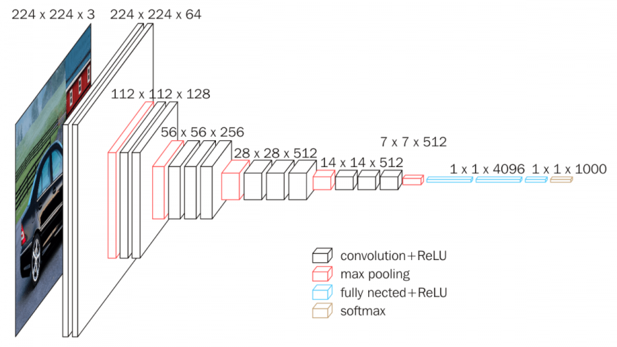
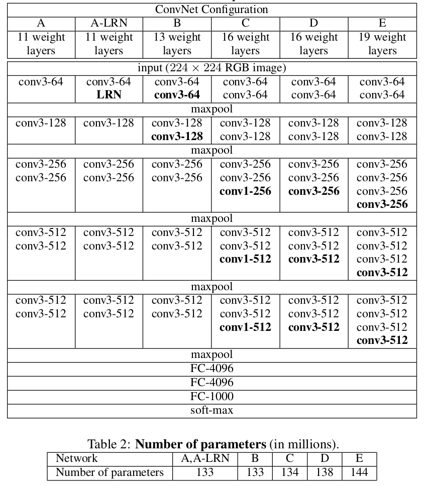

Contents

* TOC
{:toc}
----------

VGGNet은 2014 ImageNet Challenge에서 2위의 성적을 거둔 모델로, **깊은 네트워크** 를 쌓았을때의 효용을 보여준 모델입니다. 역시 [AlexNet 포스팅](/deep-learning-study/AlexNet) 때처럼 논문을 따라가면서 메인 아이디어를 살펴보겠습니다. 
## Architecture
VGGNet은 레이어 개수에 따라 11, 13, 16, 19 등으로 나누어집니다. 이는 실제로 **Convolution Layer**가 11개에서 19개까지 있는 모델로, 크게는 (Conv-ReLU)-(Conv-ReLU)-(maxpool) 을 반복하는 식으로 구성됩니다.

이 그림은 VGG-13의 그림인데, 정확한 11, 13, 16, 19의 구조는 다음과 같습니다. 중간에 ReLU가 매 conv 뒤에 들어가있지만 표시는 안되어 있습니다.

다양한 VGGNet의 버전들은 큰 틀에서는 비슷하기 때문에, 다음에 Pytorch 구현 코드를 볼 때 다시 살펴볼 예정입니다. 

VGGNet 논문의 Contribution 두 가지를 정리하자면,
1. **CNN을 깊이 쌓을 수 있다면 유의미한 성능 향상이 있다** 는 것을 보였고
2. **잘 훈련하면 이렇게 깊은 CNN도 훈련할 수 있다** 라는 것을 보였습니다.

각 Contribution을 살펴보겠습니다.

## Very Deep CNN 
VGGNet은 메인으로 3 by 3 convolution만 사용합니다. 그 이유를 저자들은 다음과 같이 제시합니다. 
- 7 by 7 convolution 하나를 쓰는 것과, 3 by 3 convolution을 세번 쓰는 것은 같은 receptive field를 가집니다. (즉, 입력의 같은 영역이 반영됩니다) 이는 직접 receptive field를 확인해보면 알 수 있습니다.
- 그런데, 파라미터의 개수는 49 : 27로 대략 절반선까지 줄어듭니다.
- 그러면서, 3번의 레이어 사이사이에는 ReLU가 들어가기 때문에 전체 함수가 더 non-linear해집니다. 
- 경우에 따라 1 by 1 convolution도 쓰긴 하는데 (VGG16), 이것도 적은 수의 파라미터만으로 nonlinearity를 추가하기 위해서입니다. 

그외에, Convolution을 깊게 들어가서 마지막에 Fully Connected Layer로 실제 classification을 추가하는 것은 AlexNet과 동일합니다.

## Training 
### Regularization
- Regularization으로는 적절한 data augmentation과 함께, $5 \times 10^{-4}$ 의 weight decay를 사용합니다.
- Fully connected layer에서는 $p = 0.5$로 dropout도 적용합니다. 

### Optimization
- SGD with Momentum. Initial LR 0.01, Momentum 0.9 
- Validation accuracy가 정체되면 LR을 1/10으로 깎는 식으로 진행합니다. 

### Initialization
VGGNet의 재밌는 점 중 하나는, training 과정에서 너무 깊은 19레이어 CNN을 한번에 training할 수 없기 때문에, 11-Layer 버전을 훈련한 후 이 위에서 레이어를 하나씩 추가해가면서 training했다는 점입니다. 이는 따져보면, pre-train 된 모델을 이용하여 initialize를 잘 하는 느낌으로 생각할 수 있습니다. 

## 결과와 의의
VGGNet은 2014 Imagenet Challenge에서 top-5 error 6.8% 정도로, AlexNet의 16%에 비해 큰 성능 향상을 이루었습니다. 
- 2014년 1위였던 GoogLeNet이 6.7%로 거의 똑같은 정확도를 갖는데, 이는 나중에 포스팅하겠지만 VGG보다 훨씬 복잡한 내부 구조를 가지고 있습니다.
- 그래서, 이후 딥러닝 연구에서 실험이나 다른 용도로 쓰기에 VGGNet이 좀더 용이합니다. 대표적으로, Semantic Segmentation 모델중 하나인 FCN은 VGGNet의 구조를 활용하여 이미지의 특징을 추출합니다.
- Initialization을 통해 훈련을 더 잘 하는 방법, 큰 convolution 하나보다 작은 convolution 여러개를 쓰는 것의 이점 등을 보여주었습니다.