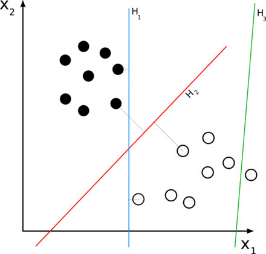
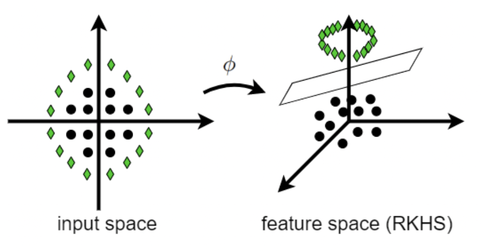

Contents

* TOC
{:toc}
----------

[이 링크](/deep-learning-study/) 의 supervised learning setup에 기반합니다. 

## Support Vector Machines
가장 기본적인 Linear Classification model 중 하나인 support vector machine (SVM) 에 대해 알아보겠습니다. 

어떤 데이터 $x_1, \dots x_n$ 과 이들의 "boolean label" 이 주어져 있다고 생각하고, 이들을 분류하는 문제를 생각하겠습니다. 즉, $y_i \in \Set{1, -1}$ 이고, 여기서 $f : \R^n \to \Set{1, -1}$을 추측하고 싶은데, $f(x_i) = y_i$ 를 알고 있는 상황입니다. 

가장 간단한 모델로, 공간상에 초평면을 하나 그어서 그 위는 1, 아래는 -1로 나눠버리는 방법을 생각할 수 있습니다. 즉, parameter $\theta = (w, b)$ 에 대해, 다음과 같은 모델을 잡습니다.
$$g_{w, b}(x) = \sgn(w^T x + b)$$
(여기서 $\sgn$은 양수/음수에 각각 1, -1을 부여하는 함수입니다) 우리는 이 모델이 $f$를 잘 approximate하기를 기대합니다. 이때 $w$와 $b$에 따라 decision boundary (1/-1을 가르는 선) 이 초평면 형태로 나타나기 때문에, 이를 "Linear Classifier" 라 할수 있습니다. 

이제, 우리는 다음을 최소화하는 $w, b$를 생각하면 됩니다. 
$$\underset{w \in \R^n, b \in \R}{\minimize}\ \abs{g_{w, b}(x_i) - y_i}^2$$
어차피 $\abs{g_{w, b}(x_i) - y_i}$는 0이거나 ($g$가 맞은 경우) 2이므로 ($g$가 틀린 경우) 제곱을 하든 말든 별로 상관은 없습니다. 

## Large Margin Classification 
만약, "올바른 결과" 가 여러 개인 경우를 생각해 보겠습니다. 즉, 
$$\underset{w \in \R^n, b \in \R}{\minimize}\ \abs{g_{w, b}(x_i) - y_i}^2$$
이 문제에서, 결과값이 0인 $w, b$가 여러 개인 경우입니다. 이를 그림으로 나타내면, 

     
    (그림 출처 : Wikipedia)

이 그림에서, 초록색 선 $H_3$은 분류가 올바르지 않으므로 치우고, $H_1$ 과 $H_2$를 비교하는 상황입니다. $H_1$보다 $H_2$가 뭔가 사이의 빈 공간을 깔끔하게 잘라주고 있는 느낌을 받는데, 이는 선에서 데이터가 떨어진 정도 - **margin** 이 보다 크기 때문입니다. margin이 크다는 것은, 지금 본 데이터와 **"비슷한" 데이터**가 더 들어왔을때 - 즉, 저 그림에서, 흰색 또는 검은색 점들이 몰려있는 부분 주위에 **새로운 점**이 또 찍혔을 때 - **올바르게 분류할 것**으로 생각할 수 있다는 의미입니다. 

따라서, 가능하다면 margin이 큰 초평면을 고르는 것이 바람직합니다. 

이때, Margin이 어떻게 계산되는지를 생각해 봅시다. margin이라는 것은 초평면에서 가장 가까운 데이터 점들에 의해 정의되며, $w$와 $b$를 적당히 상수배하면, 이 초평면의 법선벡터 $w$와 같은 법선벡터를 가지면서 (평행하면서) $y_i = 1$인 **가장 가까운** 데이터점을 지나는 평면이 정확히 $w^T x + b = 1$ 이 되게 할 수 있습니다. 즉, $y_i = 1$ 인 모든 점들에 대해, $w^T x + b \geq 1$ 이 됨을 강제한다는 의미입니다. 같은 방법으로 $y_i = -1$인 점들에 대해 $w^T x + b \leq -1$ 이 되게 할 수 있으므로, 우리는 다음과 같은 **제약 조건** 으로 바꿀 수 있습니다. 
$$y_i (w^T x_i + b) \geq 1$$
이제, 이 조건을 만족하는 모든 초평면 $(w, b)$ 들은 **올바른** classifier들입니다. 그런데, 이제 margin은 두 평면 $w^T x + b = 1$ 과 $w^T x + b = -1$ 사이의 거리가 되며, 이는 기하적으로 ${2}/{\norm{w}}$ 가 됩니다. 즉, margin이 최대인 올바른 classifier를 찾는 문제는 본질적으로 다음의 제약 있는 최적화 문제가 됩니다. 
$$\underset{w \in \R^n, b \in \R}{\minimize}\ \norm{w}^2 \quad \subto \ \ y_i (w^T x_i + b) \geq 1$$
여기서도 $\norm{\cdot}$을 최적화하든 그 제곱을 최적화하든 수학적으로는 같은 문제지만, computational하게는 제곱을 최적화하는 문제를 **Quadratic Program** 으로 해결할 수 있기 때문에, 알고리즘적인 측면에서 제곱을 최적화합니다. 

## Soft Margin SVM
위 문제는 결국 **주어진 데이터는 완전히 평면으로 분리할 수 있다**, 즉 **linearly seperable** 하다는 가정을 잡고 해결한 것입니다. 당연히 우리는 "거의" linearly seperable한 문제로 이 논증이 확장되었으면 좋겠고, 크게 두가지 방법 (서로 동치인) 이 있습니다. 

제약 있는 최적화의 관점을 이어가서, 다음과 같이 문제를 변형합니다. 
$$\underset{w \in \R^n, b \in \R}{\minimize}\ \norm{w}^2 + C \sum h_i \quad \subto \ \ y_i (w^T x_i + b) \geq 1 - h_i$$
즉, $y_i (w^T x_i + b)$가 1보다 조금 작아지는걸 허용하는 대신, 이를 반영하여 margin에 해당하는 값을 penalize하겠다는 의미입니다. 

또는, 아예 제약 없는 최적화 문제로 바꾸는 대신, Hinge Loss 를 도입할 수 있습니다. 
$$\underset{w \in \R^n, b \in \R}{\minimize}\ \norm{w}^2 + C \sum \max(0, 1 - y_i (w^T x_i + b))$$

Computational하게 보기가 좀더 편한 제약 있는 최적화 관점을 가져가겠습니다. 이제, 이 문제는 Lagrangian Multiplier (Primal-Dual) 방법을 이용하여 해결할 수 있습니다. 또한, 이후의 계산을 위해 $\norm{w^2}$ 대신 $\frac{1}{2}\norm{w^2}$ 를 최적화하겠습니다. 구체적으로, 
$$\mathcal{L}(w, b, h, \alpha, \eta) = \frac{1}{2}\norm{w^2} + C \sum h_i + \sum \alpha_i(1 - h_i - y_i (w^T x_i + b)) - \sum \eta_i h_i$$
이 함수에 대한 Lagrangian dual을 생각하기 위해, 편미분들을 계산하면 
$$\begin{align}
    \pdv{\mathcal{L}}{w} &= w - \sum \alpha_i y_i x_i = 0\\ 
    \pdv{\mathcal{L}}{b} &= - \sum \alpha_i y_i = 0 \\ 
    \pdv{\mathcal{L}}{h_i} &= C - \alpha_i + \eta_i = 0 
\end{align}$$
이제, 이 조건들을 $\mathcal{L}$ 에 대입해 넣으면 다음을 얻습니다. 
$$\minimize \ \frac{1}{2}\alpha^T Q \alpha - \alpha^T 1 \quad \subto \ \ \alpha^T y = 0, \alpha_i \in [0, C]$$
이때 $Q$는 $Q_{ij} = y_i y_j \inner{x_i}{x_j}$ 인 행렬입니다. 이는 결국 linear constraint를 가진 quadratic 최적화 문제이므로, quadratic programming 으로 해결할 수 있습니다. (참고 : [위키피디아](https://en.wikipedia.org/wiki/Support-vector_machine#Soft-margin) 는 반대로 maximization 문제로 정리하기 때문에, 최적화 방향이 반대입니다. 수학적으로는 동치이며 계산적으로도 사실 같습니다.)

## Kernel Methods
SVM은 기본적으로 linear 하지만, kernel method를 이용하면 nonlinear한 decision boundary를 잡는 것도 가능합니다. 

자세한 것은 별도 포스팅 (두세번에 걸쳐서) 할 예정이지만, 간단히 논증하자면 이렇습니다. 

     
    (그림 출처 : Benyamin Ghojogh et al,
    <i>Reproducing Kernel Hilbert Space,   Mercer’s Theorem, Eigenfunctions, Nyström Method, and Use of Kernels in Machine Learning: Tutorial and Survey</i>)

이와 같이, **고차원에서는** 선형으로 분리가 가능함에도 불구하고 저차원으로 눌러놓다 보니 선형으로 분리가 불가능해진 데이터가 있다고 생각해 보겠습니다. 적절한 mapping $\phi$ 를 만들어서, $\phi(x_i)$ 들을 분리할 수 있다면 더 강한 classification이 가능할 것입니다. 이를 Kernel method 라 하며, 이때 데이터들이 올라가 앉는 새로운 공간을 RKHS (Reproducing Kernel Hilbert Space) 라 합니다.