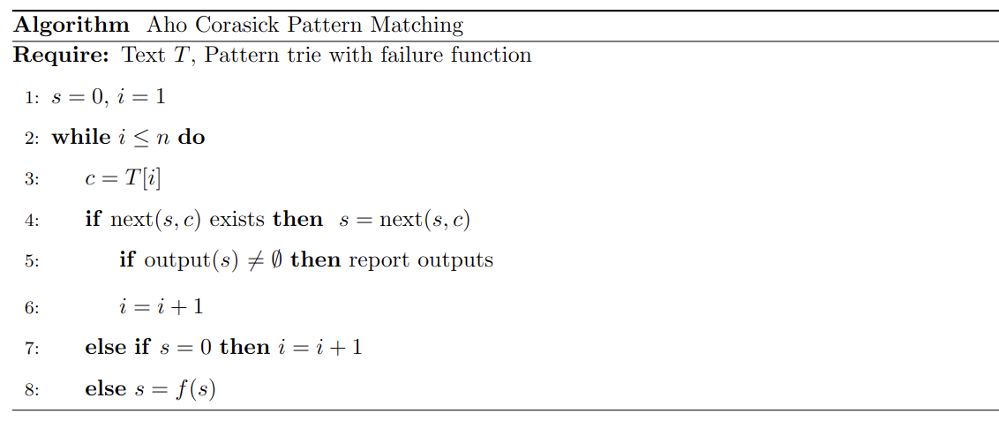

이 글은 KMP 알고리즘과 Trie 자료구조에 대한 이해를 선행으로 요구합니다. 

## Motivation
어떤 $n$글자의 긴 텍스트 $T$에 대해, 짧은 $m$글자의 패턴 $P$를 매칭하는 문제를 생각해 보겠습니다. 
- 가장 Naive하게 $T$의 모든 위치에 대해 $m$글자를 매칭해보는 알고리즘은 $O(nm)$ 입니다. 
- [KMP 알고리즘](https://en.wikipedia.org/wiki/Knuth%E2%80%93Morris%E2%80%93Pratt_algorithm) 은 (언젠가 작성할 계획은 있지만 우선순위는 낮습니다) 이를 $O(n + m)$ 으로 줄인 엄청난 성과를 보입니다. 

KMP가 이를 가능하게 하는 방법은, `T[i..i+L-1]` 과 `P`를 매칭하다가 중간에 실패했다고 할 때, Naive 매칭은 `T[i+1..i+L]` 을 시도하면서 앞서의 정보를 전혀 이용하지 못합니다. 그러나, 패턴이 `abababa`인데, ababa까지 맞고 여섯번째 b가 틀렸다면, 앞 다섯글자까지 맞았다는 정보를 최대한 이용하고 싶습니다. 이를 정말 가능한 최대로 이용하는 것이 KMP 알고리즘이며, 위 위키피디아의 링크와 함께 [BowBowBow님의 블로그](https://bowbowbow.tistory.com/6) 글을 참고하면 그렇게 어렵지 않게 배울 수 있습니다. 요점은, 앞 몇글자가 맞았음을 이용해서 절대 맞을리가 없는 위치들을 스킵하는 것입니다. 이를 **실패함수** 라고 부릅니다.

이제, 이를 패턴이 여러 개인 경우로 확장하고자 합니다. 패턴이 $m_1, m_2, \dots m_k$ 글자의 $P_1, \dots P_k$ 라고 하겠습니다.

## Algorithm
실패함수는 결국 어떤 prefix까지는 맞았다는 것을 알고 있는 데서 오는데, 우리는 여러 개의 패턴에 대해 비슷한 정보를 관리하고 싶습니다. 

Prefix 여러개를 동시에 관리하는 것은 Trie를 이용할 수 있습니다. 
  

이 그림을 보면, 파란 간선과 함께 빨간 간선이 그려져 있습니다. 파란 간선은 우리가 일반적으로 알고 있는 Trie의 간선이고, 빨간 간선은 Failure function을 의미합니다. 우리는 다음과 같이 Failure function을 정의합니다. 

"패턴 $P$에 대해, 그 prefix $P'$ 까지를 현재 매칭했다고 하자. 이때, $P'$에 해당하는 노드의 실패-노드 $f(P')$ 을 찾는데, 이는 $P'$의 **proper suffix**이면서, **다른 패턴의 prefix** 인 가장 깊은 노드여야 한다"

이 조건이 무슨 뜻인지 생각해보면...
- $P'$을 매칭하다가 실패했다고 하겠습니다. 이제 더이상 이 패턴은 진행할 수 없습니다.
- 그러면 이제, 무슨 패턴을 노릴지 결정해야 합니다. 그림에서 cacba를 텍스트 `T[i..]`에다가 대고 매칭하다가 실패했다면 현재 위치에서 당장 노릴 수 있는 패턴은 acba, cba, ba, a 등으로 시작하는 패턴을 노릴 수 있습니다. 
- 이들 중 어떤 다른 패턴의 prefix여야 노리는 것이 의미가 있을 것입니다.  
- 이러한 노드들이 여러 개 있다면, acba 노드와 cba 노드 중에는 acba 노드를 먼저 확인해야 합니다. 이유는, acba... 를 매칭하다가 실패하면 cba... 패턴은 그 다음에 노려도 되기 때문입니다. 
- 즉, 텍스트를 스캔하면서 트라이를 따라서 움직이다가, 트라이에서 더이상 갈곳이 없으면 최대한 다른 끝점을 노릴 수 있는 곳으로 이동해서 계속 시도한다는 의미가 됩니다. 

트라이는 빠르게 construct할 수 있으므로, 이러한 실패함수를 어떻게 계산할지만 따로 생각하면 됩니다. 실패함수는 BFS를 이용하여, depth가 얕은 노드부터 깊은 노드로 건설합니다. 
- 지금 노드 $x$를 보고 있다면, 이 $x$보다 깊이가 얕은 노드 중 반드시 $f(x)$ 가 존재합니다. (proper suffix의 길이는 자기자신보다 짧으므로) 
- $x$의 바로 위 부모노드 $p(x)$ 와, $p(x)$에서 $x$로 오는 edge의 알파벳 (즉 $x$의 마지막 글자에 해당하는 알파벳)을 알고 있습니다. 이를 `c` 라고 하겠습니다.  
- 또한, 실패함수는 depth가 얕은 노드부터 계산했으므로 $f(p(x))$ 도 알고 있습니다. 만약 $f(p(x))$ 에서 `c`를 이용하여 전진하는 edge가 있다면, 이를 따라 전진합니다.
- 그렇지 않다면, $f(f(p(x)))$ 에다 대고 시도하고... 를 반복하면 됩니다. 

만약 트라이를 따라가다가 어떤 패턴의 끝을 만나면, 그 패턴을 찾았다고 report하면 됩니다. 즉 각 노드는 혹시 내가 어떤 패턴의 끝은 아닌지를 미리 기억하고 있어야 합니다. 이 정보는 사실 Trie에 문자열들을 집어넣을때 미리 잡아줄 수 있으므로 크게 문제될 것이 없습니다. 

스캔의 과정을 pseudocode로 표현해 보면 다음과 같습니다.
  

## Complexity
알파벳 크기를 $q$, 패턴 전체의 글자수의 총합을 $M$, 텍스트의 글자수를 $n$이라고 하겠습니다. 이때, 
- Pseudocode를 보면 자명하게 스캔은 $O(n)$ 인것 같지만, 실제로는 $n$에 next 함수가 소모하는 시간만큼이 걸립니다. 
- 트라이를 구성하는 방법은 구현에 따라 다른데, 가장 일반적인 구현인 child pointer array 방식을 쓰는 경우 $O(qM)$ 시간에 트라이를 구성할 수 있으며 (BFS를 돌려야 해서 이만큼이 소모됩니다) $O(qM)$ 메모리를 소비합니다. 
- $q$가 크면 이것이 비효율적일 수 있는데, 트라이의 각 노드에 BBST같은걸 쓴다거나 링크드 리스트를 쓰면 복잡도가 달라집니다. 대표적으로 BBST를 쓰면 $O(M \log q)$ 시간에 트라이를 구성할 수 있고, $O(M \log q)$ 메모리를 소비하는 대신, next가 $O(\log q)$ 시간이 들게 되므로 스캔이 $O(n \log q)$ 걸립니다. 

따라서, 종합하면 간단하게는 $O(qM + n)$ 시간과 $O(qM)$ 공간을 이용하여 multiple pattern matching을 할 수 있게 됩니다. 

## 구현 
[구현 링크](http://boj.kr/d7bb9f5436ed4277ae0829584ceb0b4a)