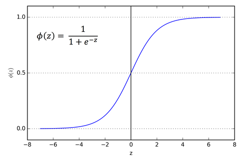

Contents

* TOC
{:toc}
----------

### Classification
- Binary 하게 (또는 Discrete하게) 뭔가를 결정하는 형태의 문제.
- ex) 종양의 양성/음성, 메일이 스팸이다/아니다 등등...
- Idea : Linear Regression + Threshold. Linear하게 hypothesis를 잡고, 어떤 값 (0.5) 이상이면 1로 예측하는 형태. 
- 한계점 : 예를 들어, 양성 데이터가 (3, 4, 5, 100) 이고 음성 데이터가 (1, 2, 2) 이면? Linear hypothesis가 별로 적절하지 않은 경우가 많다. 100에 의해 threshold가 지나치게 오른쪽으로 이동하게 되기 때문. 
- 개선 : 위 문제점은 `Linear` 때문에 생기는 문제다. `Linear` 보다 더 이런 형태에 적합하게 생긴 함수를 쓰면 어떨까? $h$ 함수의 최소와 최대도 뭔가 0과 1로 고정하고 싶다. $h_\theta(x)$ 가 1보다 크거나 0보다 작은 것은 뭔가 바람직하지 않은 상태인것으로 보인다.
- Logistic regression : 다음과 같은 형태의 sigmoid 함수를 사용한다.
  $$h_\theta(x) = \frac{1}{1 + e^{-\theta^T x}}$$
- Why? 그래프가 매우 유용한 성질들을 보이기 때문.  
    
- Interpretation : $h_\theta(x)$ = $y = 1$일 **확률** 을 돌려준다고 생각하자.
  $$h_\theta(x) = \mathsf{P}(y = 1 \ |\  x ; \theta)$$

### Multiple Features 
- $\theta$ 와 $x$를 벡터로 생각하는 앞서의 방법을 그대로 이용하면, Logistic regression도 똑같이 multiple feature에 적용 가능.
- 이때는, $h_\theta(x) = 0.5$ 인 경계면이 $\R^n$ 상의 초평면으로 제공하는 형태가 된다.
- 이를 Decision boundary 라고 부른다.
- Logistic regression도 다음과 같은 형태로 일반화할 수 있다. 
  - $h_\theta(x) = g(p(\theta, x))$, such that $g(z) = \frac{1}{1 + e^{-z}}$ 로 쓸 수 있고,
  - $p$에는 다양한 함수들이 들어갈 수 있다. 예를 들어, $p(\theta, x) = \theta_0 + \theta_1 x_1^2 + \theta_2 x_2^2$ 같은 다항식...
  - 이경우, Decision boundary가 원이나 타원, 또는 다른 형태로 나타나는 문제들도 해결 가능하다.

### Logistic Regression
- Cost function 과 그 편도함수들을 안다면, gradient descent를 쓸 수 있다. $h$는 이미 정했으므로...
- Linear regression에서처럼, $\frac{1}{2m}\sum_{i = 1}^{m} \ (h_\theta(x_i) - y_i)^2$ 를 쓴다면, 이 함수는 **Convex**하지 않다. 
- **Convex**하지 않으면 Gradient Descent의 수렴성이 보장되지 않는다!
- 가능하면 Convex한 함수를 잡아서 써야 한다. 다음 함수가 잘 작동함이 알려져 있다.
  $$Cost_\theta(x, y) = \begin{cases}
    -\log(h_\theta(x)) & \text{if } y = 1 \\
    -\log(1 - h_\theta(x)) & \text{if } y = 0
  \end{cases}$$
- $y = 1, h_\theta(x) = 1$ 이라면, cost가 0이다. 이는 **올바른 예측**에서 cost 함수가 0이 된다는 것이므로, desirable하다.
- $y = 1, h_\theta(x) \to 0$ 일 때, cost가 무한대로 발산한다. 이는, 1이어야 할 값을 0으로 예측하면 큰 penalty term을 주겠다는 의미가 된다. 이러한 intuition은 우리가 logistic regression에서 원하는 바와 잘 맞아떨어진다. $y = 0$에서도 위 두 가지가 마찬가지로 성립한다.
- 위 식은 경우로 나누어져 있어서 복잡하다 (특히 Grad-descent 쓰기에). 이를 잘 정리해서...
  $$Cost_\theta(x, y) = -y\log(h_\theta(x)) - (1-y)\log(1 - h_\theta(x))$$
- 이제, Gradient descent를 쓸 수 있다! $(x_i, y_i)$ 가 training set이라고 하면..
  $$J(\theta) = -\frac{1}{m}\left(\sum_{i = 1}^{m} y_i\log(h_\theta(x_i)) + (1-y_i)\log(1 - h_\theta(x_i))\right)$$
  $$\pdv{}{x_j}J(\theta) = \sum_{i = 1}^{m} (h_\theta(x_i) - y_i) x_j$$
- Linear regression 때의 gradient descent와 **똑같은 형태의** 편도함수를 얻는다.

### Advanced Optimization Ideas
- Optimization Algorithm은 다양하다. 더 강한 알고리즘들이 있다.
  - Gradient Descent
  - Conjuagte Gradient
  - BFGS algorithm, L-BFGS algorithm
- 주로 Gradient Descent보다 빠르고, $\alpha$를 직접 고르지 않아도 되는 (Line Search) 고급 알고리즘들. 대체로 훨씬 복잡하지만 더 좋은 성능을 보인다.

### Multiclass Classification
- 0/1이 아닌, 여러 개 중 하나를 고르는 형태의 Classification
- ex) Email Classification : Work / Friends / Family / Hobby를 0 / 1 / 2 / 3 으로.
- One-vs-All : 문제를 one-vs-all 형태의 binary classification으로 바꾸어, classifier $h_\theta$를 각각 맞춘다.
- 각각의 클래스에 대한 best $h$를 학습한 후, 새로운 데이터에 대해서는 모든 $h$들을 돌려보고 확률이 가장 높게 나오는 클래스로 판정한다.
- 가장 자연스러운? 형태의 extension.