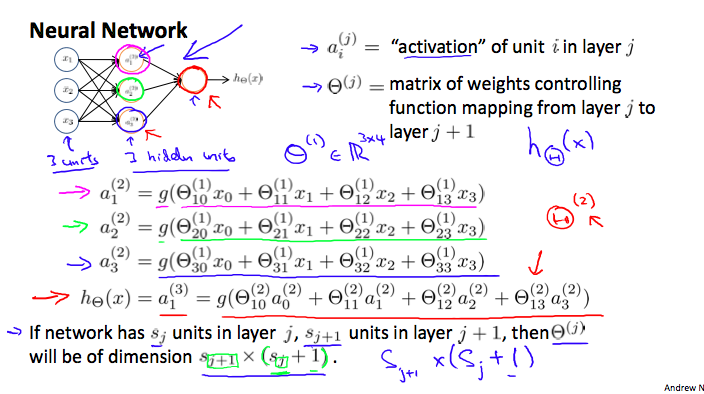

Contents

* TOC
{:toc}
----------

### Motivation 
- Complex, nonlinear hypothesis
  - 많은 수의 polynomial feature을 쓸 수도 있겠지만... 여러 개의 feature를 가진 문제에 적용하기는 어렵다.
  - 100개의 feature가 있다면? 그 이상이라면? 적절한 고차항을 쓰기는 매우 어려운 일. 
- ex) Computer Vision. **이 이미지는 차량인가?**
  - Pixel intensity matrix를 보고 원래의 이미지를 인식할 수 있는가?
  - Classification problem.
  - Feature size = 픽셀의 수 (x3 if RGB)
    - 이렇게 많은 feature로는 logistic regression같은 알고리즘을 쓸 수가 없다.
- Goal : Algorithm that mimics brain.

### Background 
- 80년대-90년대 초에 크게 유행했으나, 90년대 말에는 별로..
- Computationally expensive.
- 현대에는 이정도 자원은 사용할 만 하다 => STATE OF THE ART
- 뇌는 수많은 기능을 처리한다 -> 이 많은 기능 (언어, 시각, 청각...) 을 각각 구현해야 하는가?
- NO. `ONE LEARNING ALGORITHM HYPOTHESIS`에 의하면, 실제로 뇌에서 작동하는 것은 단 하나의 학습 알고리즘.
  - 청각 관련 기능을 끊고 시각 관련 부분에 이를 연결하면, 뇌가 알아서 잘 매핑해서 작동하더라.
  - Brain rewiring experiment
  - 뇌에 다른 센서도 잘 연결하면 (direction 등) 대략 잘 작동하더라.
  - 아마도 각각의 기능은 별개의 sw가 아닐것이다.
- Neuron : 신경계를 구성하는 기본 세포. 
  - Inputs (Dendrites)
  - Outputs (Axons)
  - I/O를 가진 기본적인 계산 단위처럼 생각할 수 있다.

### Neuron Model
- Logistic Unit : $x_1, x_2, x_3$ 을 입력받아서 $h_\theta(x)$를 compute하는 neuron을 생각.
- Layer structure (Neural Network) : Neuron들의 output을 다시 받아서 새로운 값을 계산하는 neuron간의 layer를 쌓는 느낌.
- Layer 1 (Input Layer) - 맨 끝 (Output Layer) 사이에 Hidden layer들이 위치하는 구조.
- Bias unit 같은 추가 테크닉들 사용.
- $a_i^{(j)}$ : "Activation" of unit $i$ in layer $j$ 
- $\Theta^(j)$ : Matrix of weights, 다음 layer로 넘어가는 값들.   
    
- Forward Propagation은 Vectorize를 통해 비교적 효율적으로 연산 가능하다.
- 이 방법이 왜 좋은가?
  - 맨 끝 Layer (Output Layer) 는 일종의 Logistic regression
  - 그 이전의 Hidden layer는 그 자체가 Learning된 결과물. 즉, feature 자체가 학습을 통해 발전한다.
  - Flexible한 방법.