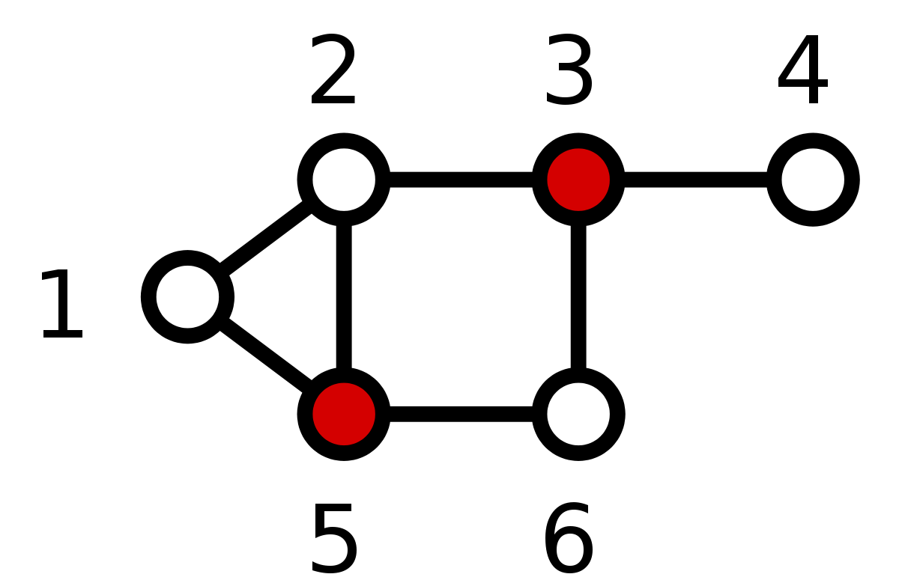

<div id="toc">
Contents
</div>
* TOC
{:toc}
----------

이번에 공부해볼 논문은 **All Pairs Almost Shortest Path** 입니다. 

D. Dor, S. Halperin and U. Zwick, "All pairs almost shortest paths," Proceedings of 37th Conference on Foundations of Computer Science, 1996, pp. 452-461, doi: 10.1109/SFCS.1996.548504.

1996년도 논문으로, 이후에도 많은 논문들이 이 논문에서 제시한 bound를 더 내리는 등 더 contribution이 있지만, 아이디어가 흥미롭고 이후 논문들의 기반이 되는 연구입니다.

연도에 대해 언급하는 이후는 이후 25년간 알고리즘 분야의 발전으로 현재에는 다른 문제들의 복잡도가 약간씩 달라졌기 때문입니다. 

그래프 문제에서 흔히 그렇듯, $G = (V, E)$에 대해 $\abs{V} = n$, $\abs{E} = m$으로 쓰되, $O(V)$ 와 같이 notation을 abuse하겠습니다. 

## Motivation
All Pairs Shortest Path (이하 APSP) 란, 단순하게 어떤 그래프 $G = (V, E)$ 가 주어졌을 때, 각 vertex에서 다른 vertex로 가는 최단 경로의 길이를 모두 알아내는 문제입니다. 당연하게도, 실용적으로 많은 쓰임이 있습니다. 

우리는 우선 논문을 따라, Undirected의 경우만 고려합니다. 이때 경로의 길이는 지나가는 edge의 개수가 될 것입니다. 

다음 세 가지 알고리즘이 가장 먼저 고려할 만 합니다. 
- Floyd-Warshal Algorithm : $O(V^3)$ 시간에 APSP를 해결하는 알고리즘입니다. 구현이 매우 쉽고, 간단한 Dynamic programming의 원리를 따르기 때문에 이해하기 쉽습니다.
- Dijkstra (or any SSSP) : 다익스트라 알고리즘은 한 정점으로부터 다른 모든 정점까지의 거리를 찾는 Single Source Shortest Path (이하 SSSP) 문제를 $O(E + V \log V)$ 또는 $O(E \log V)$ 시간에 해결합니다. (Fibonacci heap의 사용 여부에 따라 다름) 자명하게, 모든 정점에서 출발하는 각 SSSP를 해결하면 되기 때문에 우리는 $O(VE + V^2 \log V)$ 정도 시간에는 APSP를 해결할 수 있습니다. 이 방법은 sparse graph에 대해서는 매우 빠르지만, dense graph에 대해서는 $E = O(V^2)$ 까지 가능하기 때문에 $O(V^3)$ 입니다.
- Matrix Multiplication : Floyd-Warshall의 inner loop이 행렬곱셈이랑 비슷하게 생겼음을 활용합니다. 행렬곱셈과 거의 비슷한 알고리즘을 이용하면, Adjacency matrix $A$를 repeated squaring하여 이 문제를 $O(V^3 \log V)$ 에 풀 수 있습니다. 더 느려 보이는 이 방법을 언급하는 이유는, 행렬곱셈에 쓰는 빠른 알고리즘들 중 일부가[^1] 이 '유사-행렬곱셈'에도 똑같이 적용가능하기 때문입니다. 스트라센을 쓰면 $O(V^{2.807} \log V)$ 이 되고 이는 위 두 방법보다 worst-case에 더 빠릅니다.

이 논문에서는, "약간의 오차를 허용하면" 이보다 빠른 알고리즘이 존재함을 보입니다. 정확히는, 모든 정점쌍 $(v_i, v_j)$에 대해, $d(v_i, v_j) + 2$ 를 넘지 않는 값을 반환하는 알고리즘을 논의하고, 이를 확장하여 $k$만큼의 오차를 허용하되 그만큼 빨라지는 알고리즘을 논의합니다. 

## Introduction
### At a glance
이 알고리즘의 큰 아이디어는 다음과 같습니다.
1. Dijkstra 알고리즘은 sparse graph에 대해 **꽤** 빠릅니다. 
2. 그래프의 성질을 **거의** 보존하면서 원래의 그래프보다 sparse한 auxillary graph 위에서 Dijkstra를 돌리고 싶습니다.
3. Unweighted graph에 대해서는 특히, dijkstra를 일반적인 BFS로 대체할 수 있습니다.

### Dominating Set
그래프 $(V, E)$에서, 어떤 정점의 부분집합 $S$가 다른 부분집합 $T$를 dominate 한다는 것은, $T$의 모든 vertex가 $S$의 vertex중 하나 이상과 edge로 연결되어 있는 것으로 정의합니다. 즉, 아래 그림에서 빨간색으로 색칠된 vertex는 그래프 전체를 dominate합니다.

{:width="40%"}

일반적인 그래프에 대해 minimal dominating set을 찾는 것은 매우 잘 알려진 NP-Hard 문제입니다. 그러나, 우리는 좀 특수한 경우만 논의합니다. 구체적으로, 어떤 parameter $s$에 대해, 다음을 해결합니다.

**Dominate(G, s)** : $G$에서, degree가 $s$이상인 정점들을 모은 부분집합을 dominate하는 적당히 작은 dominating set을 찾는다.

여기서 **적당히 작은** 이란, $O\left(\frac{n \log n}{s}\right)$를 목표로 합니다. Aingworth et al[^2]에서는 이를 위해 다음의 알고리즘을 제시하고 있습니다. 
- 각 vertex에 대해 neighbor set을 생각하면, dominating set을 찾는 것은 set cover를 찾는 것과 같은 문제입니다. 
- 각 집합 $S_i$의 원소는 $\Set{1, \cdots, n}$ 범위 내에 있고, 전체 원소의 합은 $2m$개 입니다. 
- Greedy 알고리즘을 생각합니다. 각 스텝마다, '현재까지 cover되지 않은 가장 많은 element를 새로 cover하는' 집합을 택합니다.
- 이 알고리즘은 잘 생각해보면 $m$에 대해 선형으로 구현가능합니다.
  - 각 $x \in \Set{1, \cdots, n}$에 대해, $x$를 포함하는 모든 집합의 리스트 $L$ 를 관리하고, 동시에 현재 남은 covering power (현재 uncovered인 vertex 개수) 가 $i$인 집합의 리스트 $A[i]$를 관리합니다. 이때 각 원소의 remaining covering power를 $P[i]$라고 하겠습니다.
  - 식으로 쓰면 복잡해지므로, pseudocode를 이용해서 표현해 보겠습니다. 
    ```
    cur = maximum of |S| among sets
    while cur > 0:
        if A[cur] empty : cur -= 1, continue
        X = choose one with maximum P
        for t in X:
            if t is uncovered:
                mark t as covered
                for each Y containing t:
                    remove Y from A[P[Y]]
                    add Y to A[P[Y]-1]
    ```

- 시간 복잡도 증명 (위 알고리즘이 $O(\sum \abs{S})$) 임을 증명)
  - A를 관리하는 - 즉, `Y`를 `A[P[Y]]`에서 꺼내서 `A[P[Y]-1]` 로 옮기는 decrease 연산이 $O(1)$에 시행가능하다면, 각 집합이 모두 그 크기만큼 decrease되어야 하므로 전체 복잡도는 각 집합의 원소의 개수의 합입니다. Bucket Queue 같은 자료구조를 이용하면 이게 가능함이 알려져 있습니다. (CLRS, 35-2-3).
  - 그런데, 각 vertex의 neighbor 개수의 합은 결국 edge를 두번씩 센 것이므로 $2m$ 입니다. 
- $\log$ approximation 
  - 먼저 이 알고리즘이 얼마나 좋은 approximation을 제공하는지 생각해 봅니다. Optimal solution이 $k$개의 부분집합을 사용한다고 가정합니다. 전체 cover할 원소가 $n = n_0$개이고, 집합을 하나씩 택한후 각 step에서 "남은 cover해야할 원소의 수" 를 $n_i$라 합시다. 
  - 비둘기집의 원리에 따라, 어떤 집합은 $n / k$개보다 많은 원소를 cover해야만 합니다. WLOG, 이를 $S_1$로 택하면 $n_1 \leq (n - n/k) = n\left(1-\frac{1}{k}\right)$ 입니다.
  - 다시 비둘기집의 원리에 따라, $n_1/(k-1)$ 개보다 많은 원소를 cover하는 집합이 존재해야 하고, 
    $$n_2 \leq n_1\left(1-\frac{1}{k}\right)\left(1-\frac{1}{k-1}\right)\leq n\left(1-\frac{1}{k}\right)^2$$
  - Greedy set cover의 결과가 $u$개의 집합을 쓴다면, $u$번을 반복하여, $n_u \leq n\left(1-\frac{1}{k}\right)^u < 1$
    이를 다시 정리하여 다음을 얻습니다. 
    $$\left(1-\frac{1}{k}\right)^{k \cdot u/k} < \frac{1}{n}$$
    $(1-x)^{1/x} \leq 1/e$ 이므로, 이를 잘 정리하면 $u < k \log n$을 얻습니다. 
  - 즉, Greedy set cover의 결과는 optimal결과보다 $\log n$배 이상 나쁘지 않습니다!
- 다만 위 알고리즘은 전체 graph의 dominating set을 제공합니다. 따라서, dummy vertex $s$개를 생성한 다음 degree가 $s$ 미만인 모든 vertex들에 대해 이들을 dummy vertex에 연결해 버리면 전체 edge는 최대 $ns$개 증가하고, 모든 vertex가 $s$이상의 degree를 가집니다. dummy vertex들은 어차피 high-degree vertex와는 연결되지 않으므로, dominating set에서 이를 마지막에 제거해도 됩니다. 이렇게 하면...
- **Dominate(G, s)** 의 결과값은 $O\left(\frac{n \log n}{s}\right)$개 이하의 dominating set을 찾아주고, 그 수행시간은 $O(m + ns)$ 입니다. 

## $O(n^{3/2}m^{1/2} \log n)$ complexity, 2-error
이 알고리즘은 Aingworth et al. [^aingworth] 에서 제시된, $\tilde{O}(n^{5/2})$ 알고리즘입니다. 
- $s = (m / n)^{1/2}$ 라 하고, degree가 $s$ 이상인 vertex 집합 $V_1$ 과 미만인 집합 $V_2$로 $V$를 나눕니다.
- Low-degree vertex를 touch하는 edge의 집합을 $E_2$라 합시다. 이때, 이들의 개수는 $ns$개 이하입니다. (Low degree인 정점 최대 $V$개, 각각의 degree 최대 $s$) 
- **Dominate(G, s)** 를 돌립니다. 이 집합은 $O((n \log n) / s)$ 개 이하이므로, $O((n^{3/2} \log n) / m^{1/2})$ 개 이하의 정점으로 구성된 집합입니다. 또한, dominating set $D$를 찾는 과정에서, $V_1$개의 edge를 이용하여 $V_1$의 각 정점을 $D$의 정점에 매달 수 있습니다. 이 $V_1$개의 edge집합 (편의상, dominating edge라 하겠습니다) $E^*$을 찾습니다.
- 이제, $u \in D$에 대해, BFS를 이용해 최단경로를 그냥 찾습니다. BFS는 한번에 $O(m)$ 시간이 걸리므로 (connected graph이므로 $m \geq n$), 이부분의 수행시간은 $O(\abs{D}m) = O(m^{1/2}n^{3/2}\log n)$ 입니다. 
- $u \in V-D$ 에 대해, 다음과 같이 weighted graph를 만들어 다익스트라를 돌립니다.
  - 각 $u$에 대해, $G_2(u)$를 만듭니다. 이때, $G_2(u)$의 정점은 $V$이고, edge는 $E^*$ 와 $E_2$에 있는 edge들을 모두 취한 다음, 각 $v \in D$에 대해 $(u, v)$ edge가 $\delta(u, v)$ weight을 갖도록 만듭니다.
  - $\delta(u, v)$는 앞선 BFS, 구체적으로 `BFS(v)`에서 구한 값이므로 **정확한 최단거리값** 입니다.
  - 이때, $\abs{E^*} = V_1 = O(n)$, $\abs{E_2} = O(ns) = O(n^{1/2}m^{1/2})$, $\abs{\Set{u} \times D} = \abs{D}  = O((n^{3/2} \log n) / m^{1/2})$ 입니다. 
  - 이 그래프 위에서, 다익스트라 알고리즘의 수행시간은 $O(n + n^{1/2}m^{1/2} + (n^{3/2} \log n) / m^{1/2})$ 개의 간선을 가진 그래프에서 돌리는 다익스트라입니다. 이 Edge set의 크기는 $O(m^{1/2}n^{1/2} \log n)$ 이하입니다. 다시, 다익스트라는 최대 $\abs{V-D} \leq n$ 번 시행되므로 모두 합하면 이쪽도 $O(m^{1/2}n^{3/2} \log n)$ 이 될 것입니다. 
- 따라서 전체 알고리즘은 $O(m^{1/2}n^{3/2} \log n)$ 입니다.

이제, 이 알고리즘이 최대 2 이하의 오차를 가짐을 보입니다.
- 정점쌍 $(u, v)$에 대해 $u \to v$의 최단경로가 적어도 하나 이상의 High-degree 정점을 지난다면:
  - 마지막으로 지나는 high-점을 $w$라 합시다. 이제, $w \to v$의 최단경로는 모두 low-degree 정점만으로 구성되어 있고, 이는 다시 $G_2(u)$ 에 통째로 들어갑니다. 이는 $G_2(u)$를 만들때, low-degree 정점을 한번이라도 터치하는 모든 간선들을 때려넣었기 때문입니다.
  - $w'$ 를 $w$를 dominate하는 $D$의 정점이라고 하겠습니다. $(w, w')$ 간선 또한 $G_2(u)$ 에 들어갑니다.
  - $w' \in D$ 이므로, $(u, w') \in G_2(u)$이고, 이 간선의 가중치 $\delta(u, w')$는 `BFS(w')`에서 구한 값이므로 **정확**합니다.
  - Dominating은 바로 연결되어 있다는 뜻이므로, $\delta(u, w') \leq \delta(u, w) + 1$ 입니다. 
  - 다익스트라 알고리즘에 의해 구해지는 거리를 $\hat{\delta}$ 이라 하면, $\hat{\delta}(u, v)$ 는 다음을 만족합니다. $$\hat{\delta}(u, w') + \hat{\delta}(w', w) + \hat{\delta}(w, v)$$
  - 그런데...$\hat{\delta}(u, w')$ 은 BFS에서 구한 weight가 넘어오므로 정확하고, 이는 다시 $\delta(u, w) + 1$ 이하입니다.
  - $\hat{\delta}(w', w)$는 어차피 1입니다. 
  - $\hat{\delta}(w, v)$ 는 다시 실제 최단경로가 $G_2(u)$에 들어있으므로 정확합니다. 
  - 그러면, 다음 부등식이 성립합니다. 
  $$\hat{\delta}(u, v) \leq \delta(u, w) + 1 + 1 + \delta(w, v) \leq \delta(u, v)$$
  - 따라서, 이렇게 구한 최단경로는 최대 2만큼의 오차를 가집니다.
- 정점쌍 $(u, v)$에 대해 $u \to v$의 최단경로가 High-degree 정점을 지나지 않는다면, 최단경로가 통째로 $E_2$에 들어있고, 다익스트라 알고리즘이 정확한 경로를 반환합니다.

## $O(n^{7/3} \log^2 n)$ complexity, 2-error
알고리즘 자체는 거의 똑같지만, 이번에는 세조각으로 나눕니다. degree가 $n^{1/3}$ 이상, $n^{2/3}$ 이상인 점을 각각 MID, HIGH라 하고, MID와 HIGH의 dominating set을 찾습니다. (이렇게 표현하기는 했지만, MID는 HIGH를 **포함** 합니다. MID이상, HIGH이상이라고 생각해주세요!)
- MID의 dominating set $D_M$ 은 $O(n^{2/3} \log n)$ 크기이고, 구하는데는 $O(m + n^{4/3})$ 시간이 걸립니다. 
- HIGH의 dominating set $D_H$ 는 $O(n^{1/3} \log n)$ 크기이고, 구하는데는 $O(m + n^{5/3})$ 시간이 걸립니다. 
- 위에서와 같은 방법으로, MID에 포함되지 않는 정점 (즉 degree가 "작은" 정점) 을 하나라도 터치하는 edge의 집합을 $E_M$, HIGH에 포함되지 않는 정점 (degree가 "크지 않은" 정점) 을 하나라도 터치하는 edge의 집합을 $E_H$라 합니다. $E_M$의 크기는 $O(n^{4/3})$, $E_H$의 크기는 $O(n^{5/3})$ 입니다. 
- $D_H$ 에서 BFS를 돌립니다. 이는 $O(mn^{1/3}\log n)$ 시간이 걸립니다. 
- $D_M$ 에서 BFS를 돌리되, 이번에는 모든 간선을 쓰는 대신 $E_H$에 속하는 간선만 씁니다. 이는 $O(n^{2/3}n^{5/3}\log n) = O(n^{7/3} \log n)$ 시간이 걸립니다. 
- 마지막으로, 나머지 점들에서는 Dijkstra를 돌립니다. 이때, 간선은 $E_M$에 속하는 간선들, dominate에 쓰인 간선들, $(D_H \times V)$ 에 속하는 간선들, $(D_M \times D_M)$ 에 속하는 간선들, $(\Set{u} \times D_M)$ 이렇게만 고릅니다.
  - $E_M$이 $O(n^{4/3})$, dominate에는 $n$개가 쓰이고, 
  - $(D_H \times V)$ 가 또 $O(n^{4/3} \log n)$개, $D_M \times D_M$ 이 $O(n^{4/3} \log^2 n)$ 개, $(\Set{u} \times D_M)$이 $O(n^{2/3} \log n)$ 개입니다.
- 총 edge가 $O(n^{4/3} \log^2 n)$ 개이고, 돌리는 횟수가 $n$번 이하이므로 $O(n^{7/3} \log^2 n)$ 시간에 수행됩니다.

같은 방법으로 2-error를 보입니다. 
- 만약 최단경로가 HIGH를 아예 안 지난다면, 

------

[^aingworth] : Aingworth 
[^1] : 이론적으로 가장 빠른 알고리즘 (Coppersmith-Winograd), 실용적으로 빠른 알고리즘 (Strassen)이 이 min-plus-mm에도 적용가능함이 알려져 있습니다.