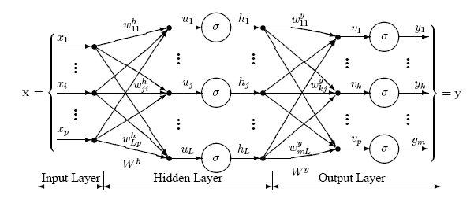

Contents

* TOC
{:toc}
----------

**심층 신경망의 수학적 기초** 6강 (9월 23일) 에 기반합니다. 

이 글은 SVM과 Logistic Regression [링크](/deep-learning-study/svm-and-lr), Softmax Regression [링크](/deep-learning-study/softmax-regression) 에 이어지는 내용입니다.

나중에 설명을 보강해서 다시 작성될 예정입니다. 

------

Logistic regression 같은 $f_\theta(x) = a^T x + b$ case를 1-layer (linear layer) neural network로 볼 수 있다. 

Softmax Regression 설명 마지막에 했던 것처럼, 적절한 loss function $\ell$ 을 도입한 다음, $\ell(f_\theta(x), y)$ 를 최적화하는 경우를 생각하자. Logistic regression은 여기에 $\ell$로 logistic loss를, $f_\theta$ 자리에 linear model을 넣은 특수한 케이스이다. 이를 좀더 엄밀하게 생각하기 위해, Linear layer를 생각하자. 

### Linear Layer
입력으로 $X \in \R^{B \x n}$, where $B = $ batch size, $n = $ 입력 크기를 받아서, 출력 $Y \in \R^{B \x m}$ 크기의 텐서를 출력하는데,
$$Y_{k, i} = \sum_{j = 1}^{n} A_{i, j} X_{k, j} + b_i$$
이와 같이 작동하는 layer 를, batch의 각 벡터 $x_k$ 에 대해 $y_k = A x_k + b$ 형태의 선형으로 나타난다는 의미에서 linear layer라 한다. 이때 $A$ 행렬을 weight, $b$ 벡터를 bias라 한다.

따라서, Logistic Regression이란, 하나의 Linear layer를 이용하고, loss function으로 logistic loss (KL-divergence with logistic probability) 를 사용하는 Shallow neural network 라고 다시 정의할 수 있다. 

### Multi Layer Perceptron
Multi-Layer (Deep Network) 를 생각하면, linear function의 깊은 결합은 어차피 linear하므로 아무 의미가 없다.

그러나, 적당한 non-linear activation function $\sigma$ 를 도입하여, 다음과 같은 layer를 구축하면 의미가 있게 된다.

  

즉, 이를 식으로 쓰면...
$$
\begin{align*}
    y_L &= W_L y_{L-1} + b_L \\
    y_{L - 1} &= \sigma(W_{L-1} y_{L - 2} + b_{L - 1}) \\
    \cdots & \cdots \\
    y_2 &= \sigma (W_2 y_1 + b_2) \\
    y_1 &= \sigma (W_1 x + b_1)
\end{align*}
$$
where $x \in \R^{n_0}, W_l \in \R^{n_l \x n_{l-1}}, n_L = 1$. (Binary classification만 잠깐 생각하기로 하자)

- 주로 $\sigma$ 로는 ReLU $ = \max(z, 0)$, Sigmoid $\frac{1}{1 + e^{-z}}$, Hyperbolic tangent $\frac{1 - e^{-2z}}{1 + e^{-2z}}$ 를 쓴다. 
- 관례적으로 마지막 layer에는 $\sigma$를 넣지 않는 경향이 있다.

이 모델을 **MultiLayer Perceptron (MLP)** 또는 Fully connected neural network 라 한다.

### Weight Initialization
SGD $\theta^{k + 1} = \theta^k - \alpha g^k$ 에서, $\theta^0$ 은 convex optimization에서는 어떤 점을 골라도 global solution으로 수렴하므로 의미가 없지만, deep learning에서는 $\theta^0$ 을 잘 주는 것이 중요한 문제가 된다.

단순하게 $\theta^0 = 0$ 을 쓰면, vanishing gradient 의 문제가 발생한다. Pytorch에서는 따로 이를 처리하는 방법이 있음.

### Gradient Computation : Back propagation
다시 잠깐 logistic regression을 생각하면, loss function을 다 셋업한 다음 결국 마지막에는 stochastic gradient descent 같은 방법을 이용해서 최적화할 계획으로 진행했다. 그렇다는 말은, 결국 어떻게든 뭔가 저 loss function의 gradient를 계산할 방법이 있기는 해야 한다는 의미가 된다. 즉, 각 layer의 weight들과 bias들의 각 원소들 $A_{i, j, k}$에 대해, $\pdv{y_L}{A_{i, j, k}}$ 를 계산할 수 있어야 한다. 

MLP에서는 이 gradient 계산이 직접 수행하기에는 매우 어렵기 때문에, 이를 pytorch에서는 autograd 함수로 제공한다. 다만 기본적인 원리는 vector calculus의 chain rule에 기반한다. 나중에 이를 따로 다룬다.

