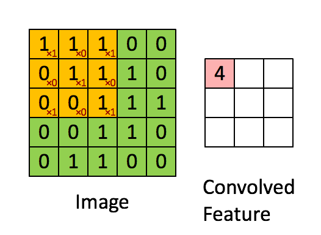
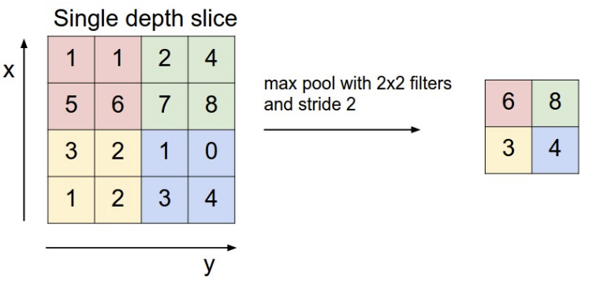

Contents

* TOC
{:toc}
----------

**심층 신경망의 수학적 기초** 7강 (9월 28일) 에 기반합니다. 

매우 유명한 [Standford CS231n 자료](https://cs231n.github.io/convolutional-networks/) 도 참고하면 좋습니다. 

## Convolution
Convolution은 수학적으로 굉장히 다양한 대상들에 대해서 잘 정의된 연산인데, 우리는 $n$차원 텐서 (배열) 에 대해서만 생각하겠습니다. 

다음 그림과 같이, Convolution은 Filter 또는 Kernel 이라는 (그림의 노란색 행렬) 을 "밀면서" 내적을 반복해서 새로운 행렬을 얻는 연산입니다. 

  
[이미지 출처 : towardsdatascience.com](https://towardsdatascience.com/a-comprehensive-guide-to-convolutional-neural-networks-the-eli5-way-3bd2b1164a53)

일반적으로, 이미지 처리에서 CNN을 가장 많이 쓰기 때문에 CNN의 입력은 3차원 텐서 (배열) 로 가정하고, filter도 3차원 텐서 (배열) 로 가정합니다. 이미지가 2차원임에도 3차원 텐서를 쓰는 이유는 이 텐서의 정체를 보면 알 수 있습니다. 보통은 세 차원을 Channel * Width * Height 으로 부르는데, Channel은 초기 입력 단계에서는 **R G B** 의 색 정보를 나타냅니다. 

그래서, 3차원 텐서지만 실재로는 여러 채널이 있는 W * H 크기의 행렬의 묶음으로 생각하면 됩니다. $C * W * H$ 입력 이미지에 대해 $C * 3 * 3$ 필터를 쓰게 되면 실제로 공간적으로 필터를 밀어 볼 수 있는 방향은 (가로, 세로) 방향으로만 밀면 되므로, $(W - 2) * (H - 2)$ 크기의 결과를 얻습니다. 그러나 우리는 여러 정보를 동시에 인코딩해서 가져가고 싶기 때문에, 실제로는 동시에 $D$개의 $C * 3 * 3$ 필터를 사용합니다. 

이렇게 해서 얻어진 각 행렬들을 모두 연결하면, $D * (W - 2) * (H - 2)$ 크기의 output을 얻습니다. 

**Padding :** 우리가 $W * H$ 크기의 이미지를 가지고 있고, 이 이미지에 $3 * 3$ filter를 convolution하면, $(W - 2) * (H - 2)$ 크기가 된다는 것은 쉽게 알 수 있습니다. 이는 맨 외곽 칸까지 밀게 되면 필터가 이미지 바깥으로 일부가 나가버리기 때문인데, 이를 보정하기 위해 이미지의 맨 외곽선을 0으로 쭉 한칸 더 만들어 주는 방법이 있습니다. 이를 Padding이라고 합니다.  

**Stride :** Filter를 평면상에서 "민다" 고 표현했는데, 위 설명은 매번 "한 칸 씩" 미는 경우를 생각하고 있습니다. 꼭 그럴 필요는 없고, $s$칸씩 한번에 밀 수도 있습니다. 그렇게 하면 당연히 출력의 크기는 더 줄어들게 됩니다. 이 $s$를 Stride라 합니다.

**Bias :** Convolution한 결과물 전체에 어떤 특정한 상수값을 더해줄 수도 있고, 이를 bias라고 부릅니다. 

여기까지 내용의 요약이 다음 image에 잘 드러나 있습니다. [이미지 출처인 Standford CS231n 자료](https://cs231n.github.io/convolutional-networks/) 에서는 저 필터가 진짜 움직이는걸 볼 수 있으니 한번쯤 보면 이해하기 좋은 것 같습니다. 그림에는 3개 채널의 5 by 5 이미지에, padding 1을 주었고, 3채널 by 3 by 3 크기의 필터를 쓰며, stride = 2 인 케이스를 보여주고 있습니다. 아래에는 bias도 포함되어 있습니다. 

  

입력이 $C_i * W_i * H_i$ 이고, padding이 $p$, stride가 $s$이며, 크기가 $C_i * F * F$ 인 필터 $K$개를 쓴다고 하면, convolution을 한번 하고 나면 다음과 같이 계산되는 $C_o * W_o * H_o$ 출력을 얻습니다. 
$$C_o = K \quad \quad W_o = \floor{\frac{W_i - F + 2P}{S} + 1} \quad \quad H_o = \floor{\frac{H_i - F + 2P}{S} + 1}$$

## Pooling 
CNN은 보통 큰 이미지 데이터를 대상으로 하며, 최초에는 이미지를 분류하는 목적으로 개발되었습니다. 그렇다 보니, 이미지 전체의 수만 픽셀의 데이터를 전부 보기보다는 그 특징을 잡아내는 것이 필요합니다. 또한 만약 신경망에서 잡아낼 수 있는 특징을 크게 훼손하지 않으면서 돌아다니는 데이터의 양을 줄일 수 있다면, training 및 inference 시간을 크게 개선할 수 있을 것입니다.

이를 위해 pooling이라는 연산을 수행합니다. pooling은 단순히 지금 보고 있는 부분의 max나 avg를 택하는 연산인데, 다음 그림을 보면 쉽게 이해할 수 있습니다. 

  
[이미지 출처 : Stanford CS231n]

위 그림에서 볼 수 있듯, pooling도 convolution처럼 filter라는 표현을 자주 쓰며, stride와 padding을 줄 수 있습니다. 다만 convolution처럼 뭔가를 train할 필요는 없고, 그냥 그 연산을 수행한다고 생각하면 됩니다. 가장 일반적인 형태의 pooling은 2 by 2 필터에 stride 2로 연산하는 것으로, 2 * 2 정사각형에서 max 또는 avg 하나씩을 남김으로서 데이터의 양을 1/4로 줄입니다. 

Pooling은 각 채널별로 독립적으로 실행할 수 있으므로, 2D 에서만 생각해도 충분합니다. 3D pooling도 똑같이 정의하면 생각할 수는 있겠지만요.

## Convolutionary Neural Network
[Multi Layer Perceptron](/deep-learning-study/multilayer-perceptron) 에서는, Linear Layer - Activation - Linear Layer - Activation - ... 의 형태로 깊게 이어진 신경망을 구축했고 이를 Multi-Layer Perceptron이라고 불렀습니다. 

Convolutinary Neural Network, CNN도 큰 틀에서는 비슷합니다. 다만, 좀더 복잡한 아이디어들이 들어가 있습니다. 

가장 기본적인 CNN은 크게 Convolution, Pooling, Activation의 세가지 Layer를 잘 반복해서 구성됩니다. 

Convolution은 앞서 설명한 convolution 연산을 적당한 필터에 대해서 수행하는 것으로, MLP에서 weight 행렬이 train의 대상인 것처럼 여기서는 필터 전체가 training의 대상입니다. 

Activation은 MLP에서처럼 모든 항에 적당한 activation function을 씌워서 신경망에 non-linearity를 제공하는 것입니다. 역시 MLP에서와 마찬가지로 ReLU, sigmoid, tanh 같은 함수들을 쓸 수 있습니다. 

Pooling은 앞서 설명한 pooling을 수행하는 layer입니다. 

## Why CNN? 
CNN의 효용에 대해 얘기하려면 기존의 MLP의 특징을 먼저 이야기할 필요가 있습니다.

- 장점 : 간단하고, 이론적으로 굉장히 general합니다. 모든 연속함수를 어떤 정해진 구간에서는 충분히 큰 MLP로 approximate 가능하다는 굉장한 정리가 있는데 (Universal Approximation Theorem) 제가 찾아본 증명은 실해석학 수준의 해석학 지식을 (Hahn-Banach, Riesz Repr thm) 요구하기 때문에 다룰 수가 없습니다.  
- 단점 : Parameter가 매우 많아서, overfitting의 문제와 training speed 문제가 발생합니다.
- 단점 : Computer vision에 쓰기에는 shift invariance 같은 것을 잘 처리하지 못한다는 심각한 문제가 있습니다. 특히 image classification 같은 경우, 이미지의 일부를 shift해도 그대로 같은 이미지인데 MLP는 이를 처리하기 어렵습니다.

Convolution은 그 자체로 shift invaraince를 가지기 때문에, 단점 2번을 잘 해결합니다. 또한, 단점 1번의 경우, Convolution의 파라미터가 꽤 많아 보이지만 $W * H$ 이미지를 던져주고 $W * H$ 출력을 만들기 위해서 Linear layer는 파라미터 $W^2H^2$ 개가 필요합니다. 입출력이 200 by 200이면 이 값이 16억인데, convolution은 파라미터가 훨씬 적습니다.

자연스러운 질문은, 파라미터가 그렇게 적으면 충분히 general하게 학습하지 못하는게 아니냐는 의문이 들 수 있습니다. [2018년 논문](https://arxiv.org/abs/1804.10306) 에 따르면 수학적으로는 CNN도 universal approximation theorem이 있다고 하는데, 굳이 이런 놀라운 수학적 결과를 들이밀지 않더라도 이미지 처리에서 CNN이 그동안 보여준 놀라운 성과를 보면 이정도 파라미터로도 Convolution 자체가 어떤 이미지를 '대략적으로' 보는 느낌이 굉장히 직관적으로 좋아서, 잘 작동하는 것으로 보입니다. 

또한, CNN은 MLP보다 같은 크기에서 훨씬 깊은 네트워크를 만들 수 있습니다 (레이어당 파라미터가 적으므로) 이 점도 장점이 될 수 있겠습니다. 

## Next posts
CNN의 여러 Model들에 대해 살펴볼 계획입니다. 
- LeNet
- AlexNet 
- VGGNet
- GoogLeNet
- [Semantic Segmentation](/deep-learning-study/semantic-segmentation) 에서 다룰 모델들.
    - U-Net
    - FCN
    - DeepLab