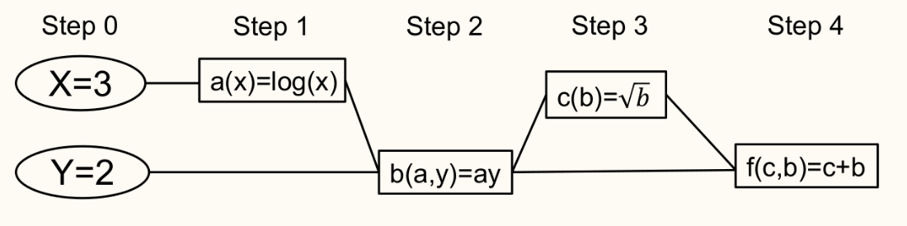
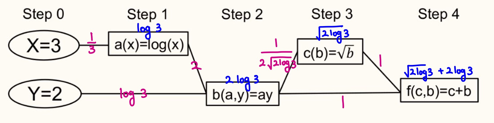

Contents

* TOC
{:toc}
----------

이 글은 심층신경망 수업에서 공부한 내용에 기반하지만, 제가 나름대로 이해한 바를 덧붙여서 작성했습니다. 특히, 설명하는 방법이 조금 다릅니다. 

## Introduction
Multi layer perceptron이 되었든, Convolutionary neural network가 되었든 기본적인 틀은 logistic regression과 다를 것이 없습니다.

설명의 편의를 위해 이 글에서는 MLP에 대해 설명하겠지만, CNN도 사실은 별로 다르지 않습니다.
- MLP는 결국, 다음과 같은 형태의 함수로 나타나는 회귀 모형이라고 볼 수 있습니다.
$$\begin{align*}
    y_L &= W_L y_{L-1} + b_L \\
    y_{L - 1} &= \sigma(W_{L-1} y_{L - 2} + b_{L - 1}) \\
    \cdots & \cdots \\
    y_2 &= \sigma (W_2 y_1 + b_2) \\
    y_1 &= \sigma (W_1 x + b_1)
\end{align*}$$
- 여기서 $W_i, b_i$ 들은 모두 trainable weight 이고, $\sigma$는 어떤 activation function 입니다.
- 우리는, $y_L$의 참값 (이라고 말하면 좀 애매하지만...) 을 반환하는 함수 $\tilde{y_L} = f(x)$ 가 존재한다고 생각합니다. 이를 최대한 **근사** 하는 것이 목표입니다. 즉, 저 위 형태의 함수 ($W_i, b_i$ 를 이용하여 표현되는 함수) 를 **표현 가능하다** 라고 정의하면, **Ground-truth 함수에 가장 가까운 표현가능한 함수** 를 찾고 싶습니다.
- 그러나 우리는 ground truth를 모두 아는게 아니라, 몇몇 데이터 $x^1, x^2, \dots$ 에 대해 알고 있습니다.  
따라서, 어떤 Loss function을 정의하여
$$\sum_{i = 1}^{n} \mathcal{L}(y_L^{i}, \tilde{y_L}^{i})$$
을 정의한 다음, 이 $\mathcal{L}$ 이 어떤 실제 $\tilde{y_L}^i$ 과 $y_L^i$ 간의 거리를 제시하므로, 이를 가능한 최소화하는 방향으로 나아가려고 합니다. 
- 그러므로, 우리는 여기서 SGD 또는 그 비슷한 알고리즘들을 사용합니다. 즉, $W_k, b_k$ 행렬 또는 벡터에 들어 있는 각 변수 $W_k(i, j)$ 나 $b_k(i)$ 를 이용해서 전체 공간에서의 Loss function을 그려놓고, 그 minimum을 (iterative하게) 찾을 수 있기를 바랍니다. 
- SGD나 다른 방법을 쓰려면, 결국은 이런 느낌의 편미분계수들을 꼭 알아야 합니다. 
$$\pdv{\mathcal{L}}{W_k(i, j)} \quad \quad \pdv{\mathcal{L}}{b_k(i)}$$

모델이 간단하면 뭐 직접 미분한다고 치지만, 위에 있는 MLP 식 같이 생긴 복잡한 함수를 어떻게 미분할 수 있을까요? 

## Backpropagation
위 형태를 잘 보면, 합성함수 형태임을 알 수 있습니다. 합성함수의 미분은 Chain rule을 이용해서 수행할 수 있습니다.  
$x \in \R^m, y \in \R^n$, $g : \R^m \to \R^n, f : \R^n \to \R$ 정도의 세팅을 생각해 봅시다. $\mathbf{y} = g(\mathbf{x}), z = \mathbf{y}$ 라 할 때, 다음이 성립합니다.
$$\pdv{z}{x_i} = \sum_{j} \pdv{z}{y_j} \pdv{y_j}{x_i}$$
이 방법을 이용해서, 우리는 전체 $P$개의 모든 파라미터에 대해 $\pdv{\mathcal{L}}{w_i}$ 를 구해야 합니다. 

이를 계산하기 위해, 먼저 Computational graph를 만듭니다. Computational graph란, 아래와 같이 각 값들을 노드로, 계산에 필요한 dependency들을 edge로 연결해서 그래프 형태로 만든 것입니다.
  
(사진출처 : 서울대학교 심층신경망의 수학적 기초 강의자료)

여기서, '변수를 다른 변수로 미분한 미분계수' 들을 구하고, '최종 결과를 변수로 미분한 미분계수' 를 그 결과로 얻을 것입니다. 구체적으로, 
1. 각 edge에 대해, 변수를 변수로 미분한 중간 미분계수를 edge에 적어넣고,
2. 마지막에, root 노드 (i.e, 계산의 최종값) 에서 출발해서, 임의의 노드까지 가는 경로를 모두 따라가면서 곱해서 더하면 '최종결과를 변수로 미분한' 미분계수를 얻습니다.

즉, 알고리즘의 언어로 말하자면 DAG 위에서 depth가 낮은 노드부터 거꾸로 올라가면서 edge의 값을 계산하고 (DP), 돌아올때는 topological order로 계산하겠다는 의미입니다. 

이 사진에 있는 함수를 직접 계산하면서 과정을 따라가 보겠습니다.
- step이 낮은 것부터 올라갑니다. 즉, 처음에는 step 1인 $a$-노드의 미분계수들을 계산하기 위해 $\pdv{a}{x}$ 를 구하며, 이 값은 $1/x$ 이므로 1/3입니다. 여기서 주목할 점은, 일반적인 symbolic differntiation을 수행할 때는 $1/x$를 들고 가지만, 우리는 어차피 최종적으로 수치연산을 할 것이므로 $1/3$ 이라는 사실만 기억하면 $1/x$ 라는 값은 잊어버려도 됩니다. 이 값은 edge에 적어 넣습니다. 또한 이후에 $a$값도 필요하기 때문에 $a = \log 3$ 이라는 결과를 노드에 적어넣습니다. 이제, step 1까지 왔습니다.
- step 2에 해당하는 $b$를 구해야 합니다. $\pdv{b}{a} = y, \pdv{b}{y} = a$ 이며, 이는 각각 $a, y$의 **이미 계산한 노드값** 을 참조해서 계산할 수 있습니다. 각각 $2, \log 3$ 이 될 것이며, 이를 edge에 적어 넣습니다. $b$ 는 $2 \log 3$ 이고. 이건 노드에 적어넣습니다. 
- step 3에 해당하는 $\pdv{c}{b}$ 는 $\frac{1}{2\sqrt{b}} = \frac{1}{2\sqrt{\log 3}}$ 입니다. $c = \sqrt{log 3}$ 입니다. 
- step 4는 마지막으로, $\pdv{f}{c} = 1$, $\pdv{f}{b} = 1$ 이며, $f$ 의 최종적인 값은 $\sqrt{2 \log 3} + 2 \log 3$ 입니다.

여기까지가 지금 1 과정이 끝난 것입니다. 이를 "Forward pass" 등으로 부릅니다. 여기까지 계산한 결과는 아래와 같습니다.
  
이제, 다시 거꾸로 돌아가면서 계산합니다.
- $\pdv{f}{c} = 1$. 이번에는, $c$에 해당하는 노드에 이 값을 적어넣습니다. 
- $\pdv{c}{b} = \frac{1}{2 \sqrt{2 \log 3}}$ 이며, $\pdv{f}{b}$ 는 여기에 따로 $b$가 $f$에 영향을 미치는 1이 있으므로 (가장 아래 edge), $\pdv{f}{b} = \frac{1}{2 \sqrt{2 \log 3}} + 1$ 입니다. 마찬가지로 $b$ 노드에 적어 넣습니다.
- 같은 방법으로 뒤로 계속 달립니다. $\pdv{f}{a} = \frac{1}{\sqrt{2 \log 3}} + 2$. 
- 결국 다 계산하면, $\pdv{f}{x} = \frac{1}{3\sqrt{2\log 3}} + \frac{2}{3}$ 과 $\pdv{f}{y} = \sqrt{\frac{\log 3}{8}} + \log 3$ 이 남을 것입니다. 
이 방법을 Backpropagation이라고 부릅니다.

## Notes
- Autodiff란, 사실은 forward autodiff 등 몇가지 방법이 더 있습니다. 그중 가장 대표적인 방법인 backpropagation을 소개했는데, 사실 생각해 보면 반대로 forward pass만으로 계산하는 방법이 있습니다. 
위 과정에서 위로 올라가는 DP를 할 때, $\pdv{b}{a}$ 같은 값들을 계산해서 edge에 적어놓고, 바로 $b$ 노드에는 $\pdv{b}{x}, \pdv{b}{y}$ 를 그자리에서 계산해서 (앞서 $\pdv{a}{x}$ 도 노드에 적어놨을 것이므로) 기억하는 방법이 있습니다.
이렇게 계산하면 한번 forward를 달릴 때 모든 계산이 끝납니다.
- 그럼에도 불구하고, 실제로 사용하는 deep learning에서의 gradient 계산은 대부분 backpropagation입니다. 그 이유는, 지금 위 예시에서는 알 수 없는 부분이긴 하지만 MLP를 다시 생각해 보면 대부분의 연산이 행렬곱이므로 위 예시와는 달리 각 edge에 스칼라값이 아니라 행렬이 쓰여지게 됩니다. 이게 왜 의미가 있냐면, 결국은 '행렬들을 순서대로 많이' 곱해야 한다는 얘기고... 행렬 여러개를 곱할 때는 작은 행렬부터 곱하고 그 결과를 큰 행렬과 곱하는 것이 대체로 보다 효율적입니다. (이 표현은 완벽하게 정확하지는 않지만, 행렬의 크기가 단조증가한다면 참입니다. 사실은 이 자체가 **행렬 곱셈 순서** 라는 (백준에도 있는..ㅋㅋ) 매우 유명한 DP 문제입니다.) 그런데 MLP든 CNN이든, 네트워크 끝쪽 (출력에 가까운 쪽) 으로 향하면서 점점 feature의 개수를 줄여나가는 것이 일반적이며, 따라서 backpropagation 방법으로 뒤에서부터 곱하면서 오는게 행렬 곱셈을 더 빨리 할 수 있기 때문입니다. 
- Torch 등 딥러닝 라이브러리들은 이 backpropagation을 자동으로 잘 따라가 주기 때문에 일반적으로는 걱정할 필요가 없지만, 새로운 loss function을 정의할 때는 항상 미분가능한지를 생각해야 합니다. 

------
**Reference**
- 서울대학교 심층신경망의 수학적 기초 강의자료 ([링크](http://www.math.snu.ac.kr/~ernestryu/courses/deep_learning.html))
- Ian Goodfellow, Yoshua Bengio, & Aaron Courville (2016). Deep Learning. MIT Press.