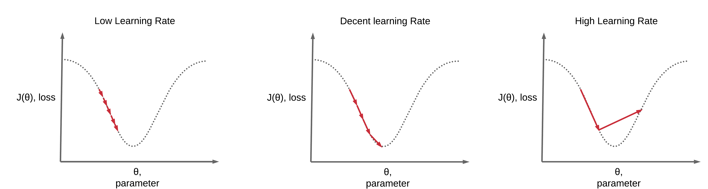
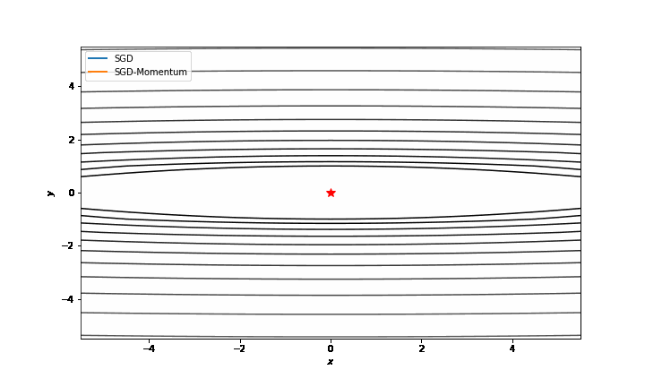
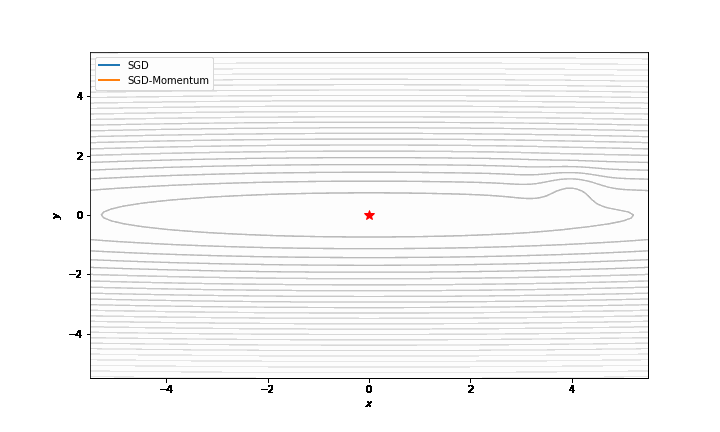
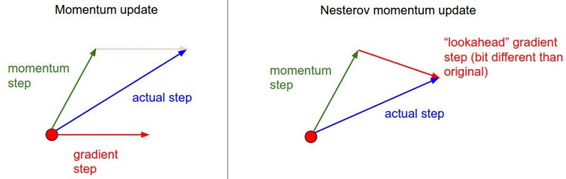
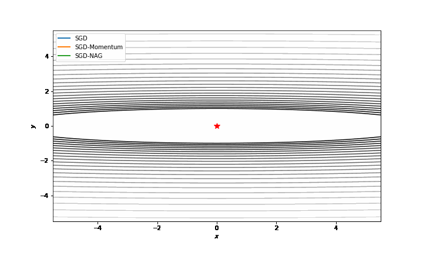
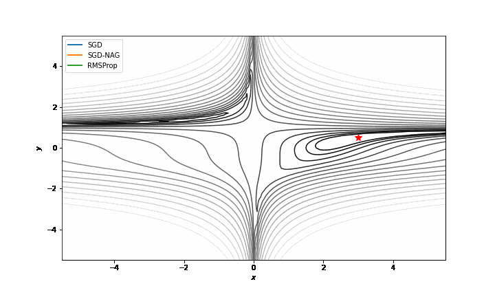

Contents

* TOC
{:toc}
----------
 

* 많은 딥러닝 문헌에서 $x^i$를 $i$번째 데이터를 의미하는데 쓰고, $x_i$는 $x$벡터의 $i$번째를 의미하는데 씁니다. 이 관행을 따르겠습니다.

딥러닝의 문제는 수학적 관점에서 환원하면 결국 다음과 같이 요약할 수 있습니다. 
- 미지의 함수 $f$에 대해 알고자 하는데, 
- 모든 지점이 아닌 어떤 지점 $x_i$ 들에서만 그 값 $f(x^i) = y^i$ 를 알고 있고, 
- 그래서 어떤 페널티 $\ell$ 을 정의해서, $\sum_i \ell(f(x^i), g(x^i))$가 작은 $g$를 $f$의 근사-함수로 생각하고 싶습니다.
- 그런데 이 $g$를 모든 함수의 공간에서 최적화하는 것은 일반적으로 가능하지 않으므로, 
- 어떤 parameter $\theta$ 에 의해 표현되는 함수공간의 부분집합 $g_\theta$만을 생각하며,
- $\minimize \sum_i \ell(f(x^i), g_\theta(x^i))$ by moving $\theta$로 생각합니다. 

그런데 $f(x_i)$는 이미 알고 있으므로, 결국은 $\ell$ 이라는 함수는 $\theta$에만 의존하게 됩니다. 따라서, 우리는 $\ell(\theta)$를 최소화하는 $\theta$를 찾는 것을 목표로 합니다. 다시 이를 일반화해서, $\theta \in \R^n$ 으로 생각하면, $\ell : \R^n \to \R$ 함수의 최적화 문제가 됩니다. 

- 일반적으로, $f$가 볼록(Convex) 함수인 경우에는 유일한 최적값이 존재하며, 추가로 강볼록 (Strictly Convex) 함수인 경우에는 최적값을 주는 최적 $\theta$도 유일함을 알고 있습니다.
- 볼록함수를 비롯한 여러 좋은 성질을 가진 함수들을 최적화하는것도 매우 흥미로운 이론들이 많이 있지만, 여기서는 깊이 다루지는 않겠습니다. 
- Deep Learning에서 사용되는 함수는 볼록성을 기대할 수 없기 때문에, 당연히 global minimum을 찾을 수는 없습니다. 우리는 Heuristic하게 그럴듯한 작은 값을 찾는 것을 목표합니다. 
- 그렇기 때문에, 여기 나온 어떤 말도 엄밀하지 않습니다. 수리과학부에 한발 걸치고 있는 제게는 약간 의아한 부분이기도 한데, convex를 기대할 수 없으면서도 convex한 함수에 대해 증명한 다음 그러므로 잘 된다~ 라고 주장하거나, convex한 함수에서조차 수렴성이 증명이 안되는 알고리즘(ADAM) 을 마음껏 사용하는 등(...) 조금은 신기한 분야입니다. 하지만 실용적인 가치가 이쪽에서는 가장 우선시되기 때문에 어쩔수 없는듯 싶습니다.

**주의** 이 글을 비롯하여, optimizer를 설명하는 많은 글에서 어떤 테스트 함수에 대한 아름다운 visualization을 이용하여 이해를 돕습니다. 매우 효과적이라고 생각했고 저도 실험해보면서 재밌었기 때문에 저도 직접 visualization을 많이 만들어 봤지만, 그래픽을 이용해서 이해할 때 주의할 점이 있습니다. 

우리가 일반적으로 사용하는 딥 러닝 모델은 수십만, 수백만 개의 파라미터가 있습니다. 다시 말해, $\R^{1,000,000}$ 같은 공간에서 뭔가를 최적화한다는 뜻입니다. 이 글에서 뒤에 설명할 "좋은" 최적화 알고리즘들인 RMSProp, Adam 등등은 이런 고차원 공간에서의 최적화를 빠르게 할 목적으로 개발되었습니다. 이런 상황과는 달리 우리의 그래픽은 $\R^2 \to \R$ 함수의 최적화를 사용하기 때문에, 세팅이 많이 다릅니다. 가장 큰 차이는 learning rate인데, 파라미터가 많다는것은 그만큼 각 파라미터에 대한 의존도는 낮아질 것이고 그러면 미세조정을 위한 작은 learning rate가 일반적입니다. 특히 $\R^2$ 같은 너무 저차원의 공간에서는 Adam같은 알고리즘들은 learning rate가 같아도 훨씬 수렴이 느립니다.

이걸 보정하기 위해, 달려나가는 점들의 초반의 이동 속도가 비슷하도록 의도적으로 learning rate를 조정했습니다. 즉, 이 그래픽을 보고 "아 Adam이 빠르군" 이런 생각을 하는 것은 **올바른 이해가 아닐 수도** 있다는 것입니다. 그래픽은 어디까지나 글로 설명한 바를 보여주기 위한 예시이므로, 많은 튜닝이 가해졌음을 염두에 두고, 말하고자 하는 바가 무엇인지를 파악하면 될 것 같습니다.

이 분야에 대한 제 이해도 아직 많이 부족하기 때문에, 설명에 오류가 있거나 보강할 점, 놓친 점이 있을 수 있습니다. 댓글 등으로 피드백은 항상 환영합니다 :) 

### (Stochastic) Gradient Descent
이 글에서는 독자가 gradient descent를 이해하고 있다고 가정하지만, 혹시 아니라면 [Gradient Descent에 대한 포스팅](/deep-learning-study/opt-and-gd) 를 참고해 주세요. 

Gradient Descent는 한 스텝 한 스텝이 너무 느리기 떄문에 (모든 데이터를 한바퀴 돌아야 해서), 대신 한 데이터 또는 소수의 데이터로 자주 밟는 stochastic gradient descent가 기본이 됩니다. 기본적인 SGD에 대해서는 [Stochastic Gradient Descent 포스팅](/deep-learning-study/sgd) 에서 다루었습니다. (언젠가 리폼될 예정) 이하의 모든 알고리즘들은 어떤식으로든 SGD에 기반하기 때문에, SGD의 식은 한번 리뷰할 가치가 있습니다. 

$$i(k) \sim \uniform{1}{N},\quad \theta^{k+1} = \theta^k - \alpha \nabla{f_{i(k)}(\theta^k)}$$

여기서 $\nabla f_{i(k)}$ 대신 다른 적당한 $g_k$를 잡아도 되는데 (Batched-gradient), 대신 $g_k$는 $\nabla F(x^k)$ 의 **Unbiased Estimator** 여야 합니다. 또한 좀더 식을 간단하게 쓰기 위해, 앞으로 $i(k)$ 의 선택은 논의하지 않겠습니다. 이건 그냥 랜덤하게 돌리면 됩니다. 즉, 위 SGD를 다시 쓸 때,  
$$\theta^{k+1} = x^k - \alpha g^k(\theta^k)$$
이렇게만 쓰더라도, $g^k$를 랜덤하게 골라진 index $i(k)$에 대한 (또는, batch를 사용하는 경우 batch-gradient) $\nabla f_i(k)$의 값으로 읽어주면 됩니다. Batch에 대한 자세한 얘기는 위에 링크걸린 SGD 포스팅을 읽어주세요.

여기서 다른건 대부분 큰 문제가 없는데, $\alpha$, learning rate의 선택이 문제입니다. Learning rate가 너무 크거나 작으면 최적화가 잘 이루어지지 않습니다.
- Learning rate가 너무 작으면, 함수값의 수렴이 너무 느립니다. 
- Learning rate가 너무 크면, 목표하는 점을 지나쳐서 수렴하지 않을 수도 있습니다. 
 
(사진출처 : https://www.deeplearningwizard.com/deep_learning/boosting_models_pytorch/lr_scheduling/)

일반적으로 좋은 Learning rate를 잡는 방법이 있는것은 아니고, 돌려보면서 찾아야 합니다. 

#### Momentum SGD
저 $\alpha$가 상수여야 할 이유는 별로 없습니다. 즉, 만약 매 순간 현재 시점까지 알고있는 어떤 정보를 이용해서 learning rate를 조정해 줄 수 있다면 더 좋은 알고리즘이 될 것입니다.

Momentum이란, SGD에 "이전에 갔던 방향으로 조금 더 가고자 하는" 관성을 추가하는 방법입니다. 이 방법을 먼저 수식으로 쓰면...
$$\begin{align*}
v^{k+1} &= g^k + \beta v^k \\ 
\theta^{k+1} &= \theta^k - \alpha v^{k+1}
\end{align*}$$
즉, '방금 전에 갔던 속도벡터의 $\beta$배' 를 현재 가고싶은 방향 (gradient)에 더해주는 것입니다. 이전에 갔던 방향으로 계속 가려는 경향성이 있기 때문에, 이런 함수를 상대적으로 빠르게 탈출할 수 있습니다. 
  
잘 보면, $x$방향으로는 gradient에 비해 가야할 거리가 먼데 비해 $y$방향은 gradient가 많이 변하고 있습니다. 일반 SGD는 후반 (valley를 내려온 후)에 gradient가 너무 작아서 학습이 잘 되지 않는 반면, Momentum이 추가된 SGD는 이전에 갔던 방향을 잘 이용해서 빠르게 진행하는 것을 관찰할 수 있습니다. 

또한, 작은 learning rate를 쓸 때 발생하는 또하나의 문제는 작은 local minima를 지나치지 못하고 묶여버리는 현상입니다. 이때 momentum은 local minima에서 빠져나올 수 있는 새로운 가능성을 제공하기도 합니다. 

아래 그림은 좀 어거지로 끼워맞춘 함수를 이용해서 만든 예시지만, (4, 1) 부근의 아주 작은 local minima를 지나치지 못하는 SGD와 momentum의 힘 (관성) 으로 지나쳐서 global minima를 향해 가는 momentum SGD를 비교해 볼 수 있습니다. 
  

#### Nesterov Accelerated Gradient
NAG라고도 불리는 이 방법은, 아래 도식에서도 알 수 있듯 momentum을 쓰되, 방금전의 momentum과 여기의 gradient를 합치는게 아니라 방금전의 momentum은 어차피 갈 것이므로 그만큼을 일단 무작정 간 다음 거기서 gradient를 찾는 방법입니다. 
  
(사진 출처 : stanford CS231)

직관적으로, 이 방법이 보다 잘 작동할 수 있을 것 같은 이유는 momentum SGD가 갖는 빠른 수렴속도 (관성) 을 유지하면서도 좀더 안정적이기 때문입니다. 예를 들어 momentum 방향이 $-y$ 방향이고, 지금의 gradient도 $-y$방향이라서 $-y$로 한참동안 가보니까 다시 $+y$ 방향 gradient가 있는 상황을 생각해 볼 수 있습니다. 이는 momentum SGD가 관성때문에 반대로 진동하게 만든다는 뜻인데, NAG는 이때 momentum만큼을 가본다음 거기서 gradient를 재기 때문에 이런 진동이 덜합니다.

위에서 본 parabola형태에서, 좀 큰 learning rate를 잡아서 momentum이 좀 크게 진동하게 만들면 이런 재밌는 예시를 얻습니다.
  
SGD는 저 멀리서 다시 평면을 기어다니고 있고 (...) 모멘텀은 위아래 진동이 너무 큰데 비해, NAG가 좀더 안정적으로 움직이고 있습니다.

### RMSProp
G.Hinton. Lecture Notes for csc321

RMSProp은 인공지능 분야의 선구자이자 최고의 big name중 하나인 Geoffry Hinton 교수님의 Coursera 강의에서 처음 소개된 알고리즘입니다. 대략적인 아이디어는, $g^k$의 지금까지의 히스토리를 볼 때, 변동이 좀 심한 값은 진동중인 값일 가능성이 높아 보이므로 그만큼 learning rate를 깎아서 적용하겠다는 아이디어입니다. 즉 $g^k$의 각 "방향" 마다, 다른 learning rate를 적용한다는 아이디어가 핵심이라고 할 수 있겠습니다.

이를 위해, $(g^k_i)^2$의 estimation을 $(m^k)_i$ 로 정의하고, 이 값의 square root로 나눠 줍니다. 즉 어떤 파라미터 방향으로의 지금까지의 gradient값의 "Root Mean Square average" 만큼을 이용, 변동이 심한 파라미터가 무엇인지를 찾습니다. 반대로, gradient의 변동이 거의 없으면 비교적 smooth한 길을 (기울어져 있을 수는 있지만, 변동이 심하지 않은) 가고 있을 것이므로, 좀 과감하게 가도 됩니다. 이를 수식으로 표현하면 다음과 같습니다. 
$$
\begin{align*}
    m^k &= \beta_2 m^{k-1} + (1 - \beta_2) (g^k \odot g^k) \\
    x^{k+1} &= x^k - \alpha g^k \oslash \sqrt{m^k + \epsilon}
\end{align*}
$$
여기서 보통 $\beta_2$ 값은 0.99 정도를 쓰고, 위 식에서 $\odot$ 와 $\oslash$ 는 elementwise 곱셈과 나눗셈을 의미합니다. 위 식을 보면, $m^k$는 (이전 $m^k$의 0.99배) 와 (현재 gradient의 각 방향별 값의 제곱의 0.01배)를 더해서 만들어지는데, 이는 즉 이전의 gradient들이 점점 영향을 덜 미치는 (즉, 가중평균을 내되, 최근값이 좀더 잘 반영되도록 하는 가중평균, 이를 **"Exponentially (decaying) moving average"** 라 해서 EMA라 씁니다) 형태의 식임을 의미합니다. $\epsilon$은 실수오차에 따라 음수의 square root를 취하는 (수학적으로는 $m^k$의 각 값이 음수가 나올 수 없지만, 계산해서 0인 값은 실수오차때문에 0에 매우 가까운 음수일 수 있습니다) 프로그램적인 오류를 방지하기 위해 추가된 값으로, 수학적으로는 의미가 없습니다. 

RMSProp을 비롯하여, 이후에 다룰 알고리즘들에게 parabola는 너무 쉬운 케이스이므로 Beale's function으로 그래픽을 그려보겠습니다.
  
마찬가지로 극초반 몇번은 속도가 비슷했지만, SGD는 gradient가 작아지면 갈곳을 잃는 반면 NAG나 RMSProp은 관성의 힘으로 좀 빠르게 나아갈 수 있습니다. 대신 약간 불안정한 모습을 보이는데, RMSProp이 좀더 빠르게 제 길을 돌아오는 모습도 확인할 수 있습니다.

### Adam
D. P. Kingma and J. Ba, Adam: A method for stochastic optimization, ICLR, 2015.

Adam은 **Ada**ptive **M**oment 의 약자로, 간단히 요약하면 Momentum-SGD와 RMSProp을 섞어놓은 알고리즘입니다. 
- Momentum-SGD에서 가져오는 아이디어는, $g^k$ 대신 모멘텀을 포함한 gradient 값을 사용하는 것입니다.
- RMSProp의 $(g^k_i)^2$의 running average를 취하는 아이디어를 그대로 가져옵니다.
- 단, Momentum도 RMSProp처럼 계산합니다. 이 말이 무슨 뜻인지는 수식을 보면서 얘기하겠습니다.
$$
\begin{align*}
    m_1^k &= \beta_1m_1^{k-1} + (1-\beta_1)g^k, \tilde{m_1^k} = \frac{m_1^k}{1 - \beta_1^{k+1}} \\
    m_2^k &= \beta_2 m_2^{k-1} + (1 - \beta_2) g^k \odot g^k, \tilde{m_2^k} = \frac{m_2^k}{1 - \beta_2^{k+1}} \\
    x^{k+1} &= x^k - \alpha \tilde{m_1}^{k} \oslash \sqrt{\tilde{m_2}^k + \epsilon}
\end{align*}
$$

수식에서, $m_1$은 $g$값의 EMA고 (이 표현은 바로 위 RMSProp에서 썼습니다), $m_2$ 값은 $g \odot g$ 의 EMA입니다. 
- 일반적으로, $\beta_1 = 0.9$, $\beta_2 = 0.99$를 많이 씁니다.
- $\tilde{m_1}$ 을 쓰는 것을 볼 수 있는데, 이건 처음에 $m_1, m_2$ 의 값을 모르기 때문에 이걸 0으로 초기화할 수밖에 없어서입니다. 0으로 초기화한 $m_1, m_2$ 때문에 초반 gradient가 올바르게 반영되지 않는 일을 막기 위해 (안그러면 처음 $m_1$은 $g_1$의 1/10에 불과하게 됩니다), 이를 bias-correction해 줍니다.

Adam은 현대 Deep Learning에서 가장 많이 사용되는 최적화 알고리즘입니다. 간단히 말해서, CNN같은걸 training하는데 뭘 쓸지 모르면 그냥 Adam을 써보면 됩니다. 

그정도의 중요도를 가진 알고리즘이기 때문에, 역으로 여기서는 짧게만 다루고 언젠가 CS-Adventure 포스팅으로 Adam 논문을 읽고 정리하려고 합니다. 재밌는 일화로, 2018 ICML에는 Adam의 볼록함수에 대한 수렴성의 반례를 찾은 논문이 발표되었습니다. Adam의 원본 논문에는 "Convex하면 수렴한다" 는 증명이 있는데, 이 증명에는 오류가 있고, 실제로는 볼록함수라는 조건 하에서도 수렴하지 않는다고 합니다. Nevertheless, 어차피 그동안 Adam 쓰던게 볼록함수에서 잘 수렴해서 쓰는게 아니었기 때문에 개의치 않고 다들 잘 쓰고 있습니다.

마찬가지로 Beale's function으로 그래픽을 그려보겠습니다.
  

맨 위의 주의에서도 말했지만, 이건 절대 각 알고리즘들의 공정한 비교가 아닙니다. 초반 몇번의 속도가 (눈으로 보기에) 비슷하도록 억지로 learning rate를 키워서 맞췄는데 (안그러면 '안정성' 때문에 Adam이 초반에 너무 느립니다), 우리가 겨우 수백개의 점에 대해 해보는것과는 달리 실제 딥러닝에서는 수천 수만개의 데이터를 수십바퀴 이상씩 돌릴거라서 근본적인 목표가 좀 다릅니다. 함수의 복잡도도 많이 다르고...이 그림은, SGD-NAG의 lr이 0.0015이고, Adam의 LR이 0.7입니다. 변명을 조금 하자면, SGD는 LR 0.1도 감당을 못하고 수렴을 못시키는데 비해 이렇게 높은 LR로도 수렴시키는게 달리말하면 Adam의 **안정성**을 보여준다고 볼 수 있습니다.

일반적으로, Adam과 같은 Adaptive rate (RMSProp도 마찬가지) 알고리즘들은 그 수렴 속도가 매우 빠르지만, **가끔** 어떤 예시에서는 잘 수렴하지 못하기도 합니다. 이때는 SGD같은 알고리즘들이 (충분히 learning rate를 잘 튜닝하면) 일반적으로 수렴성이 좋다고 알려져 있습니다. 

### Other algorithms
여기서 다루지 않은 알고리즘 중에도 재밌고 유용한게 많습니다.
- AMSGrad (Reddi et al, 2018) : Adam의 수렴성이 성립하지 않음을 지적한 논문에서 그 대안으로 들고 나온 알고리즘입니다. 언젠가 Adam에 대해 자세히 공부할 때 Adam + Convexity의 반례 + AMSGrad로 다루려고 생각하고 있습니다.
- NAdam (Dozat, 2016) : Adam의 $m_1$을 Nesterov 방식으로 바꾼 방법입니다. 
- AdamW (Loshchilov et al, 2017) : Adam 에 regularization을 적극적으로 도입해서 Adam의 generalization issue를 해결하는 방법입니다. 언젠가 다룰 수도? 있습니다.
- AdaDelta, AdaGrad, AdaMax : Adaptive rate 알고리즘들이 굉장히 다양하게 있는데, 약간씩 다른 아이디어가 있지만 기본 아이디어 (gradient와 그 square 등을 EMA해서 계산) 레벨에서는 다르지 않으므로 넘어갑니다. 
- BFGS를 비롯한 2nd-order methods : 수학적으로 흥미롭지만 이 글에서는 일부러 언급을 피했습니다. 차후에 다룰 예정입니다.