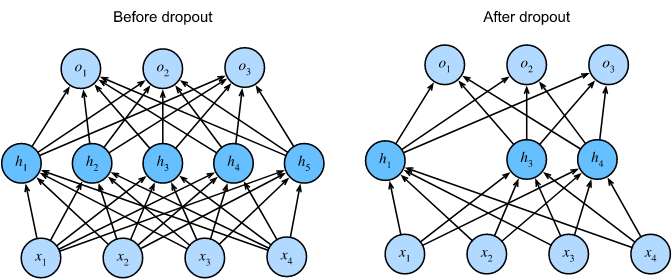

Contents

* TOC
{:toc}
----------

## Overfitting / Underfitting
이 블로그에서도 여러 차례 기본 세팅으로 언급한, **Deep learning의 기본 프레임워크** (사실은, 좀더 general하게 machine learning 내지는 regression 전체에 적용되는 프레임입니다) 를 돌아보는 것으로 시작하겠습니다.
- 미지의 함수 $f$에 대해 알고자 하는데, 
- 모든 지점이 아닌 어떤 지점 $x_i$ 들에서만 그 값 $f(x^i) = y^i$ 를 알고 있고, 
- 그래서 어떤 페널티 $\ell$ 을 정의해서, $\sum_i \ell(f(x^i), g(x^i))$가 작은 $g$를 $f$의 근사-함수로 생각하고 싶습니다.
- 그런데 이 $g$를 모든 함수의 공간에서 최적화하는 것은 일반적으로 가능하지 않으므로, 
- 어떤 parameter $\theta$ 에 의해 표현되는 함수공간의 부분집합 $g_\theta$만을 생각하며,
- $\minimize \sum_i \ell(f(x^i), g_\theta(x^i))$ by moving $\theta$로 생각합니다. 

[Optimizer에 관한 포스팅](/deep-learning-study/optimizers-for-deep-learning) 에서는 이 중, **그래서 어떻게 최적화할지** 를 생각했습니다. 여기서는, 조금 다른 문제를 생각해 보려고 합니다.

우리가 딥러닝이든, 일반적인 머신러닝이든 이용해서 $f$를 알아내려는 이유는 원래 이미 주어진 $x^i$ 들 외의, 새로운 점 $z$가 들어왔을 때 $f(z)$를 알고자 하는 것입니다. 예를들어 사진 1만 장을 이용해서 개와 고양이를 구분하는 함수 $g_\theta$를 훈련하고 나면, 훈련과정에서 한번도 본 적 없는 새로운 $z$가 개인지 고양이인지를 알아낼 수 있어야 합니다. 위 프레임은 그래서 다음 두 가지 의문이 생길 수 있습니다.
- $\ell$은 페널티이므로, $z$를 올바르게 판정하는 것은 새로운 데이터에 대해 $\ell(f(z), g_\theta(z))$ 가 작았으면 좋겠다고 생각할 수 있습니다. 그런데, 우리는 $x^i$들에 대해서 $g_\theta$를 훈련했습니다. $f$가 매우 이상하게 생긴 함수라면, $g_\theta$를 아무리 잘 최적화해 왔더라도 완전히 다른 이슈가 발생할 수도 있습니다. 
- 애초에, $g$가 모든 함수의 공간이 아닌 $g_\theta$로 표현되는 함수공간의 부분집합만을 생각하는데 $f$랑 충분히 가까운 함수가 $g_\theta$들의 집합에 있기는 할지도 모를 일입니다.

이 두가지 이슈를 딥러닝에서는 (보다 일반적으로, 통계학에서는) 각각 overfitting / underfitting이라고 부릅니다. 즉, 
- **Overfitting** 이란, 우리가 가진 모델 $g_\theta$가 훈련은 잘 되지만 미지의 데이터에 대한 성능이 그에 미치지 못하는 경우입니다. 우리가 잘 알고 있는 인간의 학습과 비교해보면, 같은 책을 계속 보다 보니 그 책은 잘 풀지만 새로운 문제를 주면 못 푸는(...) 상황이라고 할 수 있겠습니다.
- **Underfitting** 이란, $g_\theta$를 충분히 잘 최적화하지 못한 상황입니다. 역시 인간의 학습과 비교해보면 그냥 공부가 덜 된 상황입니다.
 
  

위에서 굳이 인간의 학습에 비유한 이유가 있습니다. 해결책도 약간 motivation이 비슷합니다.
- 먼저, **Underfitting** 을 해결하는 방법은 훈련을 더 하거나 (공부를 더 시키는 느낌) 아니면 더 좋은 모델을 개발하는 것입니다 (이건...인간의 학습으로 치면 스탯의 문제임을 인정하는거라 좀 애매합니다 ㅋㅋ;;)
- **Overfitting** 은 훈련이 잘못되고 있는 것입니다. 즉 모델이 필요 이상으로 훈련데이터의 특징을 잡아내고 있다는 점이고, 이것도 마찬가지로 더 많은 데이터를 쓴다거나 (아예 공부할 자료를 더 주는 느낌입니다), 아니면 regularization이라는 방법을 이용, 학습이 훈련데이터의 미세한 특징보다는 좀더 큰그림에 집중하도록 유도합니다.

여기서는 Overfitting을 줄이는 regularization에 주목합니다. Underfitting은 더 강한 모델을 쓰거나, 데이터를 늘리거나, 훈련을 늘리는 등 좀더 직관적인 방법으로 극복이 가능하기 때문에 다루지 않습니다. 

## Weight Decay / L2 Regularization
우리는 SGD를 이용하여, 다음과 같이 weight $\theta$ 값을 조정하는 식으로 training을 수행합니다. 
$$\theta^{k+1} = \theta^k - \alpha g^k$$
Weight decay란, 다음과 같이 SGD update를 수정하는 방법입니다. 
$$\theta^{k+1} = (1 - \alpha \lambda) \theta^k - \alpha g^k$$
즉, 매번 $\theta$의 값이 조금씩 decay합니다. 

이 값은 때로는 L2 Regularization이라고 불립니다. 그 이유는, 위 update를 잘 보면 $\alpha$가 $\lambda \theta^k$에 곱해져 있고, 이는 즉 $\lambda \theta^k$ 가 뭔가 $g^k$처럼 gradient스러운 값임을 의미하는 데서 찾을 수 있습니다. 즉, Loss function을 잘 조정한 다음 일반 SGD를 쓰면, 일반 Loss function에 대해서 weight decay 한 것과 같은 결과를 얻는다는 점입니다. 

정확히, 다음과 같은 loss function을 쓰면 weight decay와 동치가 됩니다. 
$$\frac{1}{N} \sum_{i = 1}^{N} \ell(f_\theta(x^i), y^i) + \frac{\lambda}{2} \norm{\theta}^2$$ 
이 계산은 간단하게 verify할 수 있는 미분 계산이므로 생략합니다. 핵심 아이디어는, "Weight값이 커지는 것을 기분나쁘게 받아들이자" 라는 것입니다. 모델이 한정된 데이터에 대해 overfitting하기 위해서는 각 파라미터값이 크게 fluctuate한다는 것을 역이용하는 아이디어입니다. 

예를 들어, 6개의 점 $(0, 0), (2, 4), (4, 16), (6, 35), (8, 65), (10, 99)$ 를 polynomial regression 한다고 생각해 봅시다. 이 데이터는 $y = x^2$ 를 "거의" 따라가므로, 2차식을 이용하여 approximate하면 $y = x^2$ 정도가 올바른 훈련 결과가 될 것입니다. 그런데, 여기에 5차식을 이용하면 training error가 0인 모델을 만들 수 있습니다 (Lagrange Interpolation). 당연히 훈련 데이터를 100% 맞추는대신 unseen data와 크게 어긋나는 좋지 못한 (overfitting이 심한) 모델인데, 이 모델을 아무튼 피팅해보면 그 결과는 $-\frac{x^5}{240}+\frac{37 x^4}{384}-\frac{73 x^3}{96}+\frac{323 x^2}{96}-\frac{287 x}{120}$ 입니다. 계수가 훨씬 크다는 것을 확인할 수 있습니다. 

이렇게, 오버피팅이 일어나면 대체로 계수가 크게 널뛰는 일들이 벌어집니다. 따라서, 반대로 계수가 커지는걸 supress하면, 오버피팅을 일부 줄일 수 있습니다. 

Weight decay는 2-norm을 loss에 더해서 L2 regularization이지만, 같은 논리로 L1, L3 등 다른 norm을 이용하는 regularization도 가능합니다. 

## Dropout 
Dropout은 훈련중에 일부 뉴런을 죽이고, 그 값만큼을 나중에 보정해주는 방법입니다. 
  
(이미지 출처 : Dive To Deep Learning)

즉, 각 레이어에서 $p$확률로 각 뉴런을 죽인다음, 살아남은 뉴런에 대해서는 가중치에 $\frac{1}{1-p}$ 만큼을 곱해서 전체의 가중치 합을 유지합니다. 이 방법은 수학적으로는 함수의 smoothness를 좀더 강제하는 방향으로 그럴듯한 argument가 있는데, 별로 rigorous하지는 않습니다. 다만 in practice 잘 작동하기 때문에 자주 사용됩니다. 

## Data Augmentation
이 방법은 간단히 설명하자면 데이터에 변형을 가해서 데이터 자체를 좀더 강화하는 것입니다. 인간의 학습으로 치자면, 같은 문제에서 숫자를 바꾼 유제를 더 풀도록 시키는 느낌인데요. 

대표적으로 Convolutional Neural Network같은걸 이용해서 classification을 하는 상황을 생각해 보겠습니다. 어떤 사진 $X_1$을 고양이라고 판단할 수 있는 네트워크는, $X_1$을 가로로 180도 뒤집은 (좌우대칭) 사진도 고양이라고 판단할 수 있어야 합니다. 또한, 이미지 전체에 약간의 노이즈가 있거나, 이미지의 크기가 바뀌거나, 가로세로에서 작은 픽셀만큼을 뺀다거나, 5도정도 돌려놓은 사진도 다 고양이라고 판단할 수 있어야 합니다.

따라서, 이런 방법들을 이용한다면, 고양이 사진 한 장을 마치 여러 데이터인것처럼 사용할 수 있기 때문에 
- 단순히 데이터를 늘린것처럼 생각하더라도, 왜 훈련이 잘 되는지 직관적으로 납득가능하며
- 결정적으로, "enforce하고싶은 성질" - 예를들어, "좌우대칭해도 라벨이 바뀌지 않는다" 를 직접 주입할 수 있습니다.

그래서, 어떤 augmentation을 할지는 데이터를 보고 직접 택해야 합니다. 예를들어 손글씨를 판단하는 태스크라면 좌우대칭 같은것은 쓸 수 없습니다 (대칭하면 라벨이 바뀌기 때문에) 그러나 대신 색깔을 바꾸는 augmentation이 가능한 식입니다. 

## Conclusion
Overfitting은 모델이 복잡하고 깊어질수록 더 많이 발생한다는 점에서 현대에 와서 더 강한(?) 모델이 등장함에 따라 더 큰 문제로 다가옵니다. 이러한 overfitting을 막기 위한 여러 regularization 방법들은 대부분의 모델에서 다양하게 사용되며, 새로운 모델을 설계할 때 필수적인 요소라고 할 수 있겠습니다. 