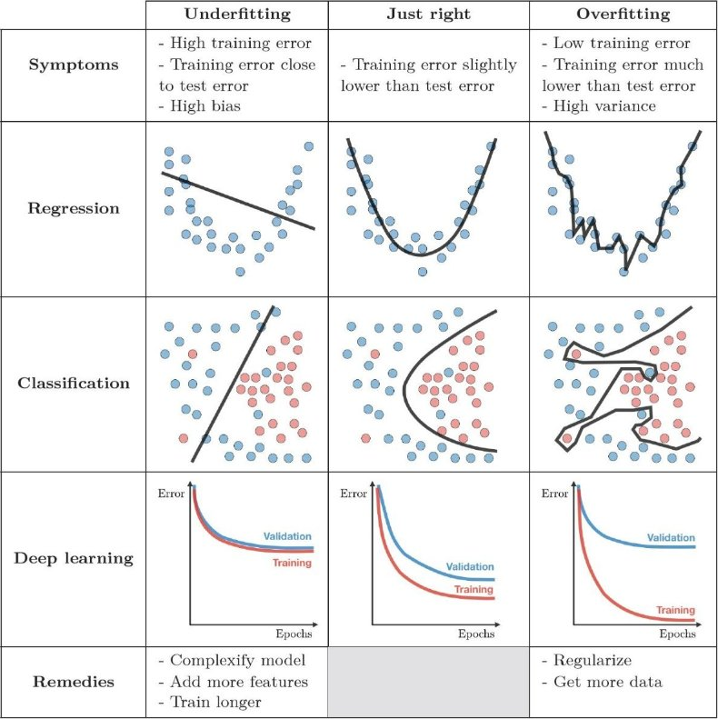

Contents

* TOC
{:toc}
----------

## Overfitting / Underfitting
이 블로그에서도 여러 차례 기본 세팅으로 언급한, **Deep learning의 기본 프레임워크** (사실은, 좀더 general하게 machine learning 내지는 regression 전체에 적용되는 프레임입니다) 를 돌아보는 것으로 시작하겠습니다.
- 미지의 함수 $f$에 대해 알고자 하는데, 
- 모든 지점이 아닌 어떤 지점 $x_i$ 들에서만 그 값 $f(x^i) = y^i$ 를 알고 있고, 
- 그래서 어떤 페널티 $\ell$ 을 정의해서, $\sum_i \ell(f(x^i), g(x^i))$가 작은 $g$를 $f$의 근사-함수로 생각하고 싶습니다.
- 그런데 이 $g$를 모든 함수의 공간에서 최적화하는 것은 일반적으로 가능하지 않으므로, 
- 어떤 parameter $\theta$ 에 의해 표현되는 함수공간의 부분집합 $g_\theta$만을 생각하며,
- $\minimize \sum_i \ell(f(x^i), g_\theta(x^i))$ by moving $\theta$로 생각합니다. 

[Optimizer에 관한 포스팅](/deep-learning-study/optimizers-for-deep-learning) 에서는 이 중, **그래서 어떻게 최적화할지** 를 생각했습니다. 여기서는, 조금 다른 문제를 생각해 보려고 합니다.

우리가 딥러닝이든, 일반적인 머신러닝이든 이용해서 $f$를 알아내려는 이유는 원래 이미 주어진 $x^i$ 들 외의, 새로운 점 $z$가 들어왔을 때 $f(z)$를 알고자 하는 것입니다. 예를들어 사진 1만 장을 이용해서 개와 고양이를 구분하는 함수 $g_\theta$를 훈련하고 나면, 훈련과정에서 한번도 본 적 없는 새로운 $z$가 개인지 고양이인지를 알아낼 수 있어야 합니다. 위 프레임은 그래서 다음 두 가지 의문이 생길 수 있습니다.
- $\ell$은 페널티이므로, $z$를 올바르게 판정하는 것은 새로운 데이터에 대해 $\ell(f(z), g_\theta(z))$ 가 작았으면 좋겠다고 생각할 수 있습니다. 그런데, 우리는 $x^i$들에 대해서 $g_\theta$를 훈련했습니다. $f$가 매우 이상하게 생긴 함수라면, $g_\theta$를 아무리 잘 최적화해 왔더라도 완전히 다른 이슈가 발생할 수도 있습니다. 
- 애초에, $g$가 모든 함수의 공간이 아닌 $g_\theta$로 표현되는 함수공간의 부분집합만을 생각하는데 $f$랑 충분히 가까운 함수가 $g_\theta$들의 집합에 있기는 할지도 모를 일입니다.

이 두가지 이슈를 딥러닝에서는 (보다 일반적으로, 통계학에서는) 각각 overfitting / underfitting이라고 부릅니다. 즉, 
- **Overfitting** 이란, 우리가 가진 모델 $g_\theta$가 훈련은 잘 되지만 미지의 데이터에 대한 성능이 그에 미치지 못하는 경우입니다. 우리가 잘 알고 있는 인간의 학습과 비교해보면, 같은 책을 계속 보다 보니 그 책은 잘 풀지만 새로운 문제를 주면 못 푸는(...) 상황이라고 할 수 있겠습니다.
- **Underfitting** 이란, $g_\theta$를 충분히 잘 최적화하지 못한 상황입니다. 역시 인간의 학습과 비교해보면 그냥 공부가 덜 된 상황입니다.
- 
  

위에서 굳이 인간의 학습에 비유한 이유가 있습니다. 해결책도 약간 motivation이 비슷합니다.
- 먼저, **Underfitting** 을 해결하는 방법은 훈련을 더 하거나 (공부를 더 시키는 느낌) 아니면 더 좋은 모델을 개발하는 것입니다 (이건...인간의 학습으로 치면 스탯의 문제임을 인정하는거라 좀 애매합니다 ㅋㅋ;;)
- **Overfitting** 은 훈련이 잘못되고 있는 것입니다. 즉 모델이 필요 이상으로 훈련데이터의 특징을 잡아내고 있다는 점이고, 이것도 마찬가지로 더 많은 데이터를 쓴다거나 (아예 공부할 자료를 더 주는 느낌입니다), 아니면 regularization이라는 방법을 이용, 학습이 훈련데이터의 미세한 특징보다는 좀더 큰그림에 집중하도록 유도합니다.

여기서는 Overfitting을 줄이는 regularization에 주목합니다.

## Weight Decay
Weight decay란, 