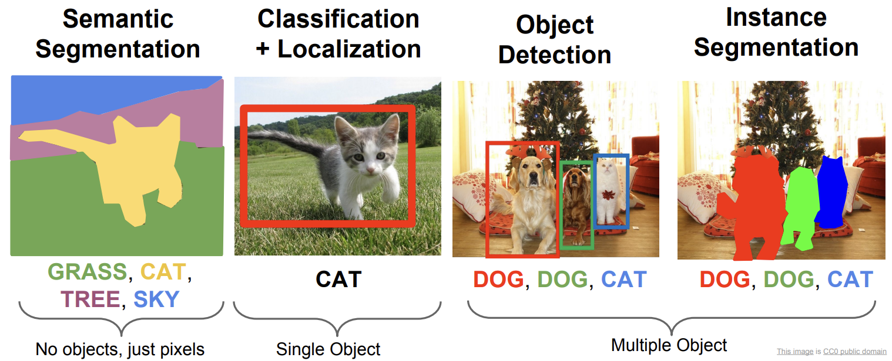

Contents

* TOC
{:toc}
----------

## Motivation
### Linear layer는 쓸 수 없다
LeNet을 시작으로 여러 CNN 모델들은 기존의 방법들로는 도저히 이룰 수 없는 성능을 보여주면서 이미지처리 분야에서 놀라운 발전을 견인했습니다. 

정말 간단하게, Imagenet challenge를 따라가면서 얘기하자면, 
- AlexNet (2012) 가 deep CNN이 얼마나 강력한지를 선보였고, 
- VGGNet, GoogLeNet (2014) 이 다시한번 (두 방법이 접근이 다르긴 하지만) 놀라운 성과로 한자리수 top-5 error rate를 보여준 데 이어,
- ResNet (2015) 이 새로운 architecture로 성능을 다시 급상승시키는 등

몇년 사이에 거의 사람이 처리하는 수준의 정확도를 보여주게 되었습니다. 그러나, 이 모델들은 **image classification** 을 수행하는 모델들이기 때문에, segmentation을 하기 위해서는 약간 다른 접근이 필요합니다. 

  

이 그림에서 볼 수 있듯, semantic 또는 instance segmentation은 classification과는 다르게, 고양이가 **있는지** 뿐 아니라 **어디에** 있는지를 알아야 합니다. 그런데, LeNet 같은 CNN의 구조를 보면...

  

마지막에 Fully connected layer를 다는게 일반적인데 (당연히, 이미지의 '전체' 를 보고 어떤 이미지인지 알고 싶은 것이므로 자연스럽습니다), 이렇게 하면 이미지에서 고양이가 원래 어디에 있었는지에 대한 spatial information을 다 날려 버리게 됩니다. 그래서, 더이상 linear layer는 쓸 수 없습니다.

그러면, 마지막도 그냥 다 convolution으로 밀어버리면 어떨까요? 이 아이디어가 FCN의 기반입니다. 
이 방법의 또 다른 장점은, feature를 추출하는 부분 (앞으로 전진하면서 줄여나가는 부분) 에 기존에 잘 알려진 네트워크 구조를 사용할 수 있고, 그렇게 되면 그 네트워크로부터 weight값을 그대로 받아오는 것도 가능하다는 점입니다. Pretrained network를 잘 활용할 수 있다는 것으로 요약할 수 있겠습니다.

### Pooling을 없앨 수는 없는데...
우리가 원하는 것은 최대한 pixel-wise segmentation입니다. 그런데, 예를 들어 무작정 VGGNet같은거의 끝 linear layer를 뜯어버리고 convolution을 몇개 더 달아서 segmentation을 시키면 어떤 문제가 있을까요? 
- VGGNet을 돌리는 과정을 잘 보면, feature map의 크기가 pooling을 하다 보면 계속 줄어들게 됩니다. 
- 그러므로, 결국 마지막 순간에 우리가 가진 feature map은 원본에 비해 가로, 세로가 각각 1/32로 줄어든 이미지가 됩니다. 256 x 256을 들고 시작했다면, 8 x 8 이 되겠네요.
- 당연히, upsampling은 쉽게 할 수 있습니다. 그런데 한 박스의 크기가 기본 32 x 32인 segmentation은 좀 마음에 안 듭니다.
- 즉, pooling을 할수록 segmentation을 정밀하게 할 수가 없습니다. 그런데 그렇다고 해서 pooling을 포기할 수는 없는 것이, pooling을 안하면 이렇게 깊게 네트워크를 쌓았을 때 크게 두 가지 문제가 있게 됩니다.
  - parameter가 너무 많아서, training이 매우 어렵거나 불가능해집니다. 파라미터가 많으면 overfitting의 문제가 증대될 수도 있습니다. 
  - 각 feature가 영향을 받는 receptive field가 너무 작습니다. 이건 convolution 연산 자체의 한계인데, convolution (3 by 3) 을 10번 하면 그 결과물의 1픽셀은 사실 가로세로 주변 10픽셀 크기 정사각형에 의해 결정되게 됩니다. 즉 전체적인 큰그림을 볼수가 없습니다. 아무리 segmentation이 local한 특징을 잡아내는 task라고는 하지만, 아예 큰그림을 볼수 없어서는 그것도 문제가 됩니다. 

### 확대하기 
결국 여기까지 오면서 다음의 결론이 나게 됩니다.
> Pooling을 포기할 수는 없다. 그러나, Pooling을 시행하면 이미지의 크기가 줄어든다.
> Convolution을 깊게 해야 feature를 축소할 수 있는데, 그러면 'semantic segmentation' 하는 의미가 좀 없어진다.

그렇다면, 합당한 생각은 이미지를 다시 **늘리는** 것일 것 같습니다. 이를 Upsampling이라고 하는데, 작은 이미지, 예를들어 100 x 100 이미지를 확대해서 200 x 200으로 만들고자 합니다. 당연히 아무렇게나 만드는것은 말도 안 되고, 이미지를 그럴싸하게 복구하고 싶습니다. 

**Unpooling** 가장 간단한 방법은 일종의 Un-pooling으로, pooling했을 때 예를 들어 2x2 로컬한 부분의 max값만을 취했다면 이를 다시 복구할때 2x2 개로 복사하는 것입니다. 이미지로부터 실질적으로 없는 정보를 더 유추하지 않으며, 단순하게 크기만 맞춰 주게 됩니다. 또는, 적당히 인접한 값들을 이용해 Bilinear interpolation하는 방법도 있겠습니다.

**Transposed Convolution** 이 이후의 많은 논문에서는 Transposed convolution이라는 기법을 사용합니다. 일부 논문들은 이것을 deconvolution이라고 부르기도 하는데, 일종의 convolution을 거꾸로 하는것처럼 보이기 때문에 그런 이름이 붙었지만 사실 수학적으로 convolution의 역연산이 아니며, 역연산은 따로 있기떄문에 별로 적절한 이름은 아닙니다. convolution이 필터를 밀면서 내적하고 이를 더하는 것처럼, 똑같이 수행하되 deconvolution을 통해서는 feature의 개수가 늘어납니다. 이것이 어떻게 가능한지는 식보다는 아래 그림을 보면 바로 이해할 수 있습니다. 

이 그림에서, convolution 연산이었다면 위쪽의 6x6이 input이 되고 3x3 필터를 밀어서 아래쪽의 4x4 feature map을 얻었을 것입니다. 그러나 이번에는 반대로, 4x4 feature map을 input으로 받고, filter에 그 값만큼을 곱해서 더해주는 식으로 작동합니다.  
따지자면, transposed convolution은 일종의 trainable up-sampling이라고 생각할 수 있습니다. 

다만, 이 방법들에는 매우 중대한 문제가 여전히 남아 있습니다. Feature map이 작아졌을 때 아무래도 어느정도 정보를 잃을 수밖에 없기때문에, upsampling을 잘 해도 fine prediction이 어렵다는 것입니다. 기껏 이미지를 다시 원래 사이즈로 올려놔도 prediction이 8x8 청크로 이루어지면 의미가 별로 없을 것입니다. 

### DAG is the way to go
Long et al, 저자들은 (이제는 많이 쓰이지만) 상당히 novel한 approach로 이 문제를 해결했습니다. 
  
이 그림에서처럼, 이미지 분류를 수행하는 path를 일종의 DAG로 확장하는 것입니다. 즉, convolution layer를 타고 흘러가는 도중에 있는 데이터를 끄집어내서, intermediate feature value들을 활용하여 segmentation을 수행합니다. 

## Training
저자들은 당시 ImageNet 챌린지에서 좋은 성과를 거두었던 VGGNet, GoogLeNet과 AlexNet을 backbone으로 하는 FCN을 실험하였고, VGGNet의 성능이 가장 우수했습니다. 
- 기본 Training은 SGD with Momentum이고 (Adam, Batchnorm이 연구되기 전입니다)
- Dropout은 원본의 classifier 부분 (linear layer가 들어갔어야 할, 끝 몇 레이어) 들에 대해서만 적용되었습니다.
- 세부적으로는 bias들에 대해서만 2배의 lr을 적용하는 등 열심히 튜닝되어 있지만 이부분은 저자들이 논문에서 말하기도 했는데, 별로 중요한 요소들은 아닙니다. 

자세한 부분들은 다음 포스팅에서 코드를 보면서 확인하겠습니다 :) 