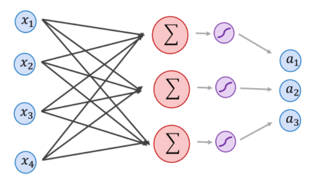
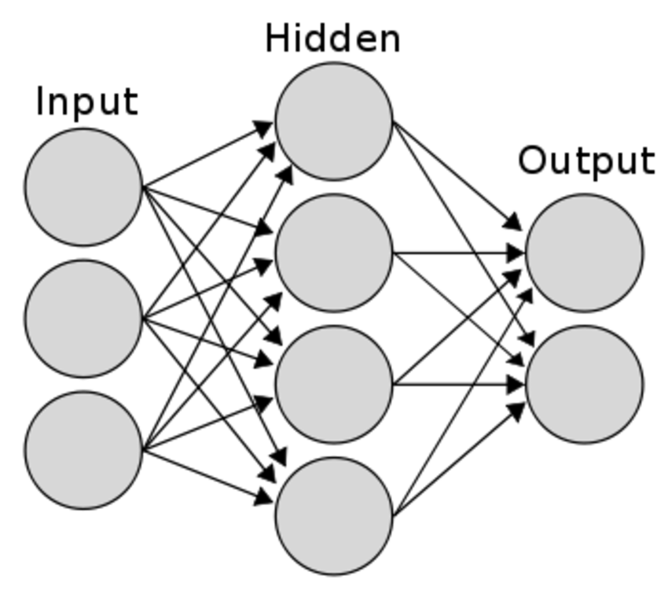

Contents

* TOC
{:toc}
----------

이 글은 [Supervised Learning 포스팅](/deep-learning-study/supervised-learning/) 위에서 출발합니다. 

즉, 우리는 어떤 적당한 loss function $\ell$과 주어진 데이터 $x^i$ 들에 대해, 
$$\underset{\theta \in \Theta}{\minimize}\ \sum_i \ell(f(x^i), f_\theta(x^i))$$
이러한 최적화 문제를 해결하는 상황을 생각할 것입니다. 예시로, **[Linear Regression](/deep-learning-study/linear-regression)** 이나 **[Support Vector Machine](/deep-learning-study/support-vector-machines)** 을 생각하면 됩니다. 

$f(x^i) = y^i$ 들이 주어져 있을 때, Linear regression은 일반적으로 다음과 같이 쓰여집니다. 
$$\underset{\theta \in \Theta}{\minimize}\ \sum_i \|X\theta - y \|^2$$
이는 즉 $\ell(u, v) = \norm{u - v}^2$ 와 $f_\theta(x) = x^T\theta$ 를 택한 상황으로 생각할 수 있습니다. 

## Linear Layer 
입력에 대해 한번의 행렬곱과 bias 연산을 수행하는 것을 **Linear Layer** 라고 부릅니다.[^linear] 즉, 
$$h_{W, b}(X) = WX + b$$
이때, $h$가 갖는 parameter $\theta$는 $(W, b)$ 로 생각할 수 있습니다. $X$ 가 $\R^n$ 벡터라면, $W$ 가 $\R^{m \times n}$ 행렬이 되고, $b$ 는 $\R^m$ 벡터가 되어 $h_{W, b} : \R^n \to \R^m$ 의 선형 함수를 이룹니다. 이때 $h$는 $m(n+1)$ 개의 파라미터를 갖는 **모델** 이 됩니다. 

Linear regression을 다변수로 확장하면, 여기서 $b$도 빼버린 형태의 $h_\theta(X) = X\theta$ 모델을 사용하는 셈이 됩니다. 
 
## Perceptron 
우리는 Linear Layer 관점에서 출발했지만, 사실 MLP의 inspiration은 다른곳에 있습니다. Perceptron 이라는 새로운 개념을 정의합니다. 

Perceptron은 인간의 뇌에 있는 Neuron에서 motivation을 얻어 개발되었습니다. 자세한 뇌과학적인 이야기는 차치하고, 우리는 수학적인 관점에서 바라볼 것이므로 Perceptron 하나를 하나의 독립된 개체처럼 생각하면 됩니다. 정확히는 벡터 하나를 먹고, 상수 하나를 뱉는 함수로 자체가 파라미터 $w \in \R^n$, $b \in \R$을 갖습니다. [^2]

따라서 벡터가 하나 주어지면, neuron 하나는 $w \cdot x + b$ 를 뱉습니다. 이를 $m$개 모으면 각자가 따로따로 parameter를 가지므로, 다음과 같이 생긴 모델이 됩니다.

이 그림에서 $\Sigma$ 하나가 뉴런 하나를 의미합니다. 뉴런 3개가 모여있는 것이 결과적으로는 $(w_1 \cdot x + b_1), (w_2 \cdot x + b_2) \cdots$ 의 형태가 되고, 이는 즉 $Wx + b$ 의 행렬곱셈과 정확히 동치임을 확인할 수 있습니다. 

## MultiLayer Perceptron 
하나의 Linear Layer로는 선형적인 함수만 만들 수 있습니다.  
그러나 세상의 거의 모든 문제는 비선형적이기 때문에, 비선형 함수를 만드는 방법이 필요합니다. 

먼저, 다음과 같이 Linear를 2개 이상 쌓는 방법을 생각해 봅시다. 

이제, 모델은 다음과 같이 주어집니다. 
$$f_{A_1, A_2, b_1, b_2}(x) = A_2(A_1 x + b_1)+b_2$$
그런데 이렇게 쌓은 레이어는 사실 전혀 도움이 안 됩니다. 선형함수의 합성은 선형함수이기 때문입니다. 즉... 
$$f_{A_1, A_2, b_1, b_2}(x) = (A_2 A_1) x + (A_2b_1+b_2)$$
사실 하나의 Layer를 쓰는 것보다 더 나을게 전혀 없게 됩니다. 

따라서, 모델에 **비선형성** 을 추가하기 위해 **Activation function** 을 도입해야 합니다. 많이 쓰이는 activation function으로는 $\tanh(x), \text{RELU}(x)$ 등이 있습니다만, 여기서는 뭔가 비선형적인 함수를 추가로 도입한다는 것을 이해하면 충분합니다. 즉, 이런 식으로 모델을 구성하게 됩니다. 
$$f_{A_1, A_2, b_1, b_2}(x) = A_2 \sigma(A_1 x + b_1) + b_2$$
이제 비선형 함수들도 표현할 수 있게 됩니다. 이제 [Backpropagation](/deep-learning-study/backpropagation/) 으로 편미분계수를 계산하여, 모델을 학습하면 됩니다. 

보다 일반적으로, $L$개의 레이어를 갖는 Multi-Layer Perceptron을 다음과 같이 쓸 수 있습니다. 행렬 Weight을 $W$로, bias를 $b$로 적었습니다. 
$$\begin{align*}
    y_L &= W_L y_{L-1} + b_L \\
    y_{L - 1} &= \sigma(W_{L-1} y_{L - 2} + b_{L - 1}) \\
    \cdots & \cdots \\
    y_2 &= \sigma (W_2 y_1 + b_2) \\
    y_1 &= \sigma (W_1 x + b_1)
\end{align*}$$
- 마지막 Layer에는 activation function $\sigma$를 넣지 않는것이 일반적입니다. 
  - 만약 우리가 예측하려는게 확률이라면 (classification) 마지막에 softmax 같은걸 걸어서 전체를 1로 맞춰주어야 하지만
  - 다른 값을 예측하는것이라면 마지막에 activation function이 경우에따라 값의 범위를 제한할 수 있기 때문입니다. 

## Further Topics
- [Pytorch MLP 모델로 MNIST 풀어보기](/deep-learning-study/mnist-mlp) 에서 간단한 MLP 활용을 볼 수 있습니다. 
- `"이제 비선형 함수들도 표현할 수 있게 됩니다."` -> 수학적으로 우리는 어떤 비선형 함수를 MLP로 풀 수 있는지 조금은 알고 있습니다.  
  정답은 놀랍게도, "충분히 큰 2-layer MLP는 임의의 함수를 잘 근사할 수 있다"는 것입니다. 증명은 꽤 고급의 수학 (해석학) 을 요구합니다. 
  **[Universal Approximation Theorem](/machine-learning-theory/universal-approximation-theorem)**

---------
[^linear]: Pytorch에서는 Linear, Keras에서는 Dense라 부릅니다.  
[^2]: 사실 perceptron은 이를 이용한 classification model을 말하고, 이 개체 하나를 neuron이라 부르는 경우도 많습니다. 혼용해서 쓰겠습니다. 