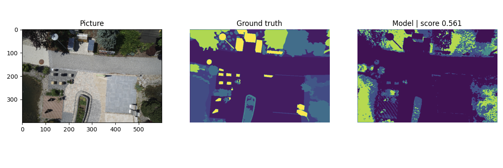

<div id="toc">
Contents
</div>
* TOC
{:toc}
----------

이번 포스팅에서는 구현이 **어떤 식으로** 동작해야 하는지를 대충 알아보기 위해, 생각할 수 있는 가장 단순한 모델인 **1-layer convolution**을 이용해 semantic segmentation을 시도합니다. 

[Preparation post](/image-segmentation-2021/preparation) 에서 이어집니다. 

## Model 만들기 
Pytorch에서 model은 `torch.nn.Module` 형태의 클래스로 만들 수 있습니다. 
```py 
# models/single_conv.py
import torch.nn as nn

class SingleConvolution(nn.Module):
    def __init__(self):
        super(SingleConvolution, self).__init__()
        self.conv_layer1 = nn.Sequential (
            nn.Conv2d(3, 23, kernel_size = 3, padding=1),
            nn.ReLU()
        )
    def forward(self, x):
        output = self.conv_layer1(x)
        return output
```
우리는 RGB 3개 채널을 갖는 이미지를 받아서, 23개 클래스 중 하나를 구분할 것입니다. 즉, 입력은 $3 \times W \times H$ 형태일 것이며, 출력은 각 $(i, j)$ 마다 23개의 클래스에 대한 probability를 출력해야 합니다. ($23 \times W \times H$)

우리가 생각할 수 있는 가장 간단한 형태의 모델은 단 한 번의 convolution layer로 구성된 모델일 것입니다. 이 모델은 $3 \times f \times f$ 크기의 convolution filter 23개가 각 클래스에 대응하며, 각 filter는 trainable weight과 bias를 갖습니다. 즉 파라미터는 여기서 $27 \times 23$개의 weight과 23개의 bias로 총 644개가 됩니다. 각 클래스의 확률값은 convolution연산과 ReLU 한번으로 바로 결과값이 도출됩니다. 

이 모델을 정의하는 것까지를 코드로 옮기면 다음과 같습니다. 
```py
# main.py
from basics import *
from datautils import * 
from metrics import * 
from evaluate import *
from train import * 
from models import * 

batch_size = 6
train_set, test_set = import_drone_dataset()
train_loader = DataLoader(train_set, batch_size=batch_size, shuffle=True)
model = SingleConvolution().to(device)
print(summary(model, (3, 600, 400)))
```
여기서 batch size는 GPU 메모리에 들어가는 한 많이 욱여넣는 것이 일반적입니다. 저는 1070Ti를 쓰기 때문에 6정도는 괜찮은것 같습니다. 다른 함수들은 앞서 Prep에서 준비한 함수들입니다. summary가 반환하는 결과가 아래와 같이 나타납니다. 

```
----------------------------------------------------------------
        Layer (type)               Output Shape         Param #
================================================================
            Conv2d-1         [-1, 23, 600, 400]             644
              ReLU-2         [-1, 23, 600, 400]               0
================================================================
Total params: 644
Trainable params: 644
Non-trainable params: 0
----------------------------------------------------------------
Input size (MB): 2.75
Forward/backward pass size (MB): 84.23
Params size (MB): 0.00
Estimated Total Size (MB): 86.98
----------------------------------------------------------------
```

우리가 예상했던 대로 644개의 trainable param을 갖는 것을 볼 수 있습니다.

## Training
이제 모델을 정의했다면, 이 모델의 633개의 parameter를 실제로 train해 줘야 합니다. Train은 크게 두 과정으로 이루어집니다.
1. Forward pass로 훈련용 데이터를 먹여서, 최종 결과를 도출한 다음, 이 결과를 ground truth와 비교해서 얼마나 다른지 (loss function)의 값을 측정
2. 그 값을 최소화하는 방향으로 뭔가 optimization 알고리즘을 적용. 

전체적인 CNN 모델 훈련의 이론에 대해서 다룬 포스팅들과, LeNet을 이용해서 pytorch에서 classification 하는 포스팅 ([LeNet으로 MNIST 풀어보기](/deep-learning-study/LeNet-MNIST))가 있으므로 이쪽을 참고해 주세요. 

여기서의 훈련과정은 LeNet MNIST훈련과 크게 다르지 않습니다. 
```py 
# train.py
from basics import * 
from metrics import *

def train(
    model : nn.Module, 
    epochs : int,
    train_loader : DataLoader,
    loss_func, optimizer,
    acc_metric = pixel_accuracy
):
    torch.cuda.empty_cache()
    train_losses = [] 
    train_acc = []
    model.to(device)
    start = time.time()
    for _ in range(epochs):
        print(f"EPOCH {_+1} training begins...")
        train_start = time.time()
        model.train()
        train_accuracy = 0 
        train_loss = 0
        for i, data in enumerate(tqdm(train_loader)):
            img, mask = data 
            img = img.to(device)
            mask = mask.to(device)
            output = model(img)

            train_accuracy += acc_metric(output, mask)
            loss = loss_func(output, mask)
            train_loss += loss.item()
            loss.backward()
            optimizer.step()
            optimizer.zero_grad()
        print(f"Train epoch {_+1} / {epochs}",
              f"Training Loss {train_loss/len(train_loader):.4f}",
              f"Training Accr {train_accuracy/len(train_loader):.4f}",
              f"Training Time {(time.time()-train_start)/60:.2f} min")
    history = {'train_loss' : train_losses, 'train_acc' :train_acc}
    print(f"Total training time {(time.time()-start)/60:.2f} minutes taken")
    return history
```

LeNet으로 MNIST 풀어보는 포스팅에서 다뤘던 것과 거의 같습니다. 여러 모델에 대해 실험하기 위해 함수로 만들었다는 정도만 차이가 있습니다. 달라지는 부분이 거의 없으므로, LeNet 포스팅을 참조해 주세요. 
- train data를 로딩할 data loader를 받고
- 몇 epoch 돌릴지를 파라미터로 받고
- 어떤 loss function을 어떤 optimizer로 훈련하고 
- 어떤 방법으로 accuracy를 측정할지 (사실 훈련 자체에는 상관이 없는데, 눈으로 보기 위해서입니다) 정합니다. 

이제, 마지막으로 이 모두를 합쳐서 최종 로직을 작성합니다. 
```py
# main.py
train(
    model = model, 
    epochs = 5,
    train_loader = train_loader, 
    loss_func = nn.CrossEntropyLoss(), 
    optimizer = torch.optim.Adam(model.parameters(), lr=0.003)
)
evaluator = ModelEvaluation(model, test_set, pixel_accuracy)
evaluator.evaluate_all()
```
이 모델에 뭔가 노력을 기울이는 것은 의미가 없으므로, 아무렇게나 5 epoch를 돌립니다. loss function과 optimizer도 일반적인 Cross Entropy Loss 와 Adam을 그대로 집어넣습니다. 이렇게 좀 기다려 보면... 

## Results
  
이 결과는 8번 이미지에 대한 결과입니다. 모델이 대부분을 void로 잡아내긴 했는데, 뭔가 이미지의 큰 청크들에 대해 분명 trivial하지 않게 뭔가를 잡아낸 것 같아 보입니다. 

이는 `show_qualitative`로 뽑은 결과인데, evaluate한 결과는 평균 pixel accuracy 47%정도가 나왔습니다. 이 프로젝트는 앞으로 다양한 방법을 이용해 이를 85% 내지는 그 이상으로 올릴 계획입니다.  