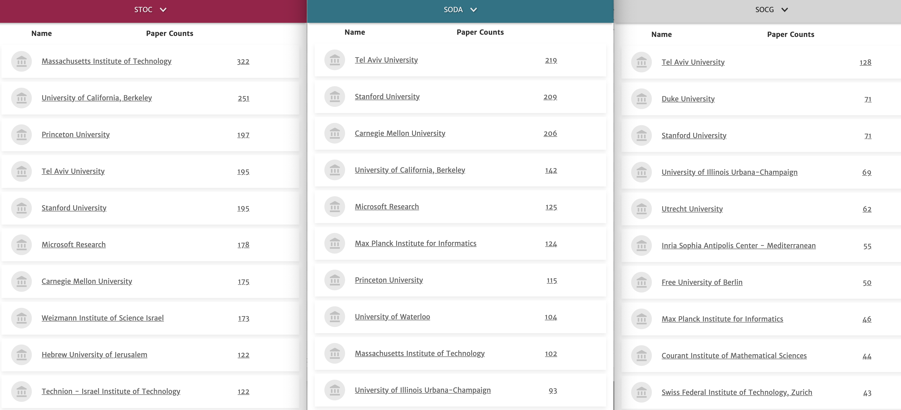

Contents

* TOC
{:toc}
----------

일정상 연습은 같이 참여하지 못하고, 혼자 문제만 풀어봤습니다. 이번에는 CERC 문제들만으로 세팅했다고 들었는데, 역시 퀄리티가 훌륭합니다. 

For some reason, 유럽권은 동유럽이든 서유럽이든 알고리즘 하시는 분들이 geometry를 매우 사랑하는것 같습니다. 
ICPC에서 기하문제의 비율이 다른 리저널보다 높은것만이 아니라, 묘하게 연구 쪽에서도 computational geometry가 강합니다. 

  
STOC (Symposium on Theory Of Computing) SODA (Symposium On Discrete Algorithms) SoCG (Symposium on Computational Geometry), 세개의 top conference에서 가장 많은 논문을 publish한 학교/연구소들인데, 왼쪽의 두개 (STOC/SODA) 는 알고리즘과 계산이론 전반을 다루고 오른쪽 SoCG는 계산기하에 집중하는 학회입니다. SoCG에 유독 유럽권 기관들이 눈에 띕니다 (Free U of Berlin, Inria Sophia, Utrechet, Max Planck, ETH Zurich...) 

------
### CERC 2019A. ABB
`BOJ 18171 / ICPC Central European Regional Contest 2019 A`  
난이도: Platinum IV 

**문제 요약:** 문자열 $S$에 대해, 최소 개수의 글자를 뒤에 덧붙여서 문자열을 팰린드롬으로 만들려고 한다. 몇 글자가 필요한가?

<b>풀이 보기:</b>

문자열 $S$가 어떤 문자열 $A$ 와 팰린드롬 $P$ 에 대해 $S = A + P$ 라면, $\abs{A}$ 만큼을 뒤에 덧붙여 $A + P + rev(A)$ 를 만들면 됩니다. 

이러한 $A$가 최대한 짧아야 하므로, 반대로 $P$가 최대한 길어야 합니다. 따라서, Manacher's Algorithm으로 $S$의 모든 극대 팰린드롬 부분문자열을 찾고, 그것들 중 $S$의 맨 뒤까지 닿는 최대 길이의 팰린드롬이 무엇인지를 판정하면 충분합니다. $O(\abs{S})$ 에 해결할 수 있습니다. 

------
### CERC 2018I. Shooter Island
`BOJ 16700 / ICPC Central European Regional Contest 2018 I`  
난이도: Platinum III 

**문제 요약:** 격자점 그리드상에, 두 가지 종류의 쿼리가 주어진다. 처음에는 모든 점이 '밟을 수 없는' 점이다.
- `1 x1 y1 x2 y2`: $[x_1, y_1] \times [x_2, y_2]$ 직사각형 상의 격자점들을 '밟을 수 있게' 한다. 
- `2 x1 y1 x2 y2`: $(x_1, y_1)$ 에서 $(x_2, y_2)$ 까지, '밟을 수 있는' 점들만 통해 이동할 수 있는지 판정하라. 

<b>풀이 보기:</b>

$R \times C$ 칸의 Union-Find를 유지할 수 있다면, 쉽게 풀 수 있습니다. 여기서 문제는 1번 쿼리 한번에 $O(RC)$ 시간을 써서는 복잡도를 맞출 수 없다는 점입니다.

한개당 $C$칸을 관리하는, $R$개의 Union find 자료구조를 추가로 관리하면, 이미 합쳐진 segment를 건너뛰면서 합칠 수 있습니다. 
- 문제를 1차원으로 줄여서 생각해 보면, $[l, r]$ 사이 점을 모두 합치는 쿼리가 여러 개 주어지고 이걸 빨리 처리하는 문제가 되며,
- 항상 맨 오른쪽의 값을 루트로 하도록 합니다. 이때, 본 노드를 다시 보지 않도록 잘 처리하면 됩니다. 
- 말로 쓰기는 어려운데... 예를 들어, $[3, 5]$ 를 먼저 합치고, $[1, 6]$ 을 합친다면,  
    - $p(3) = 4, p(4) = 5$ 로 만들고
    - $p(1) = 2$ 로 만든 다음, $p(2)$ 는 find(3) 을 수행해서 $p(2)$ 를 5로 만들고 넘어갑니다. 
    - $p(5) = 6$으로 만들고 끝냅니다.
- 이 과정에서 Path compression만 쓰면, 복잡도를 합리적으로 관리할 수 있습니다.
- 맨 오른쪽의 값을 루트로 고정함에 따라, size나 rank에 따른 Union find를 할 수 없지만, 이 문제에서는 상관이 없습니다.

이 테크닉은 [2022년 서강대학교 프로그래밍 대회](https://www.acmicpc.net/problem/26087) 에서 저는 (검수하면서) 처음 알게 되었는데, 꽤 재밌는 테크닉인것 같습니다. 잘 알려져 있는지는...잘 모르겠습니다. 

여담으로, Path compression'만' 사용하면, 쿼리당 amortized $O(\log n)$ 시간에 작동함이 알려져 있습니다. 
PS 세팅에서, $\log n$ 와 $\alpha(n)$을 구분해낼수있는 문제가 있는지는 잘 모르겠습니다. 어쩌면 모든 UF문제를 사실 path compression 하나로 뚫을수 있을지도 모르겠습니다. 

------

### CERC 2016H. Hanger Hurdles
`BOJ 13952 / ICPC Central European Regional Contest 2016 H / 2016-2017 Grand Prix of Europe`  
난이도: Diamond V 

**문제 요약:** 일부 칸들이 막혀있는 2차원 그리드가 주어진다. 한 변의 길이가 홀수 $k$인 정사각형 박스를 중심의 위치가 $(r_1, c_1)$ 에서 $(r_2, c_2)$ 까지 옮길 수 있는지 판정하여라. 
단, 그리드의 크기는 $1000 \times 1000$ 이고, $(r_1, c_1), (r_2, c_2)$ 쿼리는 $300,000$개 주어진다.  

쿼리 형태라는것이 난이도의 메인 요소라서 요약에서도 명시했습니다. 

<b>풀이 보기:</b>

변의 길이가 홀수인 박스가 있을 때, 이 박스가 $(r, c)$를 밑면의 중심으로 한다면 이를 "$(r, c)$ 위에 있다" 라고 부르겠습니다. 이하, $N$ 은 그리드의 변길이 (1000), $Q$는 쿼리의 개수 (30만) 입니다. 

쿼리가 한 개만 주어진다고 생각하면, 다음과 같이 문제를 풀 수 있습니다. 
- 각 칸에 대해, "가장 가까운 막혀 있는 칸" 이 어디인지를 알면, 이 칸 위에 올 수 있는 박스의 최대 크기를 알 수 있습니다. 
- 모든 칸에 대해, 이 칸 위에 올 수 있는 박스의 최대 크기를 안다는 것은, 자연수가 쓰여 있는 2차원 그리드가 주어지고, 값이 $k$ 이상인 점들만 밟으면서 $(r_1, c_1)$ 에서 $(r_2, c_2)$ 까지 이동할 수 있는지 판단하는 문제입니다. 
- 이 문제는 그래프로 만들고 직접 탐색을 하면 쉽게 풀 수 있습니다.
- 각 칸에 대해 가장 가까운 막힌칸을 찾는 작업은, 반대로 막힌 칸들로부터 시작해서 BFS를 돌면 쉽게 할 수 있습니다. 

즉, 이 작업은 $O(N^2)$ 시간에 모두 수행할 수 있습니다. 그러나 $O(N^2 Q)$ 로는 시간제한을 통과할 수 없습니다. 

시간 복잡도를 낮추기 위해서는, 병렬 이분 탐색을 생각할 수 있습니다. 
1) 쿼리 문제이고, 각 쿼리를 오프라인으로 처리할 수 있으며
2) 각 쿼리를 이분탐색으로 처리할 수 있기 때문입니다.

병렬 이분 탐색에 대해서는 [kks227님의 블로그 글](https://blog.naver.com/kks227/221410398513) 이 매우 쉽게 소개하고 있습니다. 
요점은 각 쿼리에 대해 [lo, hi] 값을 관리하면서, 한번 도는 사이에 모든 쿼리에 대해 업데이트하는 것입니다. 

한 쿼리를 이분 탐색하는 방법을 생각해 봅시다. 큰 박스가 올라갈 수 있는 (값이 큰) 칸부터 추가하면서, 
- $t$의 크기를 허용하는 칸을 모두 추가하고
- 현재 밟을 수 있는 칸들 중, 인접한 칸들 간에 유니온-파인드로 서로 연결되어 있음을 표시하면
- 각 쿼리마다 유니온-파인드를 이용, $s\to t$ 도달가능한지 판정할 수 있습니다. 
  
여기에 병렬 이분 탐색을 적용하여 전체를 $O(QN\log N)$ 시간에 풀 수 있고, 이 값이 조금 커 보이지만 제한시간이 8초이므로 통과할 수 있습니다. 

------
