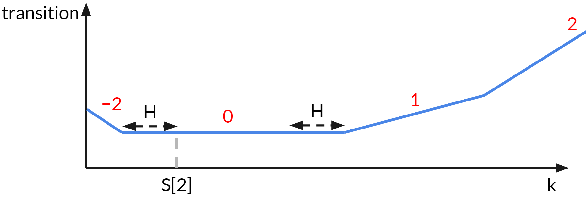

- **난이도** : Diamond 4
- **출처** : Singapore National Olympiad in Informatics, 2018 - 5번 
<div id="toc">
Contents
</div>
* TOC
{:toc}

Thinking 파트가 끝난 후에도 어떻게 구현할지 정말 많은 고민을 했고, 결국 구현을 성공하지 못해서 다른 사람 구현을 참고했다. 구현 트릭이 상당히 배울점이 많았다.

## 풀이 
주어진 문제를 formulate하면, 각 element가 $S$ 이하인 $N$개짜리 sequence에 increment 또는 decrement 하는 연산을 최소한으로 해서, $\abs{a_i - a_{i-1}} \leq H$ 가 되게 하고자 할 때 필요한 최소 횟수를 구하는 문제이다.

먼저, 답이 되는 sequence를 $b_i$ 라고 하고, $a_i$를 $b_i$로 바꾸려고 한다고 하자. 이때, 관찰할 수 있는 사실은, 현재 가장 큰 element보다 $b_i$가 더 커져야 할 이유가 전혀 없다. (거의 자명하다)

### Subtask 1, 2, 5 (+13점)
$b_i$ 는 $S$ 이하이므로, 다음과 같은 DP 테이블을 생각할 수 있다.

`dp[i][j] : a[1]...a[i] 까지만 고려하고, b[i] = j가 되도록 할 때 필요한 최소 횟수`

이 DP 테이블을 생각해 보면, `dp[i][j]`를 계산하고자 할 때, `dp[i-1][*]`의 정보만 있으면 된다. 구체적으로, 수열의 $i-1$번째가 $k$일 때, $i$번째가 $j$가 될 수 있는 가능성이 있는지를 먼저 알아야 하고, 만약 가능하다면 현재 $a_i$를 $j$까지 밀어야 한다. 즉, 다음과 같은 transition을 생각할 수 있다.

$$dp(i, j) = \min_{j-h \leq k \leq j + h} dp(i-1, k) + \abs{a_i - j}$$

당연히, $j-h$ 나 $j+h$ 범위가 $0$이나 $S$를 넘지 않도록 해야 할 것이다. 이 DP 테이블을 그냥 그대로 계산하면 $O(NSH)$ 시간이 걸리고, $O(NS)$칸 테이블이 필요하다. 모든 각각의 요소가 작게 control되어 있는 1, 2, 5번 서브태스크를 이 DP로 해결 가능하다.

### Subtask 4 (+5점)
$H = 0$일 때는, 결국 $a_i$들을 모두 똑같이 맞춰야 하며, $a_i$ 들 중 중간값이 답임이 잘 알려져 있다. 

### Full solution 
위 DP를 개선하고자 한다. 이때, `dp(i, x)` 를 $x$에 대한 함수 $f_i (x)$처럼 생각하자. 그리고 첫번째 min 파트와, 두번째 abs를 더하는 파트를 나누려고 한다.

- min을 하는 파트는, 함수에서 생각하면, $f_i(x)$의 값을 그 주변 $H$만큼의 구간의 최소값으로 대체하는 연산이다.
- abs는 그대로, $f_i$에 직접 $\abs{a_i - x}$ 가 더해지는 연산이다.

결국 이 두 연산을 교대로 수행하는 것이므로, $\abs{a - x}$ 함수가 여러 개 더해지고, 구간 minimum을 계속 취하는 것이다. 이때, abs 함수의 합이 항상 convex함에 주목하자. 또한, 함수에서 기울기가 바뀌는 지점이 $2n$개 밖에 없음을 알 수 있다. 

abs가 여러개 더해진 함수에 구간 minimum을 취하는 것은, 함수의 기울기 부호가 바뀌는 부분을 기준으로, 양쪽의 **기울기가 바뀌는 점** 을 왼쪽 점은 더 왼쪽으로, 오른쪽 점은 더 오른쪽으로 미는 효과가 된다. 

  

사진은 공식 풀이에서 가져왔다. 이걸 그릴 자신이 없어서... :(

따라서, 적절한 자료구조를 이용하여, 함수의 기울기가 바뀌는 점들을 모두 기록하고, 이들을 미는 연산과 추가하는 연산을 잘 해줄 수 있으면 된다. 

## 구현 
사실 처음에는 저기다가 Dynamic Lazy Segment Tree 같은걸 잘 박아서 어떻게 해보려고 생각했었는데, 몇시간동안 고생하다가 결국 실패했다. 공식 솔루션은 (그리고 내가 본 거의 모든 풀이는) 아래 방법으로 구현한다.

기울기가 바뀌는 점들의 리스트를 가지고 있자. 구현의 편의를 위해, 이 리스트는 반복을 허용한다. 즉, $(-\infty, 1)$ 에서의 기울기가 -3이고, $(1, 3)$ 에서의 기울기가 -1, $(3, 5)$에서의 기울기가 0, $(5, 8)$에서의 기울기가 1이라면, 이를 저장할 때 1, 1, 3, 5, 8 과 같이 저장한다. 1이 두 번 나오는 것은 기울기가 두 번 변함을 직접 표시하는 것이다. 이렇게 해도, 양쪽의 기울기가 $-n$부터 $n$까지이기 때문에, $2n$개 정도의 점만 있으면 된다. 

이때, 기울기 $0$을 기준으로, 양쪽을 multiset 같은 자료구조로 관리한다. 나중에 이 점들 전체를 들고 양쪽으로 밀어야 하는데, 직접 미는 대신 offset을 기록할 것이다. 

- min연산은 이제 offset을 바꿔줌으로써 $O(1)$에 할 수 있다. 
- abs 를 더하는 연산은, 다음과 같이 수행한다. 먼저 $\abs{a_i - x}$를 더하면 $a_i$를 기준으로 왼쪽에는 기울기가 -1 더해지고, 오른쪽에는 기울기가 1 더해진다는 사실을 관찰하자. 따라서, $a_i$를 두 번 넣어 주면, 아무 문제가 없게 된다. 
  * 이때, 앞서 양쪽을 multiset으로 각각 관리하기로 했으므로, $a_i$의 위치를 보고 어디에 넣어 주어야 하는지 찾아야 한다.
  * 만약 왼쪽 multiset에 들어가는 경우, 왼쪽 multiset의 맨 끝 값 (기울기가 원래 -1에서 0으로 넘어가는 부분)이 이제 0에서 1로 넘어가는 부분이 된다. 따라서, 이를 왼쪽에서 빼서 오른쪽에 넣어주어야 한다. 그 반대이면 당연히 값의 방향이 반대로 간다.
- 마지막에 기울기 0에 해당하는 $x$를 보고 답하면 된다. 함수값의 실제 계산도 별로 어렵지 않다.   
말로 설명하기 정말 끔찍하지만, 코드는 그렇게 심각하게 어렵지 않다. 이걸 기울기값을 그대로 multiset같은걸로 관리한다는 발상이 가장 어려운 것 같다.

## 코드 
```cpp
#include <bits/stdc++.h>
#pragma GCC optimize("O3")
#pragma GCC optimize("Ofast")
#pragma GCC target("avx,avx2,fma")
#define ll long long
#define eps 1e-7
#define all(x) ((x).begin()),((x).end())
#define usecppio ios::sync_with_stdio(0);cin.tie(0);cout.tie(0);
using namespace std;
#define int ll
using pii = pair<int, int>;
int INF = 1e15;
const int MN = 202020;
const int LEND = -1e17;
const int REND = 1e17;
int N, H;
int s[MN];

struct mset {
    multiset<int> st;
    int offset;
    int small() {
        return *st.begin() + offset;
    }
    int large() {
        return *st.rbegin() + offset;
    }
    void del(int e) {
        if (e == LEND)
            st.erase(st.begin());
        else if (e == REND)
            st.erase(prev(st.end()));
        else
            st.erase(st.lower_bound(e));
    }
    void ins(int e){
        st.insert(e);
    }
} l, r;

int32_t main()
{
    usecppio
    cin >> N >> H;
    int MH = 0;
    for (int i = 1; i <= N; i++)
    {
        cin >> s[i];
        MH = max(MH, s[i]);
    }
    l.ins(s[1]);
    r.ins(s[1]);
    int ans = 0;
    for (int i = 2; i <= N; i++)
    {
        l.offset -= H;
        r.offset += H;
        int lf = l.large();
        int rf = r.small();
        if (s[i] < lf)
        {
            l.ins(s[i] - l.offset);
            l.ins(s[i] - l.offset);
            l.del(REND);
            r.ins(lf - r.offset);
            ans += abs(lf - s[i]);
        }
        else if (s[i] > rf)
        {
            r.ins(s[i] - r.offset);
            r.ins(s[i] - r.offset);
            r.del(LEND);
            l.ins(rf - l.offset);
            ans += abs(rf - s[i]);
        }
        else
        {
            l.ins(s[i] - l.offset);
            r.ins(s[i] - r.offset);
        }
    }
    cout << ans << '\n';
}
```