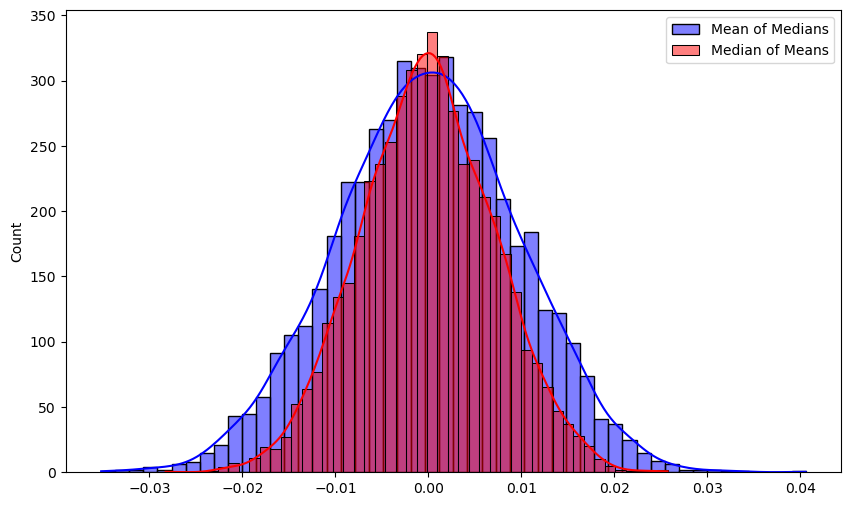
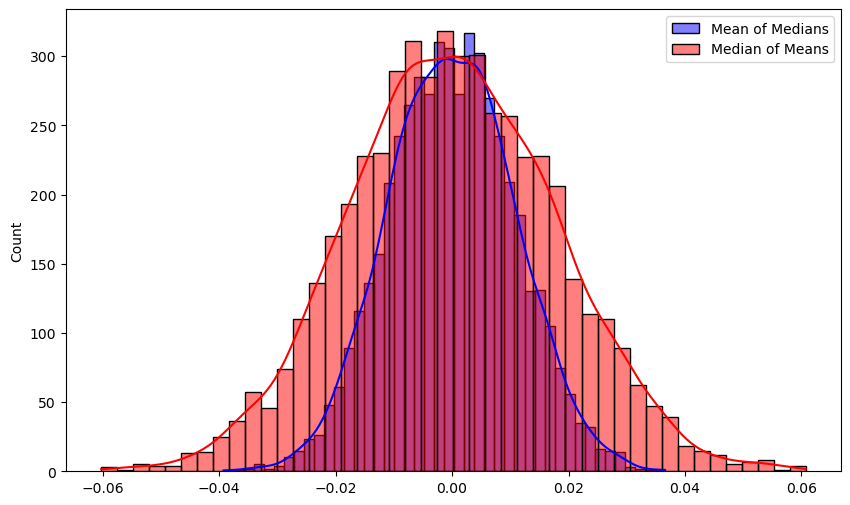

오늘 포스팅에서는 randomized algorithm 을 비롯하여, estimation 에서 매우 흔히 활용되는 중간값을 이용한 기법을 소개합니다. 

이하, 확률변수 $X$의 기댓값, 분산, 표준편차를 기댓값 $\E[X]$, 분산 $\V[X]$, 표준편차 $\sigma[X] = \sqrt{\V[X]}$ 로 쓰겠습니다.

### Problem
어떤 미지의 값에 대한 unbiased estimator random variable $X$가 주어진다고 가정합니다. 
(여기서 unbiased라 함은, $\E[X] = \mu$ 가 우리가 추정하고자 하는 미지의 값과 같음을 의미합니다.)
Randomized algorithm의 맥락에서는, 알고리즘의 출력이 확률변수로 표현되므로 그 기댓값이 참값과 같은 상황이라고 생각할 수 있습니다. 

여기서 추가로, $\V[X]$ 가 최대 $\E[X]^2$ 에 비례하는 상황을 가정합니다. (즉, $\sigma[X] = c\E[X]$. 사실 이하의 논의는 부등호 $\leq$ 로도 잘 성립합니다) 
얼핏 보면 약간 특수해 보이지만, 사실 이 상황은 알고리즘 분석을 비롯해서 매우 흔히 발생합니다. 

우리의 목표는 어떤 상수 $\delta$와 $\epsilon$에 대해, $1 - \delta$ 확률로 $\epsilon$ 만큼의 상대 오차를 보장하고 싶습니다. 
즉, 확률변수 $Y$가 다음을 만족하도록 하고자 합니다. 

    <b class="math_item_title">확률변수에 의한 $(\epsilon, \delta)$-근사</b>  
    Unbiased estimator $Y$와 참값 $\mu = \E[Y]$에 대해, 다음이 성립할 때 $Y$를 $\mu$에 대한 $(\epsilon, \delta)$-근사라고 정의한다.
    $$\P[\abs{Y - \mu} \geq \epsilon\mu] \leq \delta$$
 
(이 용어는 표준으로 쓰는 용어는 아니고, 편의상 도입한 것입니다)

------

### Naive Approach
어떤 확률변수 $X$에 대해, 다음이 잘 알려져 있습니다. 

    <b class="math_item_title">Chebyshev's Inequality</b>  
    확률변수 $X$의 기댓값 $\mu = \E[X]$, 분산 $\V[X]$, 표준편차 $\sigma[X] = \sqrt{\V[X]}$에 대하여, 다음이 성립한다. 
    $$\P[\abs{X - \mu} \geq k\sigma[X]] \leq \frac{1}{k^2}$$
 
우리는 $\sigma[X] = c\mu$를 가정하였으므로, 이는 다시 말해 $X$에 대해 다음이 성립한다는 의미입니다.
$$\P[\abs{X - \mu} \geq kc\mu] \leq \frac{1}{k^2}$$

무언가를 더 잘 추정하기 위해서 생각할 수 있는 가장 나이브한 방법은, 여러 개의 estimator를 independent하게 실행한 다음 그들의 평균을 취하는 것입니다. 
$T$개의 평균을 취하면, 기댓값과 분산에는 아래 관계가 성립합니다. 
$$Y = \frac{1}{T}\sum_{i = 1}^{T} X_i \qquad \Rightarrow \qquad \E[Y] = \E[X],\quad \V[Y] = \V[X] / T$$

따라서, $k = 1 / \sqrt{\delta}$로 두고, $\sigma[Y] = \epsilon\sqrt{\delta}\mu$ 가 되도록
$T = \frac{c}{\epsilon^2 \delta}$ 개를 잡으면 목표하는 $(\epsilon, \delta)$ 근사를 달성할 수 있습니다. 

    <b class="math_item_title">Theorem.</b>  
    Unbiased estimator $X$가 $\V[X] = O(\E[X]^2)$를 만족하면, $O(1 / (\epsilon^2 \delta))$ 개로 $(\epsilon, \delta)$ 근사를 달성할 수 있다. 
 

------

### Median-of-Mean Trick
오늘 포스팅의 메인 주제인, 이 방법보다 더 적은 개수로 목표를 달성할 수 있는 방법입니다. 
- Estimator $X$를 $4c / \epsilon^2$ 번만큼 실행하여 평균을 취한다. 이를 Estimator $Z$ 라 한다. 
- Estimator $Z$를 $12 \log (1 / \delta)$ 번만큼 실행하여 **중간값** 을 취한다. 이를 Estimator $Y$ 라 한다. 

이렇게 얻어진 $Y$가 $\mu$의 $(\epsilon, \delta)$ 근사가 됩니다!

수식을 정확히 전개하기 위해 상수를 잘 맞춰놓았지만, 실제로는 $O(1 / \epsilon^2)$, $O(\log (1 / \delta))$ 만 기억하면 충분합니다. 

#### Intuitive Explanation
중간값은 평균에 비해 양쪽 끝의 outlier에 덜 민감한 값입니다. 
여러 개의 estimator들이 **대체로** 좋은 값을 제공한다면, 낮은 확률로 값이 크게 튀더라도 중간값은 그 영향을 많이 받지 않고 robust하게 좋은 값을 얻을 수 있습니다. 

아래의 증명은 사실 이 아이디어를 formal하게 작성한 것에 지나지 않습니다. 

------

### Proof of $(\epsilon, \delta)$ Approximation
위 설명에서, ***대체로** 좋은 값을 제공한다* 
를 먼저 생각하고 들어갑니다. Estimator $Z$에 대해, 다음이 Chebyshev 부등식에 의해 성립합니다. 
$$\P[\abs{Z - \mu} \geq \epsilon\mu] \leq \frac{\V[Z]}{\epsilon^2\mu^2} = \frac{1}{4}$$
즉, $Z$ 는 상수 (3/4) 확률로 우리가 원하는 좋은 estimation을 제공합니다. 목표는 이 확률을 $1 - \delta$ 까지 높이는 것입니다. 

$r$개의 $Z$ estimator들의 중간값이 우리가 원하는 범위를 벗어나기 위해서는, 적어도 $r / 2$ 개만큼이 우리가 원하는 범위 밖에 있어야 합니다. 
($r / 2$개의 값이 구간 $[a, b]$ 사이에 있다면, 중간값이 그 범위에 들어간다는 것은 쉽게 생각할 수 있습니다) 
이를 **나쁜** estimator라 하면, $r / 2$개의 값이 **나쁠** 확률은, 성공 확률이 $1/4$ 이하인 베르누이 시행을 $r$번 해서 성공 횟수가 $r/2$번 이상이기를 기대한다는 의미이므로
$$\P[\text{at least } r / 2 \text{ estimators are bad}] = \P[B(r, 1/4) \geq r/2]$$
로 쓸 수 있습니다. 이 확률을 계산하기 위해, Chernoff Bound를 적용합니다. 

    <b class="math_item_title">Chernoff Bound (for sum of indep. random variables).</b>  
    확률변수 $X_1, X_2, \dots X_n$이 각각 $\set{0, 1}$ 에서 값을 갖는 independent random variable 이고, $X = \sum X_i, \mu = \E[X]$ 일 때, $t \in (0, 1)$에 대해 다음이 성립한다. 
    $$\P[X \geq (1 + t) \mu] \leq \exp\left(-t^{2}\mu/3\right)$$
 
이를 적용하면, $\P[B(r, 1/4) \geq r/2] \leq e^{-r / 12}$ 를 얻습니다. 
따라서, $r = 12 \log (1 / \delta)$ 를 택하면, 
$$\P[\text{median is bad}] \leq \P[\text{at least } r / 2 \text{ estimators are bad}] \leq \delta$$
가 성립하므로, 중간값 $Y$는 $(\epsilon, \delta)$ 근사입니다.

그러므로, 다음의 정리가 성립합니다. 

    <b class="math_item_title">Theorem.</b>  
    Unbiased estimator $X$가 $\V[X] = O(\E[X]^2)$를 만족하면, $O(\frac{1}{\epsilon^2}\log(1 / \delta))$ 개로 $(\epsilon, \delta)$ 근사를 달성할 수 있다. 
 

앞선 정리와 비교하면, $1 / \delta$ term을 $\log(1 / \delta)$로 개선한 것이 됩니다. 

중간값에 대해서는 재밌는 성질이 알려져 있습니다. 

Popultation median [^1] 이 $\tilde{\mu}$인 $X$에서 추출한 sample의 median에 대해,

    <b class="math_item_title">Theorem. </b>  
    (약간의 가정 하에서) $X$의 density function이 $f$, $X$의 median이 $\tilde{\mu}$일 때, $X$에서 $2m+1$ 개를 sample하여 얻은 median의 분포는 
    평균이 $\tilde{\mu}$, 분산이 $\frac{1}{8f(\tilde{\mu})^2 m}$인 정규분포로 수렴한다. 
 
위 정리는 absolute continuity, infinite population 등 몇가지 technical하고 mild한 가정이 들어가지만, 
일단은 이부분은 우리의 목표인 randomized algorithm의 경우에는 크게 중요하지는 않습니다. 

따라서, 평균의 중간값이 어떤 분포를 보일지는 대략 알 수 있습니다. 
저 정리에서 우리가 필요한 $f$ 는 (알기 어려운) 원래 estimator의 probability density가 아닌, 그 표본평균의 pdf입니다 ($Z$에 대해 중간값을 취하므로)
**Central Limit Theorem**에 의해, **표본 평균의 분포** 는 정규분포로 수렴하므로, 충분히 큰 sample size에서 $Z$ estimator는 거의 정규분포이고...
그러면 $f$ 값도 정확하게 구할 수 있기 때문입니다. 

CLT의 정확한 statement를 이용하면, 분포의 거리 상에서 많은 것을 더 논의할 수 있지만, 이 포스팅의 범위를 벗어나므로 생략하겠습니다. 

------

### 평균의 중간값 vs 중간값의 평균
> 이 장에서, 분포가 **정규분포이다** 라고 말하는 많은 경우에 사실은 **CLT에 의해** 정규분포로 수렴한 경우를 말합니다. 
> 이때의 분포는 정확히 정규분포가 되지 않으므로, 모든 수식전개는 약간의 :hand-waving: 이 포함되어 있습니다. 
> CLT에 의해 얻어지는 분포에 대해 무언가를 논증하려면 convergence in distribution 등 복잡한 개념을 적용해야 하며, 
> 과정에서 수렴을 한번씩 쓸때마다 약간씩 문제가 있습니다. 

**평균의 중간값**이어야 하는 이유가 있을까요? 구체적으로는, **중간값의 평균** 으로는 안 될까요? 

중간값의 평균에는 크게 두 가지 문제가 있습니다. 

1. 첫째로, 중간값의 평균은 원래 $X$의 기댓값이 유지된다는 (unbiasedness) 보장이 없습니다. 
만약 분포가 한쪽으로 기울어져 있어, 중간값이 평균과 다르다면, 각 sample의 median에 bias가 발생합니다. 이후 평균을 취하는 과정에서 이 bias가 사라지지 않습니다. 

2. 그렇다면, **대칭인** 분포에서는 똑같을까요? 그렇지 않습니다. 대칭인 분포에서는 unbiasedness는 보장할 수 있습니다 (median = mean이므로)
그러나 이 경우 어느 쪽이 더 나은 estimator인지는 약간 어려운 문제이고, 일반적으로는 평균의 중간값이 더 좋은 결과를 제공합니다. 

1번의 경우 조금만 생각해 보면 바로 알 수 있습니다. 2번의 경우는 그렇지 않으므로, 이부분을 더 생각해 보고자 합니다. 

수식에 대해서 생각하기 전에, 실험을 약간 해보겠습니다. $X$가 $[-1, 1]$ 에서 uniform한 분포라고 생각해 봅시다. 
이 분포의 평균은 0이고, 분산은 $1 / 3$ 이 됩니다. (앞서 알고리즘의 프레임워크에 맞추면, 우리가 예측하고자 하는 값이 0이고 분산이 $1/3$이라고 생각하면 됩니다)

이 분포에서, 10,000개의 sample을 뽑아 이를 100개씩 100개의 그룹으로 나누어, 
1) 각 group의 mean을 구하고 median을 취하는 경우
2) 각 group의 median을 구하고 mean을 취하는 경우
를 5,000번 반복하면, 아래와 같은 결과를 얻습니다. 

  

Median-of-mean의 분포가 더 좋은 (분산이 작고, 0 주변으로 몰린) 것을 확인할 수 있습니다. 구체적으로는 표준편차가 약 0.0097 vs 0.007로, 40%정도의 개선이 있습니다. 
Kolmogorov–Smirnov test를 수행했을 때도 $p < 2.5 \times 10^{-13}$으로, **명확히 통계적으로 유의하게** 개선이 있습니다. 

다시 수식으로 돌아와서 생각해 보겠습니다. 앞서의 theorem에 대입해 보면...

$X$가 기댓값 $\mu$와 분산 $\sigma^2$을 가진다고 할 떄, $(2m+1)$개를 묶어 median을 취하고, 이것을 $(2k+1)$개 묶어서 mean을 취한다면, 
정규분포로부터 얻은 sample mean은 분산을 sample size로 나눈 정규분포를 따름이 잘 알려져 있으므로, 
$$\hat{\mu} = \mu, \qquad \hat{\sigma}^2 = \frac{1}{(8f(\mu)^2 m) (2k + 1)}$$
의 parameter를 갖는 정규분포로 수렴하게 되며, (대칭인 분포를 생각하므로, $\tilde{\mu} = \mu$ 입니다)
여기서 $f$는 원래 $X$ estimator의 pdf입니다. 

반대로, $(2k+1)$ 개를 묶어 mean을 취하고, 이것을 $(2m+1)$개 묶어서 median을 취하는 경우를 생각해 보겠습니다. 
Central Limit Theorem에 의해, $(2k+1)$개의 sample mean의 분포는 (원래 분포가 정규분포가 아니어도) 평균 $\mu$, 분산 $\sigma^2 / (2k + 1)$ 의 정규분포입니다. 
정규분포에 대해, 위 median theorem을 적용하면, 평균의 중간값은
$$\hat{\mu} = \mu, \qquad \hat{\sigma}^2 = \frac{1}{(8g(\mu)^2 m)}$$
의 parameter를 갖는 정규분포로 수렴하게 되며, 여기서 $g$는 $X$로부터 얻은 $(2k+1)$개의 sample mean의 분포가 갖는 pdf입니다. 

그러므로 결국 중요한 것은 $f(\mu)$ 와 $g(\mu)$가 얼마나 차이가 나는가의 문제가 됩니다. 구체적으로는, 평균의 중간값이 더 나은 estimator라는 주장이 참이기 위해서는, 
$g(\mu)$ 가 $f(\mu)$ 의 $\sqrt{2k + 1}$ 배 이상이 되어야 합니다. 

$X$가 정규분포인 경우, $\mu$에서의 값이 $1 / \sigma$에 비례하므로 $g(\mu)$가 정확히 $\sqrt{2k+1}$ 배가 되며, 이때 두 분포 (med-of-mean / mean-of-med) 가 정확히 같아지게 됩니다. 

$X$가 다른 분포인 경우, $g(\mu)$는 여전히 정규분포에 수렴하므로 $g(\mu)$ 는 $\frac{\sqrt{2k+1}}{\sigma \sqrt{2\pi}}$ 가 됩니다. 그러므로 $f(\mu)$ 가 $\frac{1}{\sigma \sqrt{2\pi}}$ 보다 큰지 작은지에 따라 갈리게 되며, 이 값은 **정규분포에서 $\mu$ 위치의 pdf값** 입니다. 
따라서, **정규분포보다 concentrated된**[^2] 분포를 갖는 $X$에 대해서는 중간값의 평균이, 그렇지 않은 $X$에 대해서는 평균의 중간값을 택하는 것이 유리합니다. 

그 조건을 만족하는 대표적인 분포로는 Laplace 분포가 있습니다 (PDF의 최댓값이 $\sqrt{\pi}$배만큼 더 큽니다)  

같은 실험을 Laplace분포에 대해 진행하면, 아래 결과를 얻습니다. $\mu = 0, b = 1$ 인 Laplace 분포로부터 위와 똑같이 5,000 * 100 * 100 실험을 하면, 

  

와 같이, 중간값의 평균이 더 나은 분포를 가짐을 볼 수 있습니다. 

다만, 중간값의 평균의 경우 위와 같이 Chebyshev-Chernoff를 이용한 논증이 똑같이 적용되지는 않고, CLT에 의존해서 증명해야 하며, rigor가 약간 애매해지는 문제가 있습니다.

------

### Applications
Count-Min, Count-Sketch 등 sublinear sketching에 많이 사용됩니다. 언젠가 포스팅하면 링크를 추가할 예정입니다. 

--------
**References**



--------
**Footnotes**

[^1]: 확률분포 $X$의 median이란, cumulative distribution function $F_X$에 대해 $F_X(t) = 1/2$ 가 되는 지점을 말합니다.   
[^2]: 여기서의 의미는, 평균에서의 함수값 $f(\mu)$ 이 정규분포보다 크다는 의미입니다. 일반적으로 대칭이고 $\abs{x - \mu}$에 대해 단조감소하는 bell curve형태의 pdf를 생각하면, curve가 뾰족함을 의미합니다. 