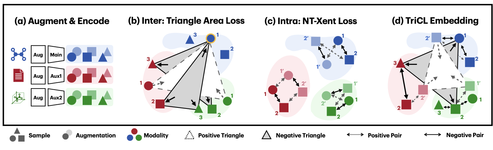
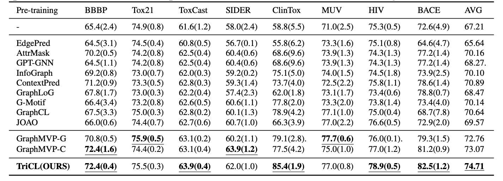

MinGyu Choi, <ins>Wonseok Shin</ins>, Yijingxiu Lu, Sun Kim, **Triangular Contrastive Learning on Molecular Graphs**

[ArXiv Link (2205.13279)](https://arxiv.org/abs/2205.13279)

------

**TriCL** is a tri-modal contrastive learning framework with triangular loss function that learns the angular geometry of the embedding space through simultaneously contrasting the area of positive and negative triplets. We achieved SOTA performance on MoleculeNet, the molecular property prediction dataset. 

### Code and Dataset
Code and dataset will be disclosed soon. 

### Motivation

Consider the **molecular property prediction** problem, as a supervised learning setup. (For example, BBBP - classification problem regarding whether molecule will penetrate through the blood-brain-barrier (1) or not (0))

Despite vast number of chemicals that are known and used to us, obtaining labeled data for such task is generally very difficult, expensive and involves some [ethical concerns](https://en.wikipedia.org/wiki/Animal_testing). It is thus of our primary interest to somehow utilize unlabeled data to pretrain the model whenever applicable. 

An important point to consider is the multifaceted nature of some tasks. Again for examples, while molecules are naturally thought as graphs, most graph neural networks are inherently insufficient to express 3D geometric information. [^1] 

Furthermore, these kind of 3D information might not be always obtainable for any downstream tasks. Hence to utilize existing information to the maximal extent, we must develop a model which can:
- While pretraining a neural network model A is the goal,
- "Teach" informations available for modality B to modality A
- So that A can "learn" how small differences in representation A can be expressed as larger difference in representation B.

So conceptually, if our multimodal contrastive learning is well done, GNN can understand how one simple change in single/double bond at this specific location can change the 3D structure, and focus on those changes when classifying molecules. 

### Alignment and Uniformity
**Alignment** and **Uniformity** suggested by Wang and Isola[^2] is a assessment metric of contrastive learning embedding space. 
- **Alignment** : Similar inputs (=augmented inputs from same raw input) should be mapped closely
- **Uniformity** : Dissimilar inputs should be mapped away from each other 

In short, CL-embedding space should map similar inputs **RELATIVELY** closer.

### Triangular Contrastive Loss

**TriCL** utilzes both intra-modal and inter-modal loss to learn the geometry of embedding space. For **ANY** neural network model to generate embedding representation from augmented input data, TriCL can be applied. 

For intra-modal loss, we suggest **NT-Xent** loss function. Again, Wang and Isola[^2] showed how NT-Xent can be understood as improving alignment and uniformity; 
$$\begin{aligned}
    \mathcal{L}_{\mathrm{intra}}^{\mathrm{enc}} &= \frac{1}{2B}\sum_{k = 1}^{B} \left(\ell(2k-1, 2k) + \ell(2k, 2k-1)\right)\\
    \text{where}\quad  \ell(i, j) &= \underbrace{-\frac{1}{n \tau}\sum_{i,j}\mathrm{sim}(\bm z^{\mathrm{enc}}_i, \bm z^{\mathrm{enc}}_j)}_{ \text{intramodal alignment}} 
    +  \underbrace{\frac{1}{n}\sum_i\log\sum_{k=1}^{2n} \mathrm{1}_{k \neq i}\exp(\mathrm{sim}(\bm z^{\mathrm{enc}}_i, \bm z^{\mathrm{enc}}_k)/\tau)}_{\text{intramodal uniformity}} \nonumber
\end{aligned}$$
And our new **Triangular Loss** aims to improve intermodal alignment/uniformity. 
$$\begin{aligned}
    \mathcal{L}_{\mathrm{inter}} = \underbrace{\mathbb{E}\left[\mathrm{Area}(\bm z^{\mathrm{main}}_i, \bm z^{\mathrm{aux1}}_j, \bm z^{\mathrm{aux2}}_k)^2 \mid  \mathbf{P}\right]}_{\text{intermodal alignment}} - 
    \underbrace{\mathbb{E}\left[\mathrm{Area}(\bm z^{\mathrm{main}}_i, \bm z^{\mathrm{aux1}}_j, \bm z^{\mathrm{aux2}}_k)^2 \mid \mathbf{N}\right]}_{\text{intermodal uniformity}}
\end{aligned}$$
For more information, please refer to the arXiv link above.

### Results
We achieved SOTA performance on MoleculeNet, by pretraining same GNN model with same dataset (GEOM)
  

[^1]: Consider the case of Cyclohexane and Benzene. Despite their graph representations looking quite similar, their 3D geometry is vastly different.  
[^2]: Tongzhou Wang and Phillip Isola. Understanding Contrastive Representation Learning through Alignment and Uniformity on the Hypersphere. In International Conference on Machine Learning. PMLR, 2020.